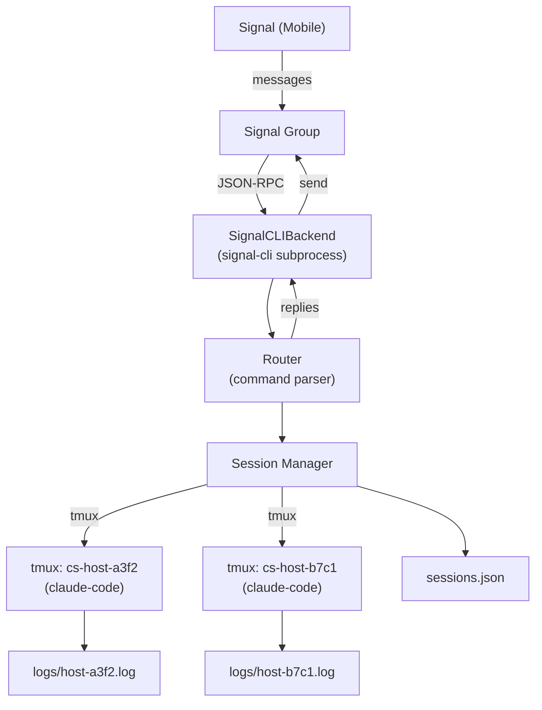

# claude-signal

A CLI daemon that bridges Signal group messages to `claude-code` tmux sessions, enabling asynchronous AI-assisted task management from your phone.

## Overview

`claude-signal` runs on one or more machines. Each instance links to a Signal group as a named device (using the machine's hostname). You send commands to the group from Signal, and each machine that understands the command replies — all in the same thread.

**Use cases:**
- Start a long-running `claude-code` task from your phone, go offline, and check back later
- Monitor progress of multiple AI sessions across multiple machines from one Signal group
- Send answers to `claude-code` prompts without needing to SSH in

---

## Prerequisites

| Dependency | Version | Notes |
|---|---|---|
| [signal-cli](https://github.com/AsamK/signal-cli) | ≥ 0.13 | Requires Java 17+ |
| Java | ≥ 17 | For signal-cli |
| [tmux](https://github.com/tmux/tmux) | Any recent | For session management |
| [claude-code](https://docs.anthropic.com/en/docs/claude-code) | Latest | The `claude` CLI |
| Go | ≥ 1.22 | For building claude-signal |

---

## Quick Start

### 1. Install signal-cli

```bash
# Download from https://github.com/AsamK/signal-cli/releases
# Requires Java 17+
wget https://github.com/AsamK/signal-cli/releases/latest/download/signal-cli.tar.gz
tar xf signal-cli.tar.gz
sudo mv signal-cli /usr/local/bin/
```

### 2. Link your device

Either use the built-in wizard:

```bash
claude-signal link
```

Or run signal-cli directly:

```bash
signal-cli link -n my-server
```

Scan the QR code with your Signal mobile app (Settings → Linked Devices → Link New Device).

### 3. Create a Signal group

From your phone, create a new Signal group. Add yourself (and any other accounts you want to control the daemon from). The group is the control channel.

### 4. Configure claude-signal

```bash
claude-signal config init
```

You'll be prompted for:
- Your Signal phone number
- The group ID (get it from `signal-cli -u +<number> listGroups`)
- Hostname and device name

### 5. Start the daemon

```bash
claude-signal start
```

Send `help` in your Signal group to verify it's working.

---

## Command Reference

All commands are sent as Signal messages in the configured group.

| Command | Description | Example |
|---|---|---|
| `new: <task>` | Start a new claude-code session | `new: write tests for auth module` |
| `list` | List sessions and their status | `list` |
| `status <id>` | Show recent output from a session | `status a3f2` |
| `tail <id> [n]` | Show last N lines of output (default: 20) | `tail a3f2 50` |
| `send <id>: <msg>` | Send input to a waiting session | `send a3f2: yes` |
| `kill <id>` | Terminate a session | `kill a3f2` |
| `attach <id>` | Get the tmux attach command | `attach a3f2` |
| `help` | Show command reference | `help` |

### Implicit reply

If exactly one session on a host is waiting for input, you can reply without specifying the session ID — just type your response directly.

---

## Multi-Machine Setup

Each machine runs its own `claude-signal` instance, all connected to the same Signal group. Messages are prefixed with `[hostname]` so you always know which machine is replying.

```
[laptop]  claude-signal started. Listening on group <id>
[desktop] claude-signal started. Listening on group <id>

You: list

[laptop] Sessions:
  [a3f2] running        14:32:01
    Task: refactor database layer

[desktop] Sessions:
  [b7c1] waiting_input  14:45:22
    Task: deploy to staging
```

See [docs/multi-session.md](docs/multi-session.md) for detailed multi-machine configuration.

---

## Architecture

```
Signal Group
    │
    ▼
signal-cli (JSON-RPC subprocess)
    │
    ▼
SignalCLIBackend  ──── implements ────  SignalBackend interface
    │
    ▼
Router (parses commands, formats replies)
    │
    ▼
Manager (creates/monitors sessions)
    │
    ▼
tmux sessions  ──── runs ────  claude-code
    │
    ▼
Log files (~/.claude-signal/logs/)
```



---

## Configuration Reference

Config file location: `~/.claude-signal/config.yaml`

```yaml
hostname: my-server           # Identifies this machine in Signal messages

data_dir: ~/.claude-signal    # Where sessions and logs are stored

signal:
  account_number: +12125551234  # Your Signal phone number
  group_id: <base64>            # Signal group ID (from signal-cli listGroups)
  config_dir: ~/.local/share/signal-cli  # signal-cli config directory
  device_name: my-server        # Name shown in Signal's linked devices list

session:
  max_sessions: 10              # Max concurrent sessions
  input_idle_timeout: 10        # Seconds of idle output before marking waiting_input
  tail_lines: 20                # Default lines for tail/status commands
  claude_code_bin: claude       # Path to claude-code binary
```

---

## Contributing

1. Fork the repository
2. Create a feature branch: `git checkout -b feature/my-feature`
3. Make your changes with tests
4. Run `make lint test`
5. Submit a pull request

The `SignalBackend` interface is designed for extensibility — see [docs/future-native-signal.md](docs/future-native-signal.md) for the roadmap toward a native Go Signal implementation.

---

## License

MIT License. See [LICENSE](LICENSE) for details.
