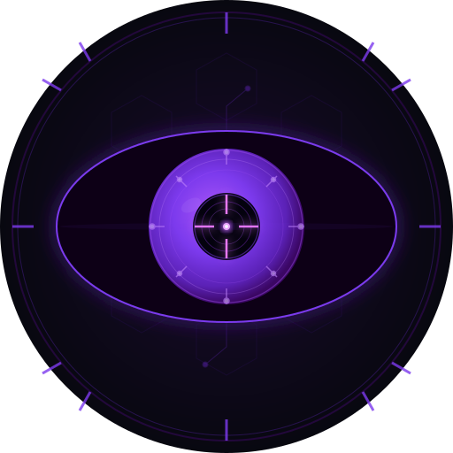

# datawatch

<p align="center"></p>

**A distributed control plane for orchestrating AI work — recursive, episodic, secure, and structured across hosts, clusters, and channels.**

[](LICENSE)
[](https://go.dev)
[](docs/setup.md)
[](CHANGELOG.md)

`datawatch` is a single-binary control plane that runs, remembers, plans, attests, and **debates** AI work — local sessions, ephemeral container workers, persistent memory, and the messaging fabric that ties them together — under one operator with one set of lifecycle, audit, and security guarantees.

It started as a daemon that bridged Signal/Telegram to AI coding sessions running in tmux. It's now a full compute abstraction layer with capability-based federation access control, multi-mode compute-node routing, a multi-server proxy surface, and full PAI-parity personal AI infrastructure — structured identity, multi-phase reasoning, rubric-based grading, and multi-persona debate — all mirrored across 7 interchangeable surfaces.

<p align="center"></p>

---

## 📱 [Android — phone, auto, and wearables unified](https://github.com/dmz006/datawatch-app)

**datawatch is now on your wrist, dashboard, and pocket.** Compose Multiplatform with full 7-surface parity across Android, Android Auto, and Wear OS — same capabilities, native to each form factor.

- **Android Auto** — hands-free voice commands via "Hey Google, ask DataWatch for status," live session/vitals monitoring on the infotainment display, quick-decision buttons, urgent push notifications. Three distraction-safe screens.
- **Wear OS** — Automata queue dashboard, **private local voice** (audio goes straight to your own server, transcribed by your own Whisper instance — no Google, no cloud STT), tile shortcuts, ambient progress, health-data cross-reference.
- **Android phone** — full session and Automata orchestration parity with desktop (REST/MCP/CLI), discussion scopes, file uploads, offline queue with auto-sync, bidirectional push replies.

> [](https://play.google.com/apps/internaltest/4701534579731858967)
>
> **We need 15 testers to unlock production release.** [Join the beta →](https://play.google.com/apps/internaltest/4701534579731858967) Feedback: open an issue in [`dmz006/datawatch-app`](https://github.com/dmz006/datawatch-app).

---

## 🎉 Community skills + plugins registry

**[`dmz006/datawatch-community`](https://github.com/dmz006/datawatch-community)** is the official hub for sharing datawatch Skills and Plugins — autonomous session patterns, multi-agent topologies, inter-agent proposal pipelines, and more, contributed by operators and installable in one command:

```bash
datawatch skills registry connect https://github.com/dmz006/datawatch-community
datawatch skills sync community
```

Browse the catalog in-app (Settings → Skills → Registry) or on GitHub. To contribute: fork, add your Skill or Plugin directory, open a PR — see [`CONTRIBUTING.md`](https://github.com/dmz006/datawatch-community/blob/main/CONTRIBUTING.md).

---

## Recent highlights

**Current: [v8.59.0](CHANGELOG.md)** (2026-10-06). Mid-way through a PWA parity adoption sweep closing the gap against the Android/iOS apps (plan: [docs/plans/2026-10-05-pwa-parity-sweep.md](docs/plans/2026-10-05-pwa-parity-sweep.md)). Phases 0–2 are complete; Phase 3's latest batch adds pause/resume for a running Automaton, Observer cards for backend health/process envelopes/quick memory capture, and an About-screen subsystem-reload control plus MCP channel/tools status cards.

- **[v8.44.0](CHANGELOG.md)** — PWA parity sweep Phase 1 complete: alert-rule firings, parent-PRD links, inline Automaton reject/revise/approve-with-note, Council badges, chat quick-reply chips, saved-command picker, and 6 GH#182 polish items (help icons, restart confirm, disconnect banner, Templates FAB, Automata config fields).
- **[v8.39.25](CHANGELOG.md)** — Security Design A3: every spawned session gets its own scoped credential (not the admin token), closing the last of the SEC-002–SEC-014 security hardening sweep (11 real findings fixed: SSRF, path traversal, prototype pollution, reflected XSS, bearer-token leakage, an origin-isolation gap in the federation-peer PWA proxy). Full writeup: [docs/plans/2026-10-03-bl394-security-findings-review.md](docs/plans/2026-10-03-bl394-security-findings-review.md).
- **[v8.39.0](CHANGELOG.md)** — Multi-provider web search registry (SearXNG + Brave, tried in priority order, closing a Bing-via-SearXNG result-degradation bug), with usage tracking, an internal result cache, and full 7-surface parity.

### v8.45.0–v8.59.0 highlights (PWA parity sweep, Phases 2–3)

- Repair-deps button, council-run markdown rendering, memory-scope browser + promote, voice-reply quick commands, "memory promote to" wizard field, watch sessions/automata, terminal search + copy, skeleton loading shimmer, mute-session notifications, splash status line + replay.
- PRD `permission_mode` editor, a persisted session Chrome-enabled badge, pause/resume for a running Automaton (new paused status + cooperative executor drain), Observer Backend Health / Envelopes / quick add-memory cards, and an About-screen subsystem reload + MCP channel/tools status cards.

See [CHANGELOG.md](CHANGELOG.md) for the complete patch-by-patch history.

### Release eras

- **v8.x** — Federation era: capability-based access control (50 capabilities, 14 built-in groups) gating every REST endpoint and MCP tool, multi-mode Compute Node routing (direct / docker-network / cross-peer proxy), channel routing, federated file service, discussion-scoped shared memory, full operational data encryption, and the Android/Wear/Auto app.
- **v7.x** — Compute abstraction era: Compute Node registry + LLM Registry with automatic failover dispatch, the Ollama Marketplace, Claude Code hooks + live status board, systematic capability enforcement across 110+ endpoints.
- **v6.x and earlier** — PAI-parity era: operator identity, Algorithm Mode's 7-phase reasoning harness, the Evals framework, Council Mode's multi-persona debate, Skill Registries, the native Secrets Manager, Tailscale mesh, and the original Signal-bridge core.

Full detail for any version: [CHANGELOG.md](CHANGELOG.md).

---

## Why a control plane and not a bot

The same profile that drives a chat-spawned session can drive a Kubernetes-deployed worker in a remote cluster, a child agent of an existing worker, a scheduled cron job, a webhook reaction, or a cross-host fan-out — and the operator only ever interacts with one surface: the daemon's REST API. **Every feature is mirrored verbatim across 7 surfaces:** REST, MCP, CLI, Comm channels (Signal/Telegram/Matrix/Slack/Discord/etc.), PWA, mobile (Compose Multiplatform), and YAML on disk.

That uniformity is the whole point. Read once, write once, audit once.

---

## What it does

➡ **[docs/architecture-overview.md](docs/architecture-overview.md)** has the one-screen Mermaid map of every interface, subsystem, and data path. The summary below is intentionally short — each area links to its full howto.

### Orchestration & autonomy

The **Automata PRD-DAG orchestrator** decomposes a goal into a dependency graph of stories and tasks, executes them with quality gates and git-diff-grounded verification, and supports guardrails, rubric-based grading, and structural mid-run editing. **Algorithm Mode** is PAI's 7-phase structured-thinking harness (Observe → Orient → Decide → Act → Measure → Learn → Improve) as a per-session state machine. **Council Mode** runs multi-persona structured debate — 6 default personas, each able to use its own LLM backend — with real-time SSE streaming. The **Evals framework** replaces binary pass/fail verification with rubric-based grading.
→ [docs/api/autonomous.md](docs/api/autonomous.md) · [docs/api/orchestrator.md](docs/api/orchestrator.md)

### Compute & LLM routing

Register any host, GPU box, Kubernetes cluster, or remote datawatch peer as a **Compute Node** with declared capacity, RBAC, and scheduling priority. The **LLM Registry** maps named LLM entries to an ordered failover list of nodes; every consumer (sessions, Council, Automata, `/api/ask`) routes through one dispatcher. Three routing modes — direct, docker-managed, or proxied through another datawatch peer. The **Ollama Marketplace** is a browseable, hardware-fit-checked model catalog shipped embedded in the daemon.
→ [docs/howto/compute-nodes.md](docs/howto/compute-nodes.md) · [docs/howto/llm-registry.md](docs/howto/llm-registry.md) · [docs/howto/ollama-marketplace.md](docs/howto/ollama-marketplace.md)

### Memory & intelligence

Vector-indexed episodic memory (SQLite or PostgreSQL+pgvector) with a 5-scope hierarchy — persona-global, persona-in-project, project-shared, session-local, and federated **discussion scopes** shared across peers via an append-only WAL. A temporal knowledge graph with validity-windowed triples, a 6-axis spatial "memory palace" schema, and a 4-layer wake-up stack that auto-injects operator identity and relevant context into every spawned session.
→ [docs/memory.md](docs/memory.md) · [docs/howto/discussion-scopes.md](docs/howto/discussion-scopes.md)

### Federation & multi-instance

**Capability-based access control** — 50 capabilities, 14 built-in groups — gates every REST endpoint and MCP tool for federated peers; no admin-or-nothing. Peers can proxy inference, aggregate sessions, route inbound channel messages to specific peers, and share a federated file service. A remote peer's own PWA can be viewed inline from your dashboard, served from an isolated origin so a compromised peer can never read your session's credentials.
→ [docs/howto/channel-routing.md](docs/howto/channel-routing.md) · [docs/howto/file-service.md](docs/howto/file-service.md)

### Security

Full operational data encryption at rest (XChaCha20-Poly1305) covering config, memory, logs, and every JSON store. A centralized native secrets manager (plus optional KeePass/1Password/Vault backends) with `${secret:name}` references everywhere a credential is needed. Bearer token auth, dual-port TLS, full audit logging, and — as of the current release — a fully reviewed and hardened CodeQL/Dependabot posture.
→ [docs/encryption.md](docs/encryption.md) · [docs/plans/2026-10-03-bl394-security-findings-review.md](docs/plans/2026-10-03-bl394-security-findings-review.md)

### Interfaces & extensibility

A manifest-driven **plugin framework** (hot-reload, declared comm verbs / CLI subcommands / MCP tools / mobile cards) and **Skill Registries** synced from git, including the community hub. **Docs-as-MCP-Interface** makes 22 curated howtos searchable and executable through MCP with a hybrid vector+BM25 index. Claude Code hooks auto-install at session spawn and drive a live status board. An MCP server exposes 60+ tools to Cursor, Claude Desktop, and VS Code.
→ [docs/skills.md](docs/skills.md) · [docs/mcp.md](docs/mcp.md) · [docs/howto/claude-hooks.md](docs/howto/claude-hooks.md) · [docs/howto/docs-as-mcp.md](docs/howto/docs-as-mcp.md)

### Also included

Multi-channel messaging (Signal, Telegram, Discord, Slack, Matrix, Twilio, webhooks, DNS, voice via Whisper) · pluggable LLM backends (claude-code, aider, goose, gemini, opencode, ollama, openwebui, shell) · Docker/Kubernetes container workers with PQC bootstrap · auto rate-limit recovery · eBPF per-process network monitoring + Prometheus `/metrics` · Tailscale mesh for the PWA and agent pods.

See the [Documentation index](#documentation-index) below for everything else.

---

## Installation

### Linux (one-liner)

```bash
curl -fsSL https://raw.githubusercontent.com/dmz006/datawatch/main/install/install.sh | bash
```

Installs to `~/.local/bin` for non-root users, `/usr/local/bin` for root. Includes systemd service.

### From source

```bash
git clone https://github.com/dmz006/datawatch
cd datawatch
go build -o bin/datawatch ./cmd/datawatch
sudo mv bin/datawatch /usr/local/bin/
```

### Update an existing install

```bash
datawatch update && datawatch restart
```

Update is version-string aware. Tmux sessions survive daemon restarts.

---

## Quick start

```bash
# 1. Initialize configuration
datawatch config init

# 2. Set up a messaging backend (choose one)
datawatch setup telegram    # Telegram bot
datawatch setup discord     # Discord bot
datawatch setup slack       # Slack app
datawatch setup signal      # Signal (requires signal-cli + Java)
datawatch setup web         # Web UI only (no messaging backend needed)

# 3. Start the daemon
datawatch start

# 4. Configure your operator identity
datawatch identity configure
# or open the PWA and click the 🤖 robot icon in the header

# 5. Review auto-migrated LLM entries and add your hardware
datawatch llm list
datawatch compute node list

# 6. Pull a model and start chatting
datawatch compute pull-model datawatch-ollama llama3.1:8b
datawatch sessions start --llm ollama --model llama3.1:8b --task "Hello"

# 7. Verify
datawatch version
curl -ks https://localhost:8443/api/health
```

Send `help` in the configured channel to see the command reference, or see [docs/howto/chat-and-llm-quickstart.md](docs/howto/chat-and-llm-quickstart.md) for the fastest path from daemon to chatting.

---

## Surface quick reference

Every datawatch feature is reachable from all of these surfaces:

| Surface | Example |
|---|---|
| REST | `curl https://localhost:8443/api/llms` |
| MCP | `llm_list` / `compute_node_list` (via Claude Code / Cursor / VS Code) |
| CLI | `datawatch llm list` / `datawatch compute node list` |
| Comm | `llm list` / `compute node list` (sent in Signal / Telegram / Matrix / etc.) |
| PWA | Settings → Compute → LLM Configuration / Compute Nodes |
| Mobile | Mirrored via Compose Multiplatform app (`dmz006/datawatch-app`) |
| YAML | `~/.datawatch/datawatch.yaml` `compute:` + `llm:` blocks |

The mobile parity rule: every operator-visible PWA change files an issue against `dmz006/datawatch-app` so the Compose pipeline mirrors it.

See [docs/commands.md](docs/commands.md) for the full command reference.

---

## Architecture

➡ **[docs/architecture-overview.md](docs/architecture-overview.md)** — one-screen Mermaid diagram of every interface, subsystem, and data path, with planned features called out.

For deeper drill-downs: [docs/architecture.md](docs/architecture.md) (package list, component diagram, session state machine) · [docs/data-flow.md](docs/data-flow.md) (per-feature sequence diagrams) · [docs/plans/README.md](docs/plans/README.md) (open and planned features tracker).

---

## Documentation index

Full documentation lives in [docs/](docs/) — see [docs/README.md](docs/README.md) for a complete index with all flow diagrams.

| Area | Start here |
|---|---|
| Getting started | [docs/setup.md](docs/setup.md) · [docs/commands.md](docs/commands.md) · [docs/pwa-setup.md](docs/pwa-setup.md) |
| Compute + LLM | [docs/howto/compute-nodes.md](docs/howto/compute-nodes.md) · [docs/howto/llm-registry.md](docs/howto/llm-registry.md) · [docs/howto/ollama-marketplace.md](docs/howto/ollama-marketplace.md) |
| Sessions + hooks | [docs/howto/sessions-deep-dive.md](docs/howto/sessions-deep-dive.md) · [docs/howto/claude-hooks.md](docs/howto/claude-hooks.md) |
| Backends | [docs/llm-backends.md](docs/llm-backends.md) · [docs/messaging-backends.md](docs/messaging-backends.md) |
| Interfaces | [docs/mcp.md](docs/mcp.md) · [docs/howto/mcp-tools.md](docs/howto/mcp-tools.md) · [docs/howto/docs-as-mcp.md](docs/howto/docs-as-mcp.md) · [internal/server/web/openapi.yaml](internal/server/web/openapi.yaml) |
| Autonomous + plugins | [docs/api/autonomous.md](docs/api/autonomous.md) · [docs/api/orchestrator.md](docs/api/orchestrator.md) · [docs/api/plugins.md](docs/api/plugins.md) · [docs/skills.md](docs/skills.md) |
| Comms + federation | [docs/howto/channel-routing.md](docs/howto/channel-routing.md) · [docs/howto/file-service.md](docs/howto/file-service.md) · [docs/howto/discussion-scopes.md](docs/howto/discussion-scopes.md) · [docs/howto/comm-channels.md](docs/howto/comm-channels.md) |
| Memory & intelligence | [docs/memory.md](docs/memory.md) · [docs/memory-usage-guide.md](docs/memory-usage-guide.md) |
| Operations & security | [docs/operations.md](docs/operations.md) · [docs/config-reference.yaml](docs/config-reference.yaml) · [docs/encryption.md](docs/encryption.md) · [docs/multi-session.md](docs/multi-session.md) · [docs/uninstall.md](docs/uninstall.md) |
| Community | [`dmz006/datawatch-community`](https://github.com/dmz006/datawatch-community) |
| Source attribution | [docs/plan-attribution.md](docs/plan-attribution.md) |

---

## Prerequisites

| Dependency | Version | Notes |
|---|---|---|
| [signal-cli](https://github.com/AsamK/signal-cli) | ≥ 0.13 | Optional — Signal protocol bridge |
| Java | ≥ 17 | Optional — required by signal-cli |
| [tmux](https://github.com/tmux/tmux) | Any recent | Session management |
| [ollama](https://ollama.com) | Any recent | Optional — local LLM inference |
| [claude CLI](https://docs.anthropic.com/en/docs/claude-code) | Latest | Optional — claude-code backend |
| [Tailscale](https://tailscale.com) | Any | Optional — for PWA + mesh |
| Go | 1.24+ | Only required for building from source |

---

## License

Polyform Noncommercial 1.0.0. See [LICENSE](LICENSE).

Commercial licensing inquiries: open an issue.

---

## Acknowledgements

Special thanks to **[Daniel Keys Moran](https://en.wikipedia.org/wiki/Daniel_Keys_Moran)** and his novel
**[The Long Run](https://www.amazon.com/Long-Run-Daniel-Keys-Moran/dp/1939888336)** — the story of Trent
the Uncatchable, a thief and hacker operating under the eye of an all-seeing AI surveillance network, sparked a
decades-long obsession with the intersection of technology, autonomy, and the systems that watch over us.
That spirit lives somewhere in this project.

> *"The DataWatch sees everything."*

If you haven't read it: [buy it on Amazon](https://www.amazon.com/Long-Run-Daniel-Keys-Moran/dp/1939888336)
(Kindle edition also available), or borrow it from the
[Internet Archive](https://archive.org/details/longruntaleofcon0000mora).
Daniel has also historically offered copies by email request via his
[blog](https://danielkeysmoran.blogspot.com).

### Additional Acknowledgements

Datawatch's design also borrows heavily from three projects, with full attribution in [docs/plan-attribution.md](docs/plan-attribution.md):

- **[HackingDave/nightwire](https://github.com/HackingDave/nightwire)** — Signal-driven AI coding bot. Episodic memory + Signal-as-control-plane shape.
- **[milla-jovovich/mempalace](https://github.com/milla-jovovich/mempalace)** — Memory palace metaphor, 4-layer wake-up stack, full 6-axis spatial schema, conversation mining, repair self-check.
- **[danielmiessler/Personal_AI_Infrastructure (PAI)](https://github.com/danielmiessler/Personal_AI_Infrastructure)** — Identity / Telos, Algorithm Mode 7-phase, Skills, Evals, Council, ISA generalization.

---

## Contributing

Issues + PRs welcome. Read [AGENT.md](AGENT.md) for the operating rules — every commit follows the documented Pre-Execution / Versioning / Documentation / Mobile-Parity / Secrets-Store rules.
