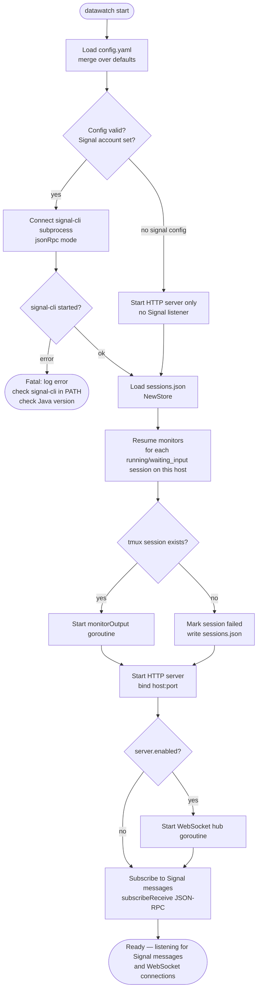
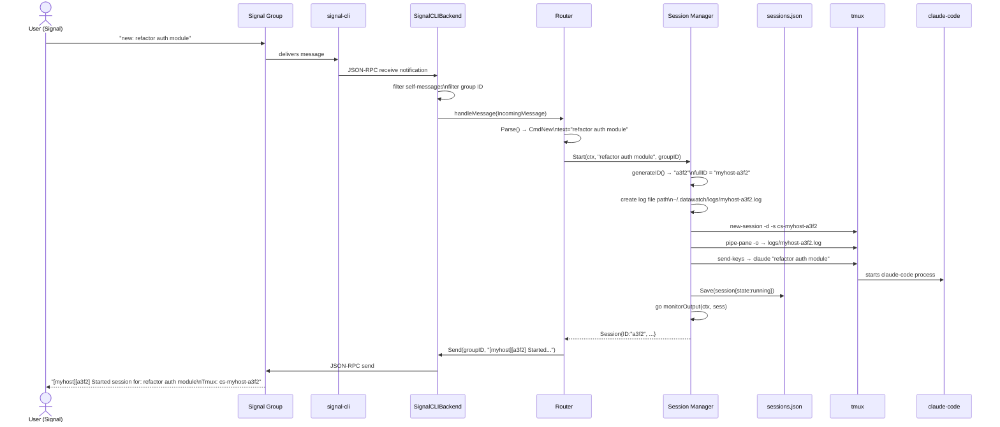
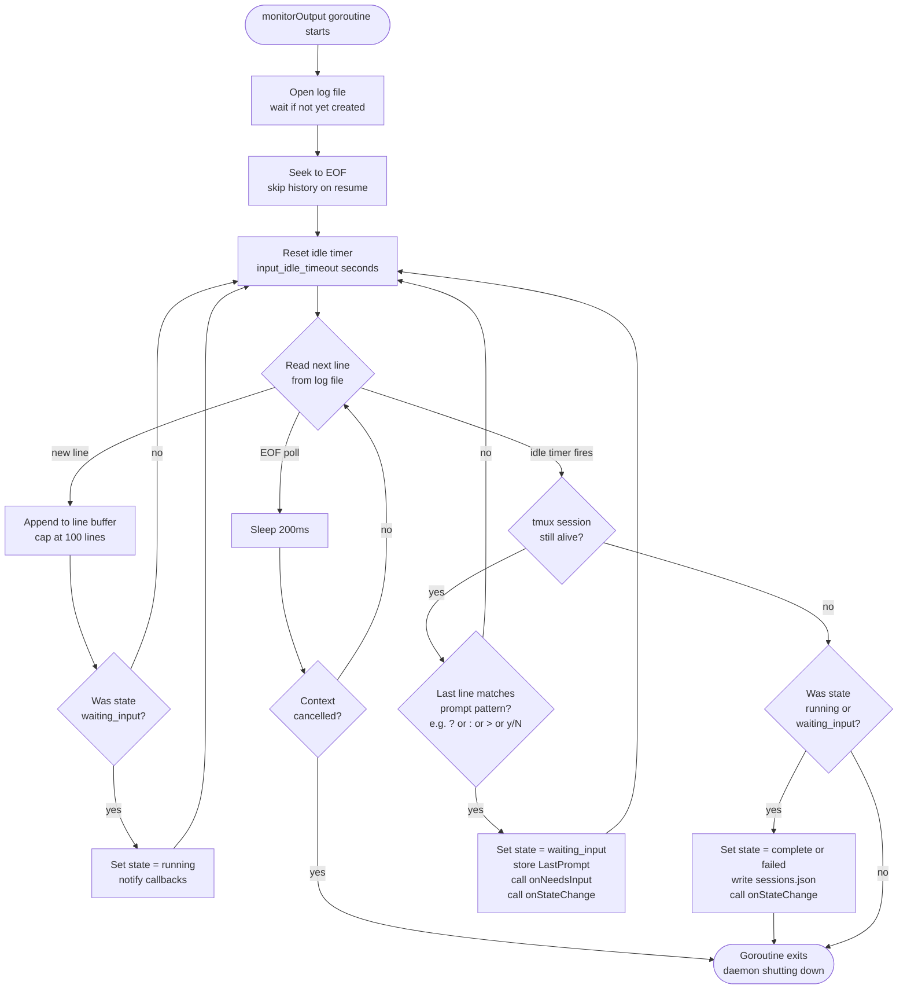
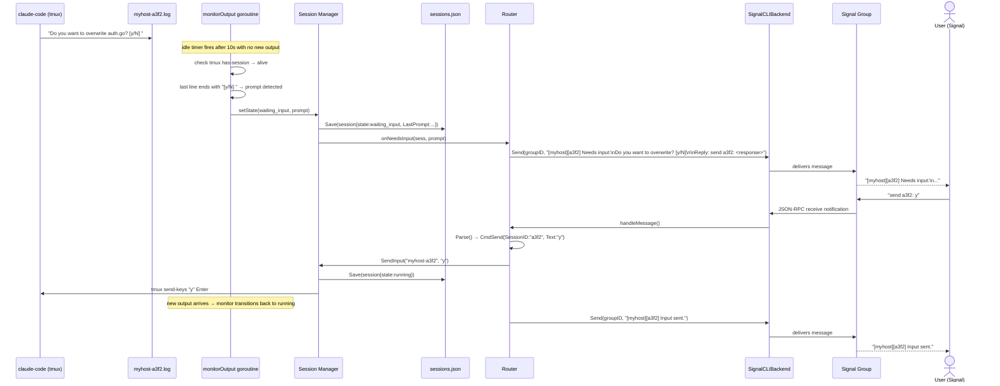
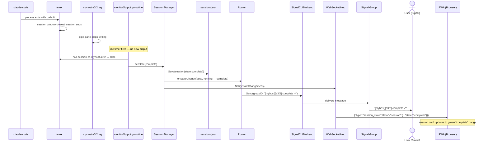
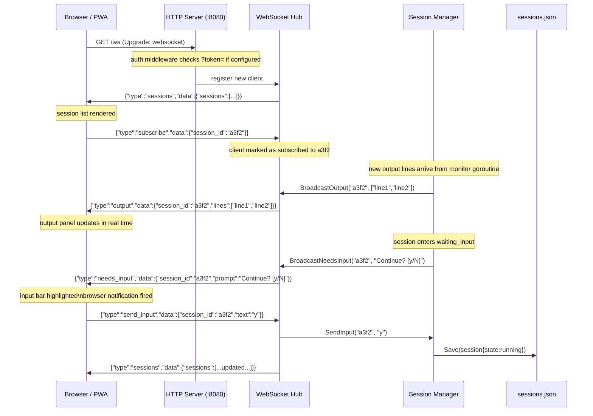
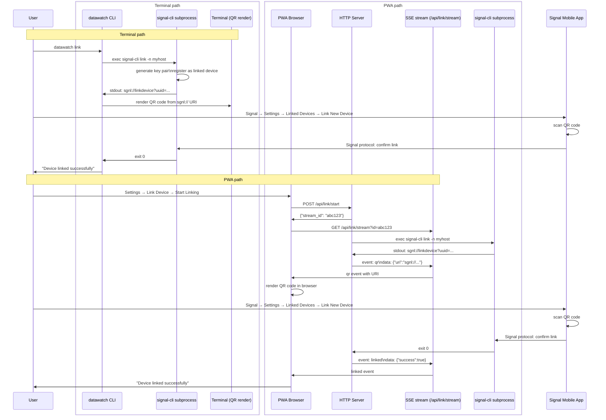
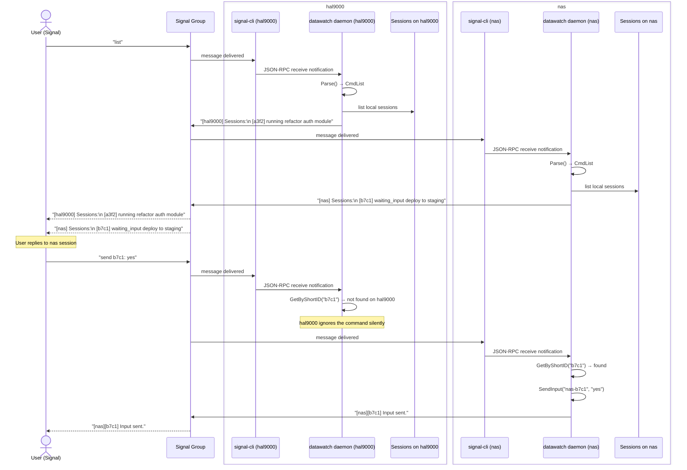

# Application Flow — datawatch

Mermaid diagrams for all major flows through the system.

---

## 1. Daemon Startup Flow

🔍 <a href="https://mermaid.live/view#pako:eNplVEtv4jAQ_iujnFqpdB_aE4etWmiX0hYoQdpDQCvHGYIXx0Z-QBHqf9-JndCsygUN_l4zY3NKuC4w6SdrqQ98w4yDxXCpgD63F1nBHDswxzdgHR2tLqHX-wl32bNmBXCt1qK8PrJKLpeqQlMi6D0aKHDNvHR2FXXuAmlwGgQ87JkUxQ0xUlEqJoFxrr1yYNHdvEfGgBigNNiIiEZBZZildRAYLRYzYpjaTit5JDnCN4pSWIcKzaqjdkQbBO4ziqGQu0a8x6UA6_Od0RytJZ2_Vqv5jkNFc2kU7gP14dSl1DGwaBM_1B5ojDYB-usie6DRyT5IXcbfSZlvkG-7vkLB7HYxOh-N2Z4BtWSFVqvLjrLeBtlRHLyloISw13VUIk_wkDpt2rTDiI3FKBSP2Rytr5CaUoKgdZ9ryoqMVmu8UkKVXw5MOPr-I9TOu9aEpgtuIyxstHWNwWPQHJ9c5d_OOHyjqdt2HuPuzJ-apTXmU-9qg1Ib7cmwjT1ull4znrMXZrZn7TUTEgvKfDDC4f_9N-ynwHv5fD2IlQtVhPz9nTZtE8-REIuXUExOkXKNiuXyY7mTbjPTxuI35qnmW3Sw8fmnZiadZmZZ6nPLjcgR3PmSVtQEK7HehG2P58hR7BHG6XTSm88Gjdg0ysRiForXC9ooK46w9N-_fvvRXHnaHtRr_WzBaAIfiXl8AvUMV5fJVUJvt2KioH-B0zuVfkfvHu-LellJf82kxauEeafTo-JJ3xmPLWgoWGlY1aDe_wFNhG3-">View this diagram fullscreen (zoom &amp; pan)</a>

---

## 2. New Session Flow

🔍 <a href="https://mermaid.live/view#pako:eNqNVctu2zAQ_BWCJwcwHTQ9VUB6SFwUKpoH4vYU5UCQK5mNRKp85AHD_fYuRSpx5TioL3rNDLmzs_SGCiOBFtTB7wBawFLxxvKu0gR_XHhjyU8HlnCXrrOVajRvjxKg59YroXquPflqTegjLiHS8z7s_HsZQW4AMdGqfciZVbKBVymknHFxD1ruY29M8Gl76W4fccE1bxJkBc4po8dX-9gV1jss7BLSLX45o_dxP7rwFGEer2-U2PIgBxkx3LHocZVloovs8-fBnYJUVMNjQSzUyWse_Jp0RoYWKpoIAxIZ6EJBJLTqAawjHW4Qa0gQ_ISAZFtBvq2uLtnN9TmqCkA00carWgnu1VhLgu5watVGGx20NcvSrqp0ft0MrS2XE3JyvCBrrmULF4k2K7UwndJNfs5JSdgd0jW3DmZHpAonHz6dkPNOXsIjLunhyZ9W9D1HXrRyHwvsG9o_E_5pTg5R56mKcpk3lLm7Kg1osNxDuXzdV0X5x_oEV0YzQtuWS3KK77rntXGe5U-H9IQFVCOtaaK_gBnxa9T5c7yQ3PNH7sX6GD-64x25Bb6YCsa0FQSDwnIsCZOEYboc293Im6xe9cAwlUCYGWv6_zUdzhy7h2c3UlOgyfv9idwY2AGLIrE5_8wC6a0RWMp00WH8sJv8AWa51A2yPRQ2aI2Z2r7TPIO70AoVroLvQ05DVJlwdjKYz4NNuSzGPs_JYrHYTnI2TskK7ZjlGMWk3SYT724j9y6lECQKVPRoMit53l9m072cZmm-ERJPhuKg6ngkkdrYAwdGpVPXJrmgdE47sB1XEg_6zRYfQ48JhC8y2kWLmrcO5hSlzOpZC1p4G2AE5T-EjNr-BRTEGmE">View this diagram fullscreen (zoom &amp; pan)</a>

---

## 3. Output Monitor Flow

🔍 <a href="https://mermaid.live/view#pako:eNp1VF1P4zAQ_CurPIEEXO8eKx0I2vJNi-hJ9xCqysSb1IdjR_bmShXx32_tJJDqRB-iZj2zMztepUkyKzEZJ7m222wjHMGv6bMB_p0fpKU1iqxb1FTVBIV1tiZlEDwx0K8O4fj4FC7SRYUGtC0gVxqfn81WKAKVg7EEOyTIHApCuWr7XkTWJF0ivgJZmC0umeNfVQUb5VluB9aAQ1-X2FEmkTJNn9BzOyU1AqkSHfOUYWvrUFqHEhsEj5k10nfcaeTOmicUEgy-EWgegZm5s-WH6_cWPGMwg7YRE4mX6XnF48ngNBZf6jyPypmoQBB8H43iQa93GWlXzW_hQ07UB6JMsY5mzzqtq6C1Qx_x1xwHtXj4Ca42PFjBTI5Q5TvIhNYvInvtRSLX2DaWtnQ9fIlzcLBQWa3jwU261IgV_BiNyr7LTTy5bSbWEAcTZzIZao2yN3k7NHl3kF597AC-KfJMkQJ5TcBvagozgrRbszocsDubs4Gzzxvk8F3X_b6hsn7j2_NeWRNWghSbF1r9xd7O_aDhw17EXWRg3Vd5PwxHme_lndmy0sh_LRsSvA4yNHGKK50df_LHR1PhJng_l4E52QhT9Ds6byMaaHU-7wbWe_lFcy98u4lQCso2GKKseCMrgkoQoTNnXMGT4gTOgq1xeJyGx-7bvJto8f8WLIYqj3tD7oUS47UOIfh4jLqfw80Rpb_pYF8O_NjqJkcJ32MplOSvSPPOr3UlGTuT4dORjHOhPR4loia73JksGZOrsQdNlSicKDvU-z-Blnsi">View this diagram fullscreen (zoom &amp; pan)</a>

---

## 4. Input Required Flow

🔍 <a href="https://mermaid.live/view#pako:eNqtVWFv0zAQ_SsnfypSG9j4hIWGtHZCRVs3LfBpmZBJrqlZYgfbWamq_nfOdtKOZhMCUVVq0rx7fn73ztmyXBfIOLP4o0WV40yK0og6U0CfRhgnc9kI5WBaibZAEBbycDXxhTBydfvz1RB9qUsPrTcrbd1EvF2eJpUuh7grraTTJmDj5XXrmtZBqY1unVT4TI1QosRQk6K1Uqv-ryE2JcYg2kakTb5brYa4W1osUsarIeLcyKIMVKkslaiml_NzkT-gKobYj6S9OUDjfYSJ3G_3i42Lhd9RRJGLERKdnpydkYkcMjbTsNEtrD2z06Af0ayNdKSldauk1B_gbvN6cU_IWL_Q9Myjenc5yKJCcLKm_5bSoAWx9Ns9eWNhLd0KlAaFa9DB-8jS1ZKMPUu-wvwBfMdhJeyksxSy9vTk3SmISj7ii7WVsA4q6ieQY92qGeuF9xyN0XXjoECHucNiwBbbzKmbLnXC4WgtJIWk_CoVCR939V0eOzTVhRRwSMUjjjrVW-vr-VH9Jam8CRw8SZLdgCiGg4NWC8TCzn1VYDxaOuKoIKaGlqZdj0ofg_ls7DceJ-P-zo_GPQQ2CCJ4lqmXOt51mhD0vcWm2ngrVAGehcN76mxDGcezjHVC4vokJESQk7O-S4amjUTTpiIqPJwQyueR_1EeWeOzFmt9yYE_Y0_0bPpERv6DG5_S68Xk9mYKBnMkPZQ_J5cyF072w7kX3lu-EopCfBVlj4597lE3wlh62udpWhfe-W13TsxnPGNeW8bG8Bl_0m4Yidwdke1j5mtjjzP25Cjz1aHwL4JmWqUoaMNIxWnncay8eZMH3NjIDxdqfxY9M9WHkQVhDPlo-313Zyk4I5SV3lUL34QfXg2dkn8LanDDy3TJf87Yb8xszOisqoUs6NW03dFt2xRk40Xht8X4UlQWx4wOQJ1uVM64My32oO4V1qF2vwC3A1sO">View this diagram fullscreen (zoom &amp; pan)</a>

---

## 5. Session Complete Flow

🔍 <a href="https://mermaid.live/view#pako:eNqNlG9v0zAQxr_Kya-K1FRrh4Twi0m0QzBpA0SG9mKZkJtcU0NqB9tZV1X57pz_pEwLSPRFE9u_5-5897RHVuoKGWcWf3WoSryUojZiVyigTyuMk6VshXKwakRXIQgLZXjLvHCM3e66Jw85eo5Pr3XtD3eHrbYuE-ebxazR9Zi70Uo6bQIbXz93ru0c1Nrozkn1l8w3QokagyZHa6VWw9aYzSliuIuNpJ39sFqNua-ULIaMb2NiaWRVh1C5rJVoVtdXS1H-RFWN2Y_d2oN3uM41IWFjTH2gG7Z_AsZ1xETpm_LNxpLCcxKpV-M4X-7eeco_Jkuj90QTFbk4zOziwo-LQ2t0SY0AfJLOwl66LfjpwlmkPXRiU8eIUpXekxk07RSFGvbp5jbKaNikom9KIFvMqCoE63RLKYykIabBf9IOQT_SZdLYOciqQXByR3sbadBC0S3O5q9BaVC4Bx3MENVJc6pvK2w21FLa7JnVfJD52wVsRGPxpThZxd_P5U44nJR61zboMLU2AYQG83DIxSNOUqaj9RI-SPqRJtqHg1Yh-GorVB3VUzCdUtSMobx_5iW3cN8suTm8DJLYmIXQ6EqqkaYxqb2Bri6nULD72I6He9-Ph1Mqn_rN_LxgKU6UU5zgPQ4VNpLmQz9GykXVRCocZkR5I_L_iB5ldA3SkC05HAvmDi0WjBcsdfJ76GTBpgWrhBN0dDyd-cVsNqN1ZEg15ChY3_cv7RRynLwgTAVdS0HJTk5DbRAVPI8Aa0G3ZlNGttsJWdG_4rGnZRS9r7xTGA_umTLROZ0fVMm4Mx0OUPr3TFT_G0F02SA">View this diagram fullscreen (zoom &amp; pan)</a>

---

## 6. PWA WebSocket Flow

🔍 <a href="https://mermaid.live/view#pako:eNqtVV1r2zAU_SsXPaWQpd32Ugxr2UfZ9rCukI4-1KXI1rWjxZY8SW4WQv77rj6crnVJO1ggxLk-uufcc2R5w0otkGXM4q8eVYmfJK8Nb3MF9Om4cbKUHVcOPhi9smiA293lIVxcvR8jv1xeXnhY-J2juSPoJDs-Oj46eALcFx57hcVcl0sMhTHqG1e8juRztFZqNZTG2LnTBj3SRqSd_bRa5Soik_ZXJydeXgafzy7hcGVh8qOjuQVmsMLCBilJ7bl2CNoPEVfw3i2glUI0uOLEVC6wXFo4dXqJ6h3ICkqtKln3BkXs4Nd5wr7IwGAtraNmCldQNhKVS6C-IEySl8EmZ27dYc6ynA2D5GyaM8Edp-rm73J2PZvNbrbbx4J33RIUGuImCUpgEDeyxCt8wNwXtjSywKepb6UIMP62epOzMX_oF4eElpslipDL0FSA0xDWqscrU7pZsEn3rusdiVdogRsj7xAqo1totZKUNtTaEIZuxzZp8TAQzcdFya37HvpMBr1TuM6Zb_o6TOevqHpz8GweUc9LLEltQ0RPce2JLA1NWxob6DsiouGlovR4A062uMe0IW7yHY2FFZdkTn0rlZe916JzRGG_qoc25eyjVtShx1O4Xh-e3-TseZOU75QoX-ZUR5F2LtRGfHuMChRQcAMLWS8a-jra27kq0imltJOVLLnzjlTyhRufnpF_Eu_wd5S-vhcb3dmlMqeeY2vXOzPvMwlHGC3gdzhJhBvraAdkpleKotwe_KdDI24sEY8PNmUtmpZLQS-Ejf8bb58J_5SxrOKNxSmjA1DP16pkmTM9DqD04kio7R8T-ibf">View this diagram fullscreen (zoom &amp; pan)</a>

---

## 7. QR Linking Flow

Two paths for linking a Signal device.

🔍 <a href="https://mermaid.live/view#pako:eNrNVdFO2zAU_RUrTyBROrqnRRqoG2hDYoyRIl4iTa5zm1okdrCdlgr137m249aFMOBtfXFjn3t9zsm57WPCZAFJmmi4b0EwOOW0VLTOBcFPQ5XhjDdUGHKjQRGq3ZoLfz6VD2QCquaCVgg2c7_9vPT7xbmtLKihS2rY3G70IzNeYqsOr93DgFWc6HbaKMlA6_66DQks23zf-3NNFIgC1L6vwu8x86vb8T9I21PsZpdvSi6d6j7cz8nkygLdmoFavAbMsjOLs4s2CmhN9oa04cOKi7uh39l_w5XRG7ZEAnekzKUAd7crJb_klFdAxk0T0JfSAJFI3b3eg2Bh2vd2LWJwfIx00uiVWhX-HA_weMM5JfAALGZtoWQgSL2aS2180Qa-W1qCAEWR2x2skAJXeS4UlFwbH0bbCgpSwIIzeNnJ9dCmkK3BtRRVOnR2e_xJ2_Li6-HhYcx7K91Hh2CI7IiQmZJ16EFurs93zHAOp8HfvB0dfRlhGIzhotTh-cKTPXWX7-ySS1h2-76t67ftqxkVgcguIPKquxwDYSSTKIBJMeOqjl7NC2_ggRvyKdZvBaUkTzybYLBumU3ZrK2qVZ68khpMdvpsqII9t-O0145O9MYxg6l1BwjshN6OsYEdLuz9O5uQeGYQ7VH2PNzzmCd-mv7yIk-sFjplR6PPebKOWzq2P852G9qyEwxFVxH33g7hBxM92vB_bxLDjZYhLEBgyb1Nvp02p69VHJWhTt_IFgZxWBSMuFe-miy5mW8j6-U7xLOIc0Gm8U_dfxPu0cfSvXU8znePqz7dsbNd0NFdo1p46Wk3D64-tvM9Y5McJDX-ulBe4P_t4xof2wYvhrOCG6mSdEYrDQcJbY3MVoJ5CgHU_S93qPUTYMuAHg">View this diagram fullscreen (zoom &amp; pan)</a>

---

## 8. Multi-Machine Message Flow

Two hosts (`hal9000` and `nas`) both connected to the same Signal group.

🔍 <a href="https://mermaid.live/view#pako:eNrFVdFq2zAU_ZWLnhJIRpo9jPqh0KWjyyhemdlTHYoq3zgCW_IkeV0o_fddWY6bek7CoNC8OLbOuT733CP5iQmdIYuYxV81KoFXkueGl6kC-nHhtIGfFg1wG66jROaKF-MAqLhxUsiKKwfXRteVxwVEuE9VAD7oP7DhxflsNgsP-uzFzfL-q2fbhj0VhYRRyxgPUy5zVC6QMu74I3diQ_-w1OoUNUFrpVY2sHd3QMRXIlFl-w0obg-Lj_viCX1UeDws_DCtEx33RXfC9gT7aU0vLpopRJCyQlqXst1q85iWG9sjKKkYzxEyLORvNJgFVLNKqNbpCL4l3-Ppj9sFGBRISFDaybUU3JGUwGmx-6xbbiyOxpDW87PzOSzK7MaL6cFfZhKBFwuFFhQj2z7uw7vG7tqRrTpLotSD7_jH9XwFplZKqhxI8jrkmdduA6XO6gKHDYmPGhJ3rcX_Ycgr1mlD4n1D4pOGxK8MoTj8Y8bDJ3G2gkcuHZlxL1VVO6DuqkJvwWmwjue00PeDyvocvYXNw0XfQmqsHYKmKUEo25xThvASrScovzHDK4a3hqVtA_6tEWzRvtMmuUb3eZtstHHLq1HKvJyUdRGhErDWNensn1Ev3Xel2nWgw0gb78EGQeiy5ES3siBUsX2X3B_vsenvIDehIS19FohIE50G8oTG18xsfHw7tKFqClAYlPtwPJNDeDZhJZqSy4y-l0_PdFtXdH7jl0xS3lm05oXFCaPc62SrBIucqXEHar-rLer5L7pxcds">View this diagram fullscreen (zoom &amp; pan)</a>
