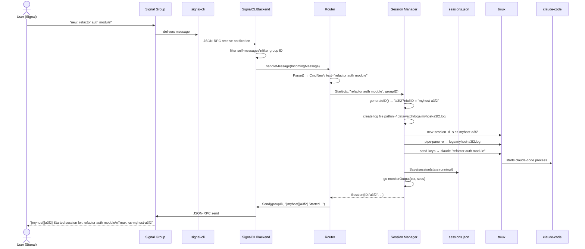
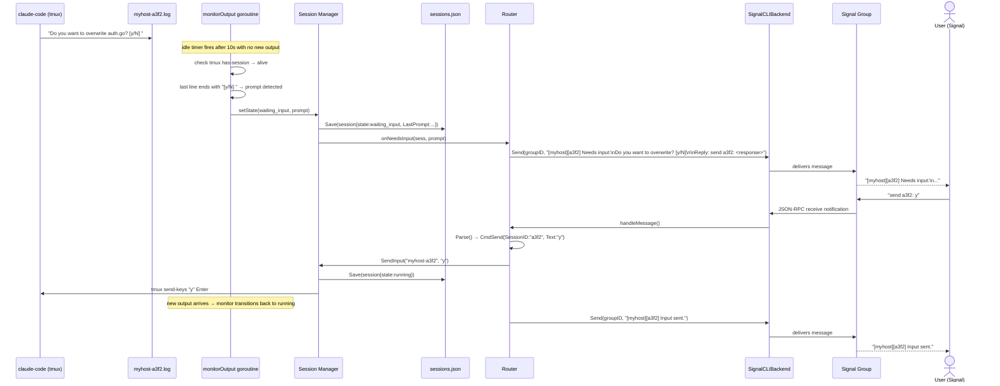
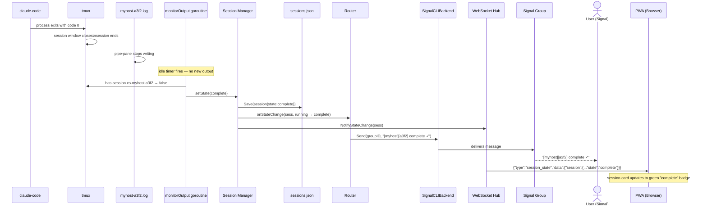
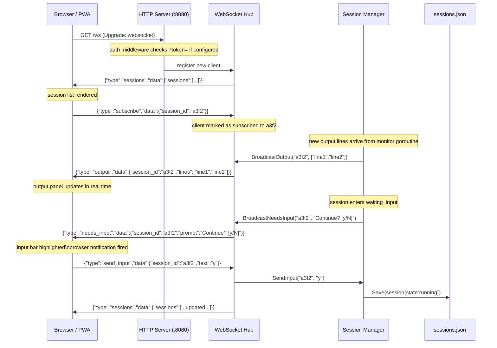
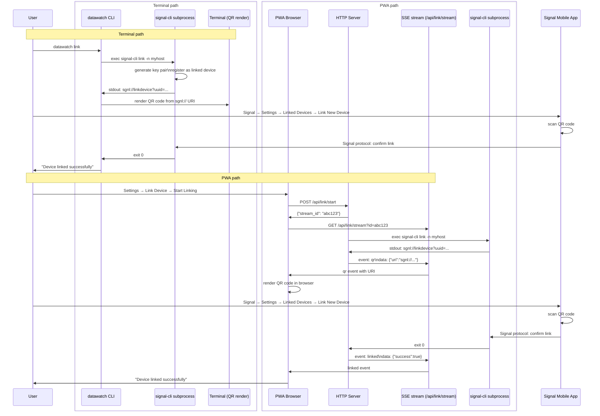
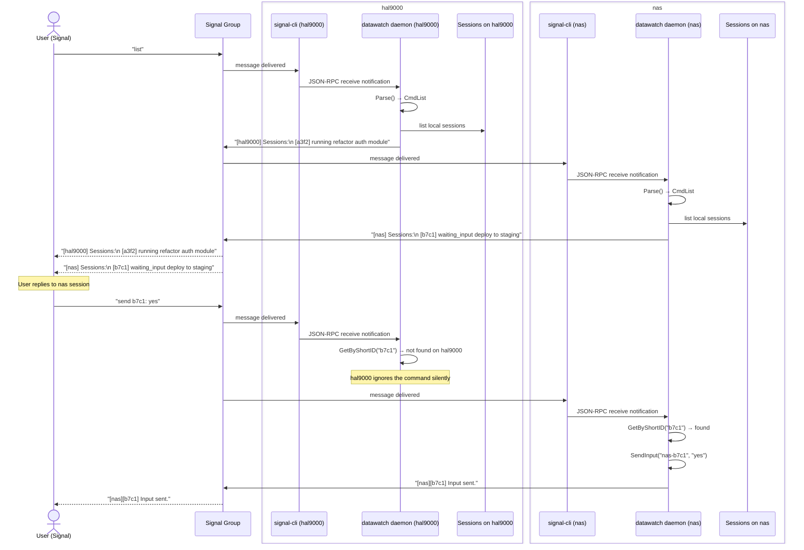

# Application Flow — datawatch

Mermaid diagrams for all major flows through the system.

---

## 1. Daemon Startup Flow


---

## 2. New Session Flow



---

## 3. Output Monitor Flow

```mermaid
flowchart TD
    A([monitorOutput goroutine starts]) --> B[Open log file\nwait if not yet created]
    B --> C[Seek to EOF\nskip history on resume]
    C --> D[Reset idle timer\ninput_idle_timeout seconds]
    D --> E{Read next line\nfrom log file}
    E -- new line --> F[Append to line buffer\ncap at 100 lines]
    F --> G{Was state\nwaiting_input?}
    G -- yes --> H[Set state = running\nnotify callbacks]
    G -- no --> D
    H --> D
    E -- EOF poll --> I[Sleep 200ms]
    I --> J{Context\ncancelled?}
    J -- yes --> K([Goroutine exits\ndaemon shutting down])
    J -- no --> E
    E -- idle timer fires --> L{tmux session\nstill alive?}
    L -- no --> M{Was state\nrunning or\nwaiting_input?}
    M -- yes --> N[Set state = complete or failed\nwrite sessions.json\ncall onStateChange]
    N --> K
    M -- no --> K
    L -- yes --> O{Last line matches\nprompt pattern?\n? [ : > [y/N]}
    O -- no --> D
    O -- yes --> P[Set state = waiting_input\nstore LastPrompt\ncall onNeedsInput\ncall onStateChange]
    P --> D
```

---

## 4. Input Required Flow



---

## 5. Session Complete Flow



---

## 6. PWA WebSocket Flow



---

## 7. QR Linking Flow

Two paths for linking a Signal device.



---

## 8. Multi-Machine Message Flow

Two hosts (`hal9000` and `nas`) both connected to the same Signal group.


