# Architecture Overview

Top-level map of every interface, subsystem, and data path in datawatch.

This page is the canonical "one-screen" view that the [README](../README.md) used to ship
inline. It is split out so it can grow as new interfaces (mobile push, generic voice API,
federation fan-out, ephemeral container agents, …) are added without bloating the README.

For deep dives, see:

- [docs/architecture.md](architecture.md) — package list, component diagram, state machine, proxy mode (4 Mermaid diagrams)
- [docs/data-flow.md](data-flow.md) — every per-feature sequence diagram
- [docs/plans/README.md](plans/README.md) — open and planned features (the next things to land here)

---

## At a glance

```mermaid
graph TD
    subgraph "Inbound messaging (bidirectional)"
        Signal["Signal — signal-cli"]
        Telegram["Telegram Bot (+ voice)"]
        Matrix["Matrix Room"]
        Discord["Discord Bot"]
        Slack["Slack Bot"]
        Twilio["Twilio SMS"]
        DNSChan["DNS channel — TXT, HMAC"]
        GHWH["GitHub webhooks"]
        WH["Generic webhooks"]
    end

    subgraph "Outbound messaging (send-only)"
        Ntfy["ntfy push"]
        Email["Email SMTP"]
    end

    subgraph "Mobile / device push (planned — F17)"
        FCM["FCM transport"]
        DevReg["Device registry\n/api/devices/*"]
    end

    subgraph "AI agent clients"
        Cursor["Cursor / Claude Desktop\nMCP stdio"]
        RemoteAI["Remote AI agent\nMCP SSE :8081"]
        PWA["Browser / PWA\nTailscale :8080"]
        MobileApp["Mobile app\n(planned — F17/F18/F19)"]
    end

    subgraph "datawatch daemon"
        HTTP["HTTP/WebSocket server :8080\nREST + /ws + Prometheus + healthz/readyz"]
        Router["Router\n(command parser)"]
        MsgReg["Messaging registry"]
        MCP["MCP server\n(stdio + SSE :8081)"]
        Voice["Voice dispatcher (planned — F18)\n/api/voice/transcribe"]
        Whisper["Whisper transcriber\n(internal/transcribe)"]
        Federation["Federation aggregator (planned — F19)\n/api/federation/sessions"]
        RemDisp["Remote dispatcher\n(proxy mode)"]
        Mgr["Session manager\n+ profiles & fallback chains"]
        Pipe["Pipeline executor\n(DAG / parallel / quality gates)"]
        Alerts["Alert store\n+ filter engine"]
        AutoRL["Rate-limit auto-recovery"]
        Memory["Episodic memory\n+ knowledge graph"]
        Stats["SystemStats / Prometheus / WS broadcast"]
    end

    subgraph "AI sessions (tmux)"
        Tmux["tmux pane\n+ pipe-pane log\n+ fsnotify monitor"]
        Backends["LLM backends\nclaude-code / opencode / opencode-acp /\nollama / openwebui / aider / goose / gemini /\nshell — RTK token-saving on supported backends"]
    end

    subgraph "F10 ephemeral agents (sprints 3-5)"
        AgentMgr["Agent manager\n(internal/agents)"]
        DockerDrv["Docker driver"]
        K8sDrv["K8s driver (kubectl)"]
        AgentProxy["/api/proxy/agent/{id}/...\nreverse proxy + WS relay"]
        TokenBroker["Token broker\n(internal/auth)\nmint + revoke + sweep + audit"]
        GitProvider["Git provider abstraction\n(internal/git)\ngh CLI; gitlab stub"]
        WorkerPods["Worker container/Pod\n(datawatch start --foreground\nin agent-* + lang-* image)"]
    end

    subgraph "Storage"
        SessJSON["sessions.json (encrypted)"]
        OutLog["output.log(.enc) — XChaCha20 envelope"]
        DevJSON["devices.json (planned — F17, encrypted)"]
        VecMem["Vector store\nSQLite or PostgreSQL+pgvector"]
        KG["Knowledge graph\n(temporal triples)"]
        Wake["4-layer wake-up stack\nL0 identity / L1 facts / L2 room / L3 search"]
    end

    Signal --> MsgReg
    Telegram --> MsgReg
    Matrix --> MsgReg
    Discord --> MsgReg
    Slack --> MsgReg
    Twilio --> MsgReg
    DNSChan --> MsgReg
    GHWH --> MsgReg
    WH --> MsgReg

    MsgReg --> Router
    Router --> Mgr
    Router -->|notify| MsgReg
    MsgReg --> Ntfy
    MsgReg --> Email

    MobileApp -->|register / list / revoke| DevReg
    MobileApp -->|voice POST| Voice
    MobileApp -->|all-servers GET| Federation
    DevReg --> FCM
    DevReg --> Ntfy
    Mgr -->|state callback| DevReg

    Voice --> Whisper
    Voice --> Router
    Telegram -.legacy voice path.-> Whisper

    Federation --> Mgr
    Federation --> RemDisp

    Cursor -->|stdio| MCP
    RemoteAI -->|HTTPS/SSE| MCP
    MCP --> Mgr

    PWA --> HTTP
    HTTP --> Router
    HTTP --> Mgr
    HTTP -->|/ws broadcast| PWA
    HTTP --> Stats

    Mgr --> Tmux
    Mgr --> Backends
    Mgr --> AgentMgr
    AgentMgr --> DockerDrv
    AgentMgr --> K8sDrv
    AgentMgr --> TokenBroker
    DockerDrv -->|"spawn"| WorkerPods
    K8sDrv -->|"kubectl apply"| WorkerPods
    WorkerPods -.->|"bootstrap (TLS-pinned)"| HTTP
    AgentProxy -->|"HTTP/WS proxy"| WorkerPods
    HTTP --> AgentProxy
    TokenBroker --> GitProvider
    Mgr --> Alerts
    Mgr --> AutoRL
    Mgr --> Memory
    Mgr --> Pipe
    Mgr --> SessJSON
    Mgr --> OutLog

    DevReg --> DevJSON
    Memory --> VecMem
    Memory --> KG
    Memory --> Wake

    RemDisp -->|HTTP/WS proxy| Mgr
```

🔍 <a href="https://mermaid.live/view#pako:eNqFV21v4zYS_iuEPxySZhUl2x4uTYEDvHndW2fXjYymQH0faImReZZFlaTsddf73-8ZUpJN2XcJkogcDWeG8_ro2yBVmRhcD3LNqzmb3E5Lhh9TzzxhOvhYzlRdZmwpjOG5LHN2MpOZ1CK1UpW8OJ0O_Bn6SWQO0h_TgV-waf3-4vInZtwuSgs5Hfx7xz0RhYCaJfjbJfugLDs5YyslU3EacD9xq-VX8PoFe1ZqGTDcSpMqnYGjWZGwgCMpeLog6-h58HayloVUZIxbsOQpCeV_Tm7mvCT5nxOWYlmK7oqT3yfv2OPT8CY48vD48gj-B2kf6xlbi9lcqYUJWDyDKIWW6SGHKLNpeRCTL7U9CIoBa6TKYhME5LN93UB-iQerajMPVN8tuaRguSeuOxm_ofdJzWQhWMwysUJ8nER2UhXkiaz1xP3lPwIT7m-eoAP_mdW8NJXSodtvxepZ5ORVL1SLXBqrN9NpGfNKxl6XiX94w7jhR8ZzUVqGNMPD7NtwU2ujNHT4BW5wU_A6E1BuFlZV0PV0M2bGZlIFxj2LpbJi-BFH_ZK1apojSXLHrq8uri6DY-OXIU580GptBGnDHvwTuNmkHB6kExdhdjvXDqvqj87NvCK7jrg3vr-8wt_Pp294JOOWr7lN5yzjML7c98jjZDKGKnrEL2KWqHQhLIO1KxjszZuWz3fJhJ2xeG3wf6zVUti5qGkzF7yw879iLXi2-St0maqtIF_7BV0hVcslR7pWXENDr6xN7sP_1OVylwEB3w3Z66LkjCS5Ll6wpgtCKPo3aiI45J4sk6YiZ-B-hz69Om3TzXWe2KVqquVMhMU6hxB3uWbFdozOIlniyuh1ewJCm-5FJjSn1klF0W2QUzmuza06Zt3PnXWv3YnYwF94mn6-ovlVu3Td3drlklZfN2yJlt8LQk53SrxEhlghxenAGcOJVySjYX9jr7woZtQ40fpkT-9YVuRpehSyFEx8FWmNy5DS2-EDSgCxx3k0zJj9WfNC2g3DdYUJDRkWQlsDSW6BglRaODtgBDyLREeGhDEZQs_ziG4McVEhl9IyDlqEEaWQKL00gls0tcS7ShqVoecuHcUpWZRqXYgsF8yVUDg7LHeGJRtjxdLtqLB3RRGzl4TNtOJZyo19u1m18WMndll_DVrmBASoIjr8VnoPVPBtRDtWqNz7xJTKylcKaCnJ2fv2fkCkoJtMHo2e2KzZ4mDqWl9Egx9Gq0qUvWXE04rF4FRFwZe8eYPZVEusucxcT8uVMnQqF0tZSsdv5qLoJuLz5BOzCkojw1dU1sgsU1fU_5HbnT3_30_3lxdMVHOxRNYXvvHCYabSkhY_Rn8P_Dak9z6X3XIvk3eV6YWEaXdL7U_f6hWNIbdmmZbUZfa5Pl0Zz4JF856dLOoZoFDRS2PSMaZiA7crXFd5Xnf8TWbf4_Pzc5ilBYTAjb4wzyiFtCh4mLMT8iKGycJ1HrejRFv0L1bbOTUKhMNCFESDBQuzFqLCE1GX4egFLoGRKwqoRylkh9syPkMH5g7jBUpyaUlHPmc3o4-_MGwLPkOd1rOwUSoN88bK5Z_fsFSVFo1D6Bh0ErqbT8ZyVHsUvaLcc03QBu9l6QMe_QDj0RJzLOQSpLfmXoJaAFsATFFs_0q-fIY1bd2d_8cgI0-Q8npTISXDCAJijRSNJQyxqrbnqLmTc_Cetun9O7Agft8jP8uVKFAhfVTT6GvwS6PucJq_Y__DhN9Eim5F8wsJhrnQNsPk15FEZwdlrIzF2ADhrMpXjitM2AdK1l5Tg-PRwFCGKCgA6aro9-AXvqBe_lOEPETY1thGdUUxShc4PbpgyJDSUgeP2egScyF1vXD0nmlgclr9iO7GdTo_Fqjm0yCK_tnMfk_uvgD6Lxq43ye3GL9P99j-QLqH9AdCPKQ_oBNuPyD2SI11budeNHin3IEgz58f0La-b2_De-4kEWo_IDqU3qlt4aIT5wGT68oFFnj44t824PrYGYdz2PhLMtl6oHSMCRM78nDLsIc7cO4QS-NAJ9_ZB4R_QNu7SO5vjixC7qYNlNgZ6Lk8UqOTDb7qk_d9vMuYcyx4uvFfjZiYdn6-L8Kz74GtICw9eoOg2lPNB4M3HWhzS0C0iWfzbeBeEpBOYgDRPQYCq50qT8KHgCMRu6fQ6uBqHbGzsqVsCYx3KGPrvizCIw6adHni3e4QRUhp8UFIbSeop7Y796qbkUfe-cl45MXe6GqSo5XiLoNuXPE1Pky2exPDM3qRDVczZOmTqNgc497tkQ3uyEwpSyOsYieTURJVktruKZ3d-X43phs9_nMo8eP4mJ7Oy7ujTTLuLure743Wnocdwu3RHIQNaR6ohjSC1yGlnWsh1Q-v6WGNNlOp4XYaHN2PmgPyp4cDEg2HVnBTKl3-d57bkiWDdwOgNjStbHA9-PYd27rCxBd3GWHVwTU-J4x4NyConmzKdHBtdS1aplvJqbQbru__BVPU6Lo">View this diagram fullscreen (zoom &amp; pan)</a>

---

## How to read this diagram

- **Solid arrows** are data/command paths active today.
- **`(planned — Fxx)` nodes** are landing soon. They are linked here pre-emptively so the
  diagram doesn't need a full rewrite each release. Each planned node has a tracker entry
  in [docs/plans/README.md](plans/README.md) and a per-feature plan doc in `docs/plans/`.
- **All-five-channels rule.** Per [AGENT.md](../AGENT.md), every configurable item in
  every box above is reachable through YAML, CLI, Web UI, REST API, comm channels, and
  (for stats/status) MCP. New nodes are not merged until they meet that bar.

---

## F10 multi-session example — three worker repos under one parent

A concrete steady-state target for F10 sprints 4-7: one parent
running on a K8s control-plane node orchestrates three concurrent
worker Pods, each working on a different repo (and a different
language toolchain), all sharing the parent's pgvector memory.

```mermaid
graph TB
    User["Operator<br/>chat / web / mobile / MCP"]

    subgraph CP["K8s — control-plane namespace (datawatch)"]
        Parent["datawatch parent (Helm-deployed)<br/>:8080 / :8443<br/>session manager + agent manager<br/>token broker + sweeper"]
        ProfStore["Project + Cluster<br/>Profile stores (encrypted)"]
        Mem["Episodic memory<br/>pgvector + KG"]
        TokStore["Token store<br/>(0600 JSON + audit log)"]
        Audit["audit.jsonl<br/>(mint / revoke / sweep)"]
    end

    subgraph WS["K8s — workers namespace (datawatch-workers)"]
        subgraph W1["Pod: dw-agent-A — datawatch (Go)"]
            W1Worker["datawatch start --foreground<br/>worker daemon"]
            W1Sess["claude-code session"]
            W1Repo["/workspace/datawatch<br/>(git clone via parent token)"]
        end
        subgraph W2["Pod: dw-agent-B — datawatch-mobile (Kotlin)"]
            W2Worker["datawatch start --foreground"]
            W2Sess["claude-code session"]
            W2Repo["/workspace/datawatch-mobile"]
        end
        subgraph W3["Pod: dw-agent-C — datawatch-ai (Python)"]
            W3Worker["datawatch start --foreground"]
            W3Sess["opencode session"]
            W3Repo["/workspace/datawatch-ai"]
        end
    end

    subgraph Forges["Git forges"]
        GH1["github.com/dmz006/datawatch"]
        GH2["github.com/dmz006/datawatch-mobile"]
        GH3["github.com/dmz006/datawatch-ai"]
    end

    User -->|"agent spawn proj cluster"| Parent
    Parent -->|"spawn (kubectl apply)"| W1
    Parent -->|"spawn (kubectl apply)"| W2
    Parent -->|"spawn (kubectl apply)"| W3

    W1Worker -.->|"bootstrap (TLS-pinned)"| Parent
    W2Worker -.->|"bootstrap (TLS-pinned)"| Parent
    W3Worker -.->|"bootstrap (TLS-pinned)"| Parent

    Parent -->|"git.token + url + branch<br/>via bootstrap response"| W1Worker
    Parent -->|"git.token + url + branch"| W2Worker
    Parent -->|"git.token + url + branch"| W3Worker

    W1Repo -->|"clone + push"| GH1
    W2Repo -->|"clone + push"| GH2
    W3Repo -->|"clone + push"| GH3

    W1Sess -->|"writes memory<br/>(shared mode)"| Mem
    W2Sess -->|"sync-back on session end"| Mem
    W3Sess -->|"ephemeral (no sync)"| Mem

    Mem -.->|"recall"| W1Sess
    Mem -.->|"recall"| W2Sess
    Mem -.->|"recall"| W3Sess

    Parent -->|"reverse-proxy /api/proxy/agent/{id}/..."| W1Worker
    Parent -->|"/api/proxy/agent/{id}/..."| W2Worker
    Parent -->|"/api/proxy/agent/{id}/..."| W3Worker

    Parent --> ProfStore
    Parent --> TokStore
    TokStore --> Audit

    style Parent fill:#1a3050,stroke:#4a90e2,color:#fff
    style W1 fill:#1a4a1a,stroke:#4ae24a,color:#fff
    style W2 fill:#4a1a3a,stroke:#e24aa0,color:#fff
    style W3 fill:#4a3a1a,stroke:#e2c04a,color:#fff
    style Mem fill:#3a1a4a,stroke:#a04ae2,color:#fff
```

🔍 <a href="https://mermaid.live/view#pako:eNqdVlFzmzgQ_isa8kImwWDwdXKem860uV4yl_aaqXPjh_M9CFjbNEJiJBGfL81_70qAgZo4dXiwBfq-1e63q5UenUSk4EydlaTFmty9X3CCz98K5D8L53MBkmohf4ul_zZZU018soEYf3MRZwxw8OnyduH8u-AVT5VxZejyFuk3F4osyjAYT0giuJaCeQWjHAinOaiCJkDclGq6oTpZn1ozpH5uqQSu0cZunhT2E3GvgeVeCgUTW0hPrWvTi-AiQGemF5NJZL8oUCoTnOSU0xVIckbwD9n1u8VocQ-cxBL_DEBtADDevhtSLGcoAKAnOP4KiUbkJSuVro0YhFFCGZQiLvBEbguNnvUMfYIcTXwoMiXSLCE55EJurYFi9YBWhfHg5qrHuRP3zdp31lW7hiW5wZsgIH_OPv9lIivTTBMmVv0l35nPyLXTo69KcFZx84ybREp4QKs4sIG3XODpXjrns346N0KiaGowkV492femNTU2Wop0StKNZ5PivWvMtsl2r0Sfb575eG5N98pCaSo18bwlarOSouSpjbJyAi2i0nzA0gwLBO0kDOUBz2wCUtfMAPgLFALBvjFqw_V361eSrjABCRNY2g8ZbSrV1lc_CqvtviThniTv9yTx6i3n3gjNMj6gTvhT6gzwjtEiPKBF7eLPRBztRXy5HzHNiHu71WsxFG30ymijOlpR4FY9GGp0KFSaDYc5tHv-EHIFZs0rLJOlfemRr67NnsAaWpfxKBG5n-b_B8GbdrUf0OFh9FAarq6jF0idgDoxmIMABX37DfuIbaCow4aTAnshFrxtgwvnW92uK0o1rkkV3L0vY2xyjNCiYNtTw5iPj0KHR6Gjxv2mYxBvZCmxEFppTApx7z7OvCLj3HbqfgTNTjqSFR3LGogJMzSqzqUzUkqGv7GkvG4zpre0VvG4KQRXUKlZrX2ExUrW19GihtaobHZKTaza4BkpSmXBWNyNqgdRYaPiQVQns2Yf17iNzDQevp1T1VVrjCbFe0oKVnM8gBs3OkS15YkX0-Se4F2huTOY8u8xog4DijXkeCtixOWCGH5rvoLjsCkBCQllrEqQsXEIEL4EiCrAQK7wJMfzFjzclf9tiU-LzLdD325Z_zFLn_zRaPRCoRzmha_k_VAqLbO9W-3NNBefaqJ5s1P2UrNrsHqLB2JNxFsYm56MaRT8EpzjDsHanZ5M6K8BhOeJYEJOT5bLZZc4H-9IEzqmHRKEE_ocKaxJhhK1JEOhwXOkaEeKuitBmATPrmSqoGIZzqRl0cB42GE55w6WZE6zFC_yj0_4WhbY2OEDaiWkM11SpuAcL4JazLBgnamWJTSg3zOKp1Reo56-A0sO2ao">View this diagram fullscreen (zoom &amp; pan)</a>

**What this shows:**

- **One parent, many workers.** The Helm-installed parent (Sprint
  4) is the only path in for the operator. It mints + tracks per-
  worker git tokens (Sprint 5 broker), spawns Pods via the
  in-cluster `kubectl` ServiceAccount RBAC, and proxies every
  worker API call through `/api/proxy/agent/{id}/...` (Sprint 3.5)
  so workers need no Ingress.
- **Per-worker image taxonomy.** Each Pod gets a different
  Project Profile → different `agent-*` + `lang-*` image pair.
  A Go session uses `agent-claude` + `lang-go`; a Kotlin session
  uses `agent-claude` + `lang-kotlin`; a Python session might use
  `agent-opencode` + `lang-python`. (Sprint 1.9 image taxonomy.)
- **Memory federation modes (Sprint 6).** Each profile picks its
  policy: `shared` (writes flow to parent's pgvector with a
  per-project namespace), `sync-back` (worker keeps a local DB,
  pushes deltas on session end), `ephemeral` (memory dies with
  the Pod). Recall always reads from the parent's federated store.
- **TLS pinned every hop.** Worker → parent uses Sprint 4.3
  fingerprint pinning (no system trust store, no TOFU). Parent
  → forge uses the operator's `gh auth` over the standard CA
  bundle. Token broker secrets stay 0600 on the parent's PVC.
- **Audit-by-default.** Every token mint, revoke, and sweep lands
  in `audit.jsonl` (one JSON object per line, `jq`-friendly).
  Combined with the F10 spawn flow's `agent.failure_reason` and
  the parent's daemon log, every spawn → work → exit is
  reconstructible after the fact.

When Sprint 7 lands, an additional **orchestrator agent** (one of
the Pods) gets RBAC to spawn child agents through the parent's
`/api/agents` proxy — that's the multi-agentic story; same
diagram with an arrow from a worker back to `Parent`.

---

## Subsystem ownership map

| Subsystem | Package | Where to look first |
|---|---|---|
| Messaging registry & router | `internal/messaging`, `internal/router` | [docs/messaging-backends.md](messaging-backends.md) |
| LLM backends | `internal/llm` | [docs/llm-backends.md](llm-backends.md) |
| Session lifecycle, tmux, persistence | `internal/session` | [docs/architecture.md](architecture.md), [docs/data-flow.md](data-flow.md) |
| HTTP/WS server + REST API | `internal/server` | [docs/api/openapi.yaml](api/openapi.yaml) |
| MCP server (stdio + SSE) | `internal/mcp` | [docs/mcp.md](mcp.md) |
| Proxy / federation | `internal/proxy` + `/api/federation/sessions` | [docs/architecture.md](architecture.md) Proxy Mode — shipped in v3.0.0 (closes [#3](https://github.com/dmz006/datawatch/issues/3)) |
| Voice transcription | `internal/transcribe` + `POST /api/voice/transcribe` | Shipped in v3.0.0 (closes [#2](https://github.com/dmz006/datawatch/issues/2)); PWA mic UI added v4.2.0 (#21) — [flow diagram](flow/voice-transcribe-flow.md) |
| Device push registry | `internal/devices` | Shipped in v3.0.0 (closes [#1](https://github.com/dmz006/datawatch/issues/1)) |
| Episodic memory + KG | `internal/memory` | [docs/memory.md](memory.md), [flow diagram](flow/memory-recall-flow.md) |
| Validator agent | `internal/validator` + `cmd/datawatch-validator` | Shipped in v3.0.0 (BL103) |
| Stats / Prometheus | `internal/stats`, `internal/metrics` | [docs/operations.md](operations.md) |
| RTK token savings + auto-update (BL85) | `internal/rtk` + `/api/rtk/{version,check,update,discover}` | [docs/rtk-integration.md](rtk-integration.md), [flow diagram](flow/rtk-auto-update-flow.md) — auto-update REST surface shipped v4.0.1 |
| F10 ephemeral agents (drivers + manager) | `internal/agents` | [docs/agents.md](agents.md), [F10 plan](plans/2026-04-17-ephemeral-agents.md) |
| F10 token broker + sweeper | `internal/auth` | [docs/agents.md#git-provider--token-broker](agents.md) |
| F10 git provider abstraction | `internal/git` | [docs/agents.md#git-provider--token-broker](agents.md) |
| F10 Project + Cluster Profiles | `internal/profile` | [docs/agents.md](agents.md) (config table) |
| F10 Helm chart | `charts/datawatch/` | [charts/datawatch/README.md](../charts/datawatch/README.md) |
| Autonomous PRD decomposition (BL24+BL25) | `internal/autonomous` | [docs/api/autonomous.md](api/autonomous.md), [design doc](plans/2026-04-20-bl24-autonomous-decomposition.md) — shipped v3.10.0 |
| Plugin framework (BL33) | `internal/plugins` | [docs/api/plugins.md](api/plugins.md), [design doc](plans/2026-04-20-bl33-plugin-framework.md), [flow diagram](flow/plugin-invocation-flow.md) — shipped v3.11.0; native plugin surfacing (B41) shipped v4.2.0 |
| PRD-DAG orchestrator + guardrails (BL117) | `internal/orchestrator` | [docs/api/orchestrator.md](api/orchestrator.md), [design doc](plans/2026-04-20-bl117-prd-dag-orchestrator.md), [flow diagram](flow/bl117-orchestrator-flow.md) — shipped v4.0.0 |
| Observer — unified stats + sub-process monitor (BL171) | `internal/observer` | [docs/api/observer.md](api/observer.md), [design doc](plans/2026-04-22-bl171-datawatch-observer.md), [flow diagram](flow/bl171-observer-flow.md) — substrate shipped v4.1.0; native plugin surfacing (B41) shipped v4.2.0 |
| Claude MCP channel bridge | `internal/channel` + `internal/channel/embed/channel.js` | [docs/claude-channel.md](claude-channel.md), [flow diagram](flow/channel-mode-flow.md) — Node.js dependency documented v4.2.0 (B39); native Go rewrite tracked in [BL174 design doc](plans/2026-04-25-bl174-go-mcp-channel-and-slim-container.md) |

---

## Adding a new feature to this diagram

When you land a new top-level interface or subsystem:

1. Add a node (or a new `subgraph`) to the Mermaid block above.
2. Mark it `(planned — Fxx)` if not yet shipped; remove the marker on completion.
3. Add the row to the **Subsystem ownership map** table.
4. Verify the [AGENT.md "Configuration Accessibility Rule"](../AGENT.md) — YAML, CLI,
   Web UI, REST API, comm channel, MCP are all covered before flipping the marker off.
5. Cross-link the per-feature plan doc in `docs/plans/`.

The README keeps a small pointer to this page; do not re-inline a copy of the diagram
there.
