# Architecture Overview

> **Doc-alignment audit:** last refreshed for **v8.0.0** (2026-05-19). The Mermaid diagram below remains the canonical "one-screen" view; the **v5.x / v6.x / v7.x / v8.x deltas** sections at the bottom of this page enumerate every subsystem added since the original cut and point at the howto / API reference for each.

Top-level map of every interface, subsystem, and data path in datawatch.

This page is the canonical "one-screen" view that the [README](../README.md) used to ship
inline. It is split out so it can grow as new interfaces (mobile push, generic voice API,
federation fan-out, ephemeral container agents, …) are added without bloating the README.

For deep dives, see:

- [docs/architecture.md](architecture.md) — package list, component diagram, state machine, proxy mode (4 Mermaid diagrams)
- [docs/data-flow.md](data-flow.md) — every per-feature sequence diagram
- [docs/plans/README.md](plans/README.md) — open and planned features (the next things to land here)

---

## At a glance

```mermaid
graph TD
    subgraph "Inbound messaging (bidirectional)"
        Signal["Signal — signal-cli"]
        Telegram["Telegram Bot (+ voice)"]
        Matrix["Matrix Room"]
        Discord["Discord Bot"]
        Slack["Slack Bot"]
        Twilio["Twilio SMS"]
        DNSChan["DNS channel — TXT, HMAC"]
        GHWH["GitHub webhooks"]
        WH["Generic webhooks"]
    end

    subgraph "Outbound messaging (send-only)"
        Ntfy["ntfy push"]
        Email["Email SMTP"]
    end

    subgraph "Mobile / device push"
        FCM["FCM transport"]
        DevReg["Device registry\n/api/devices/*"]
    end

    subgraph "AI agent clients"
        Cursor["Cursor / Claude Desktop\nMCP stdio"]
        RemoteAI["Remote AI agent\nMCP SSE :8081"]
        PWA["Browser / PWA\nTailscale :8080"]
        MobileApp["Mobile app"]
    end

    subgraph "datawatch daemon"
        HTTP["HTTP/WebSocket server :8080\nREST + /ws + Prometheus + healthz/readyz"]
        Router["Router\n(command parser)"]
        MsgReg["Messaging registry"]
        MCP["MCP server\n(stdio + SSE :8081)\nfederated auth v7.4"]
        Voice["Voice dispatcher\n/api/voice/transcribe"]
        Whisper["Whisper transcriber\n(internal/transcribe)"]
        RemDisp["Remote dispatcher\n(proxy mode)"]
        Mgr["Session manager\n+ profiles & fallback chains"]
        Pipe["Pipeline executor\n(DAG / parallel / quality gates)"]
        Alerts["Alert store\n+ filter engine"]
        AutoRL["Rate-limit auto-recovery"]
        Memory["Episodic memory\n+ knowledge graph"]
        Stats["SystemStats / Prometheus / WS broadcast"]
    end

    subgraph "Federation layer"
        FedPeers["Federation peer registry\n/api/federation/peers/*\n50 capabilities · 13 groups"]
        CBAC["fedCap() CBAC guard\n(every REST handler + MCP tool)"]
        FedRemDisp["Remote dispatcher\n(proxy mode)"]
    end

    subgraph "Compute layer"
        ComputeReg["Compute Node registry\n/api/compute/nodes/*"]
        LLMDisp["LLM dispatcher\n(named LLMs + ordered failover)"]
        DockerLC["DockerLifecycle\n(docker-network routing)"]
        ProxyRtr["ProxyRouter\n/api/proxy/llm/<name>\n(datawatch-proxy routing)"]
    end

    subgraph "AI sessions (tmux)"
        Tmux["tmux pane\n+ pipe-pane log\n+ fsnotify monitor"]
        Backends["LLM backends\nclaude-code / opencode / opencode-acp /\nollama / openwebui / gemini-api / opencode-api /\naider / goose / shell\n— RTK token-saving on supported backends"]
    end

    subgraph "Ephemeral agents"
        AgentMgr["Agent manager\n(internal/agents)"]
        DockerDrv["Docker driver"]
        K8sDrv["K8s driver (kubectl)"]
        AgentProxy["/api/proxy/agent/{id}/...\nreverse proxy + WS relay"]
        TokenBroker["Token broker\n(internal/auth)\nmint + revoke + sweep + audit"]
        GitProvider["Git provider abstraction\n(internal/git)\ngh CLI; gitlab stub"]
        WorkerPods["Worker container/Pod\n(datawatch start --foreground\nin agent-* + lang-* image)"]
    end

    subgraph "Storage"
        SessJSON["sessions.json (encrypted)"]
        OutLog["output.log(.enc) — XChaCha20 envelope"]
        VecMem["Vector store\nSQLite or PostgreSQL+pgvector"]
        KG["Knowledge graph\n(temporal triples)"]
        Wake["4-layer wake-up stack\nL0 identity / L1 facts / L2 room / L3 search"]
    end

    Signal --> MsgReg
    Telegram --> MsgReg
    Matrix --> MsgReg
    Discord --> MsgReg
    Slack --> MsgReg
    Twilio --> MsgReg
    DNSChan --> MsgReg
    GHWH --> MsgReg
    WH --> MsgReg

    MsgReg --> Router
    Router --> Mgr
    Router -->|notify| MsgReg
    MsgReg --> Ntfy
    MsgReg --> Email

    MobileApp -->|register / list / revoke| DevReg
    MobileApp -->|voice POST| Voice
    MobileApp -->|all-servers GET| FedPeers
    DevReg --> FCM
    DevReg --> Ntfy
    Mgr -->|state callback| DevReg

    Voice --> Whisper
    Voice --> Router
    Telegram -.legacy voice path.-> Whisper

    FedPeers --> Mgr
    FedPeers --> FedRemDisp

    HTTP --> CBAC --> FedPeers
    MCP --> CBAC

    Cursor -->|stdio| MCP
    RemoteAI -->|HTTPS/SSE| MCP
    MCP --> Mgr

    PWA --> HTTP
    HTTP --> Router
    HTTP --> Mgr
    HTTP -->|/ws broadcast| PWA
    HTTP --> Stats

    Mgr --> LLMDisp --> ComputeReg
    LLMDisp --> DockerLC
    LLMDisp --> ProxyRtr
    ProxyRtr -->|"datawatch-proxy"| FedPeers

    Mgr --> Tmux
    Mgr --> Backends
    Mgr --> AgentMgr
    AgentMgr --> DockerDrv
    AgentMgr --> K8sDrv
    AgentMgr --> TokenBroker
    DockerDrv -->|"spawn"| WorkerPods
    K8sDrv -->|"kubectl apply"| WorkerPods
    WorkerPods -.->|"bootstrap (TLS-pinned)"| HTTP
    AgentProxy -->|"HTTP/WS proxy"| WorkerPods
    HTTP --> AgentProxy
    TokenBroker --> GitProvider
    Mgr --> Alerts
    Mgr --> AutoRL
    Mgr --> Memory
    Mgr --> Pipe
    Mgr --> SessJSON
    Mgr --> OutLog

    Memory --> VecMem
    Memory --> KG
    Memory --> Wake

    RemDisp -->|HTTP/WS proxy| Mgr
```

---

## How to read this diagram

- **Solid arrows** are data/command paths active today.
- **All-five-channels rule.** Per [AGENT.md](../AGENT.md), every configurable item in
  every box above is reachable through YAML, CLI, Web UI, REST API, comm channels, and
  (for stats/status) MCP. New nodes are not merged until they meet that bar.

---

## Multi-session example — three worker repos under one parent

A concrete steady-state target: one parent
running on a K8s control-plane node orchestrates three concurrent
worker Pods, each working on a different repo (and a different
language toolchain), all sharing the parent's pgvector memory.

```mermaid
graph TB
    User["Operator<br/>chat / web / mobile / MCP"]

    subgraph CP["K8s — control-plane namespace (datawatch)"]
        Parent["datawatch parent (Helm-deployed)<br/>:8080 / :8443<br/>session manager + agent manager<br/>token broker + sweeper"]
        ProfStore["Project + Cluster<br/>Profile stores (encrypted)"]
        Mem["Episodic memory<br/>pgvector + KG"]
        TokStore["Token store<br/>(0600 JSON + audit log)"]
        Audit["audit.jsonl<br/>(mint / revoke / sweep)"]
    end

    subgraph WS["K8s — workers namespace (datawatch-workers)"]
        subgraph W1["Pod: dw-agent-A — datawatch (Go)"]
            W1Worker["datawatch start --foreground<br/>worker daemon"]
            W1Sess["claude-code session"]
            W1Repo["/workspace/datawatch<br/>(git clone via parent token)"]
        end
        subgraph W2["Pod: dw-agent-B — datawatch-mobile (Kotlin)"]
            W2Worker["datawatch start --foreground"]
            W2Sess["claude-code session"]
            W2Repo["/workspace/datawatch-mobile"]
        end
        subgraph W3["Pod: dw-agent-C — datawatch-ai (Python)"]
            W3Worker["datawatch start --foreground"]
            W3Sess["opencode session"]
            W3Repo["/workspace/datawatch-ai"]
        end
    end

    subgraph Forges["Git forges"]
        GH1["github.com/dmz006/datawatch"]
        GH2["github.com/dmz006/datawatch-mobile"]
        GH3["github.com/dmz006/datawatch-ai"]
    end

    User -->|"agent spawn proj cluster"| Parent
    Parent -->|"spawn (kubectl apply)"| W1
    Parent -->|"spawn (kubectl apply)"| W2
    Parent -->|"spawn (kubectl apply)"| W3

    W1Worker -.->|"bootstrap (TLS-pinned)"| Parent
    W2Worker -.->|"bootstrap (TLS-pinned)"| Parent
    W3Worker -.->|"bootstrap (TLS-pinned)"| Parent

    Parent -->|"git.token + url + branch<br/>via bootstrap response"| W1Worker
    Parent -->|"git.token + url + branch"| W2Worker
    Parent -->|"git.token + url + branch"| W3Worker

    W1Repo -->|"clone + push"| GH1
    W2Repo -->|"clone + push"| GH2
    W3Repo -->|"clone + push"| GH3

    W1Sess -->|"writes memory<br/>(shared mode)"| Mem
    W2Sess -->|"sync-back on session end"| Mem
    W3Sess -->|"ephemeral (no sync)"| Mem

    Mem -.->|"recall"| W1Sess
    Mem -.->|"recall"| W2Sess
    Mem -.->|"recall"| W3Sess

    Parent -->|"reverse-proxy /api/proxy/agent/{id}/..."| W1Worker
    Parent -->|"/api/proxy/agent/{id}/..."| W2Worker
    Parent -->|"/api/proxy/agent/{id}/..."| W3Worker

    Parent --> ProfStore
    Parent --> TokStore
    TokStore --> Audit

    style Parent fill:#1a3050,stroke:#4a90e2,color:#fff
    style W1 fill:#1a4a1a,stroke:#4ae24a,color:#fff
    style W2 fill:#4a1a3a,stroke:#e24aa0,color:#fff
    style W3 fill:#4a3a1a,stroke:#e2c04a,color:#fff
    style Mem fill:#3a1a4a,stroke:#a04ae2,color:#fff
```

🔍 <a href="https://mermaid.live/view#pako:eNqdVlFzmzgQ_isa8kImwWDwdXKem860uV4yl_aaqXPjh_M9CFjbNEJiJBGfL81_70qAgZo4dXiwBfq-1e63q5UenUSk4EydlaTFmty9X3CCz98K5D8L53MBkmohf4ul_zZZU018soEYf3MRZwxw8OnyduH8u-AVT5VxZejyFuk3F4osyjAYT0giuJaCeQWjHAinOaiCJkDclGq6oTpZn1ozpH5uqQSu0cZunhT2E3GvgeVeCgUTW0hPrWvTi-AiQGemF5NJZL8oUCoTnOSU0xVIckbwD9n1u8VocQ-cxBL_DEBtADDevhtSLGcoAKAnOP4KiUbkJSuVro0YhFFCGZQiLvBEbguNnvUMfYIcTXwoMiXSLCE55EJurYFi9YBWhfHg5qrHuRP3zdp31lW7hiW5wZsgIH_OPv9lIivTTBMmVv0l35nPyLXTo69KcFZx84ybREp4QKs4sIG3XODpXjrns346N0KiaGowkV492femNTU2Wop0StKNZ5PivWvMtsl2r0Sfb575eG5N98pCaSo18bwlarOSouSpjbJyAi2i0nzA0gwLBO0kDOUBz2wCUtfMAPgLFALBvjFqw_V361eSrjABCRNY2g8ZbSrV1lc_CqvtviThniTv9yTx6i3n3gjNMj6gTvhT6gzwjtEiPKBF7eLPRBztRXy5HzHNiHu71WsxFG30ymijOlpR4FY9GGp0KFSaDYc5tHv-EHIFZs0rLJOlfemRr67NnsAaWpfxKBG5n-b_B8GbdrUf0OFh9FAarq6jF0idgDoxmIMABX37DfuIbaCow4aTAnshFrxtgwvnW92uK0o1rkkV3L0vY2xyjNCiYNtTw5iPj0KHR6Gjxv2mYxBvZCmxEFppTApx7z7OvCLj3HbqfgTNTjqSFR3LGogJMzSqzqUzUkqGv7GkvG4zpre0VvG4KQRXUKlZrX2ExUrW19GihtaobHZKTaza4BkpSmXBWNyNqgdRYaPiQVQns2Yf17iNzDQevp1T1VVrjCbFe0oKVnM8gBs3OkS15YkX0-Se4F2huTOY8u8xog4DijXkeCtixOWCGH5rvoLjsCkBCQllrEqQsXEIEL4EiCrAQK7wJMfzFjzclf9tiU-LzLdD325Z_zFLn_zRaPRCoRzmha_k_VAqLbO9W-3NNBefaqJ5s1P2UrNrsHqLB2JNxFsYm56MaRT8EpzjDsHanZ5M6K8BhOeJYEJOT5bLZZc4H-9IEzqmHRKEE_ocKaxJhhK1JEOhwXOkaEeKuitBmATPrmSqoGIZzqRl0cB42GE55w6WZE6zFC_yj0_4WhbY2OEDaiWkM11SpuAcL4JazLBgnamWJTSg3zOKp1Reo56-A0sO2ao">View this diagram fullscreen (zoom &amp; pan)</a>

**What this shows:**

- **One parent, many workers.** The Helm-installed parent (Sprint
  4) is the only path in for the operator. It mints + tracks per-
  worker git tokens (Sprint 5 broker), spawns Pods via the
  in-cluster `kubectl` ServiceAccount RBAC, and proxies every
  worker API call through `/api/proxy/agent/{id}/...` (Sprint 3.5)
  so workers need no Ingress.
- **Per-worker image taxonomy.** Each Pod gets a different
  Project Profile → different `agent-*` + `lang-*` image pair.
  A Go session uses `agent-claude` + `lang-go`; a Kotlin session
  uses `agent-claude` + `lang-kotlin`; a Python session might use
  `agent-opencode` + `lang-python`. (Sprint 1.9 image taxonomy.)
- **Memory federation modes (Sprint 6).** Each profile picks its
  policy: `shared` (writes flow to parent's pgvector with a
  per-project namespace), `sync-back` (worker keeps a local DB,
  pushes deltas on session end), `ephemeral` (memory dies with
  the Pod). Recall always reads from the parent's federated store.
- **TLS pinned every hop.** Worker → parent uses Sprint 4.3
  fingerprint pinning (no system trust store, no TOFU). Parent
  → forge uses the operator's `gh auth` over the standard CA
  bundle. Token broker secrets stay 0600 on the parent's PVC.
- **Audit-by-default.** Every token mint, revoke, and sweep lands
  in `audit.jsonl` (one JSON object per line, `jq`-friendly).
  Combined with the spawn flow's `agent.failure_reason` and
  the parent's daemon log, every spawn → work → exit is
  reconstructible after the fact.

When Sprint 7 lands, an additional **orchestrator agent** (one of
the Pods) gets RBAC to spawn child agents through the parent's
`/api/agents` proxy — that's the multi-agentic story; same
diagram with an arrow from a worker back to `Parent`.

---

## Subsystem ownership map

| Subsystem | Package | Where to look first |
|---|---|---|
| Messaging registry & router | `internal/messaging`, `internal/router` | [docs/messaging-backends.md](messaging-backends.md) |
| LLM backends | `internal/llm` | [docs/llm-backends.md](llm-backends.md) |
| Session lifecycle, tmux, persistence | `internal/session` | [docs/api/sessions.md](api/sessions.md) — full operator reference; [docs/architecture.md](architecture.md) (process model); [docs/data-flow.md](data-flow.md) |
| HTTP/WS server + REST API | `internal/server` | [docs/api/openapi.yaml](api/openapi.yaml) |
| MCP server (stdio + SSE) | `internal/mcp` | [docs/mcp.md](mcp.md) |
| Proxy / federation | `internal/proxy` + `/api/federation/sessions` | [docs/architecture.md](architecture.md) Proxy Mode — shipped in v3.0.0 (closes [#3](https://github.com/dmz006/datawatch/issues/3)) |
| Voice transcription | `internal/transcribe` + `POST /api/voice/transcribe` | [docs/api/voice.md](api/voice.md), [flow diagram](flow/voice-transcribe-flow.md) |
| Device push registry | `internal/devices` | [docs/api/devices.md](api/devices.md) |
| Episodic memory + KG | `internal/memory` | [docs/api/memory.md](api/memory.md), [docs/memory.md](memory.md) (architecture), [flow diagram](flow/memory-recall-flow.md), [how-to: cross-agent memory](howto/cross-agent-memory.md) |
| Validator agent | `internal/validator` + `cmd/datawatch-validator` | Shipped in v3.0.0 |
| Stats / Prometheus | `internal/stats`, `internal/metrics` | [docs/operations.md](operations.md) |
| RTK token savings + auto-update | `internal/rtk` + `/api/rtk/{version,check,update,discover}` | [docs/rtk-integration.md](rtk-integration.md), [flow diagram](flow/rtk-auto-update-flow.md) — auto-update REST surface shipped v4.0.1 |
| Ephemeral agents (drivers + manager) | `internal/agents` | [docs/agents.md](agents.md), [design plan](plans/2026-04-17-ephemeral-agents.md) |
| Token broker + sweeper | `internal/auth` | [docs/agents.md#git-provider--token-broker](agents.md) |
| Git provider abstraction | `internal/git` | [docs/agents.md#git-provider--token-broker](agents.md) |
| Project + Cluster Profiles | `internal/profile` | [docs/agents.md](agents.md) (config table) |
| Helm chart | `charts/datawatch/` | [charts/datawatch/README.md](../charts/datawatch/README.md) |
| Autonomous PRD decomposition | `internal/autonomous` | [docs/api/autonomous.md](api/autonomous.md), [design doc](plans/2026-04-20-bl24-autonomous-decomposition.md) — shipped v3.10.0 |
| Plugin framework | `internal/plugins` | [docs/api/plugins.md](api/plugins.md), [design doc](plans/2026-04-20-bl33-plugin-framework.md), [flow diagram](flow/plugin-invocation-flow.md) — shipped v3.11.0; native plugin surfacing shipped v4.2.0 |
| PRD-DAG orchestrator + guardrails | `internal/orchestrator` | [docs/api/orchestrator.md](api/orchestrator.md), [design doc](plans/2026-04-20-bl117-prd-dag-orchestrator.md), [flow diagram](flow/orchestrator-flow.md) — shipped v4.0.0 |
| Observer — unified stats + sub-process monitor | `internal/observer` | [docs/api/observer.md](api/observer.md), [design doc](plans/2026-04-22-bl171-datawatch-observer.md), [flow diagram](flow/observer-flow.md) — substrate shipped v4.1.0; native plugin surfacing shipped v4.2.0 |
| Claude MCP channel bridge | `internal/channel` + `internal/channel/embed/channel.js` | [docs/claude-channel.md](claude-channel.md), [flow diagram](flow/channel-mode-flow.md) — Node.js dependency documented v4.2.0; native Go rewrite design at [(plans/2026-04-25-bl174-go-mcp-channel-and-slim-container.md) |
| Session telemetry + Status tab | `internal/server/hook_events.go` | [docs/howto/session-telemetry.md](howto/session-telemetry.md), [flow diagram](flow/telemetry-flow.md) — hook payloads → structured task tree + persist-on-stop |
| Guardrail Library + scan unification | `internal/autonomous/guardrail_registry.go` | [docs/howto/guardrail-library.md](howto/guardrail-library.md), [flow diagram](flow/guardrail-flow.md) — named guardrails, profiles, per-Automaton overrides |
| /dashboard Mission Control | `internal/server/web/app.js` | [docs/howto/dashboard.md](howto/dashboard.md), [flow diagram](flow/dashboard-flow.md) — WS-driven session constellation + EKG waveform + sprint pipeline + expand mode |
| Federation CBAC (50 capabilities, 13 groups, `fedCap()`) | `internal/federation` | [docs/operations.md](operations.md) — shipped v7.3.0 |
| Compute Node routing (direct / docker-network / datawatch-proxy) | `internal/compute`, `internal/inference` | CHANGELOG.md BL318–BL322 — shipped v8.0.0 |
| LLM proxy router (`/api/proxy/llm/<name>`) | `internal/inference/proxy_router.go`, `internal/server/bl320_proxy_llm.go` | CHANGELOG.md BL320 — shipped v8.0.0 |
| Multi-server proxy surface | `internal/server/multiserver` | [docs/operations.md](operations.md) — shipped v8.0.0 |

---

## Adding a new feature to this diagram

When you land a new top-level interface or subsystem:

1. Add a node (or a new `subgraph`) to the Mermaid block above.
2. Add the row to the **Subsystem ownership map** table.
4. Verify the [AGENT.md "Configuration Accessibility Rule"](../AGENT.md) — YAML, CLI,
   Web UI, REST API, comm channel, MCP are all covered before flipping the marker off.
5. Cross-link the per-feature plan doc in `docs/plans/`.

The README keeps a small pointer to this page; do not re-inline a copy of the diagram
there.

---

## v5.x deltas (since the v4.x cut of this page)

Every subsystem below is current and reachable from YAML + REST + MCP + CLI + PWA + (where applicable) chat per the AGENT.md configuration-accessibility rule.

| Subsystem | Shipped | Reference |
|-----------|---------|-----------|
| BL191 review/approve gate (PRD lifecycle: `needs_review` / `revisions_asked` / `approved`) | v5.2.0 | [howto/autonomous-review-approve.md](howto/autonomous-review-approve.md) |
| BL203 LLM overrides at PRD + Task scope (`backend` / `effort` / `model`) | v5.4.0 | [api/autonomous.md](api/autonomous.md) |
| BL17 `datawatch reload` CLI parity (already had SIGHUP + REST + MCP) | v5.7.0 | [commands.md](commands.md) |
| BL201 voice / whisper backend inheritance (chat backend → transcription) | v5.8.0 | [howto/voice-input.md](howto/voice-input.md) |
| BL191 Q4 recursive child-PRDs (Task.SpawnPRD → Decompose+Approve+Run; depth tracking; cycle prevention) | v5.9.0 | [howto/autonomous-planning.md](howto/autonomous-planning.md) |
| BL191 Q5/Q6 guardrails-at-all-levels (per-task + per-story verdicts) | v5.10.0 | [api/autonomous.md](api/autonomous.md) |
| BL180 cross-host federation correlation (`observer_envelopes_all_peers` MCP, `/api/observer/envelopes/all-peers` REST) | v5.12.0 | [howto/federated-observer.md](howto/federated-observer.md) |
| eBPF kprobes (tcp_connect / inet_csk_accept) for connection attribution | v5.13.0 | [api/observer.md](api/observer.md) |
| BL190 howto screenshot pipeline (puppeteer-core + per-recipe overrides) | v5.11→v5.15 | scripts/howto-shoot.mjs |
| Autonomous PRD CRUD finally complete (DELETE+`?hard=true`, PATCH for title+spec) | v5.19.0 | [api/autonomous.md](api/autonomous.md) |
| MCP channel one-way redirect-bypass for loopback `/api/channel/*` paths | v5.18.0 | internal/server/server.go |
| BL202 autonomous `learnings` surface (engine-collected lessons across runs) | v5.20.0 | [api/autonomous.md](api/autonomous.md) |
| Observer + whisper config-parity sweep (every key now bridged through `applyConfigPatch`) | v5.21.0 | internal/server/api.go |
| Autonomous WS auto-refresh (`prd_update` broadcast → PWA panel reload, 250ms debounce) | v5.24.0 | docs/api/autonomous.md |
| Settings docs chips per card section + diagrams-page restructure (drop Plans, add How-tos) | v5.25 / v5.26 | [howto/](howto/) |
| Refined release-asset retention (every major + latest minor + latest patch) | v5.25.0 | scripts/delete-past-minor-assets.sh |
| New PRD configured-only backends + Model dropdown follows backend | v5.26.1 | internal/server/web/app.js |
| Per-session channel ring buffer + `GET /api/channel/history` (PWA Channel-tab backlog seeding) | v5.26.1 | [api/channel.md](api/channel.md) |
| Howto-README relative-link rewriting in the diagrams viewer | v5.26.1 | internal/server/web/diagrams.html |
| Helm chart docs in setup-howto (Option E: secrets dual-supply, NFS storage, cross-cluster kubeconfig, Shape-C observer DaemonSet) | v5.26.2 | [howto/setup-and-install.md](howto/setup-and-install.md) |
| Long-press server-status indicator → force-refresh WS connection | v5.26.3 | internal/server/web/app.js |
| Autonomous CRUD button revival (escHtml on inline-onclick `JSON.stringify` outputs) | v5.26.3 | internal/server/web/app.js |
| Pre-v6.0 security review (gosec triage; 0 govulncheck vulns; `// #nosec` annotations w/ rationale) | v5.26.3 | [security-review.md](security-review.md) |

---

## v6.x deltas (v6.0 → v6.22)

| Subsystem | Shipped | Reference |
|-----------|---------|-----------|
| Secrets Manager — AES-256-GCM store, `${secret:name}` resolver | v6.4.x | [docs/registry-and-secrets.md](registry-and-secrets.md) |
| Tailscale k8s sidecar + headscale client + ACL generator | v6.5.x | [howto/](howto/) |
| Skill Registries + PAI default (10 REST endpoints, 13 MCP tools) | v6.7.0 | [docs/skills.md](skills.md) |
| HashiCorp Vault / OpenBao 4th secrets backend | v6.15.0 | [docs/registry-and-secrets.md](registry-and-secrets.md) |
| Operator identity wake-up layer (L0 structured self-description) | v6.8.x | [docs/operations.md](operations.md) |
| Algorithm Mode — 7-phase session harness | v6.9.0 | [api/autonomous.md](api/autonomous.md) |
| Evals Framework — rubric-based grading (4 grader types) | v6.10.x | [api/autonomous.md](api/autonomous.md) |
| Council Mode — multi-persona debate (6 default personas, debate/quick) | v6.11.0 | [docs/agents.md](agents.md) |
| Docs-as-MCP-Interface — 22 howtos, hybrid vector+BM25 index, plan-then-execute | v6.22.0 | [howto/docs-as-mcp.md](howto/docs-as-mcp.md) |

---

## v7.x deltas (v7.0 → v7.4)

| Subsystem | Shipped | Reference |
|-----------|---------|-----------|
| Compute Node registry — hardware abstraction (hosts, GPUs, k8s, remote peers) | v7.0.0 | [api/compute.md](api/compute.md) |
| LLM Registry + dispatcher — named LLMs, ordered failover, 4 adapters | v7.0.0 | [docs/llm-backends.md](llm-backends.md) |
| Ollama Marketplace — embedded curated catalog with hardware-fit indicator | v7.0 alpha.33 | [docs/llm-backends.md](llm-backends.md) |
| Alert dock — always-on header badge, filterable in-app panel | v7.0 alpha.29–30 | internal/server/web/app.js |
| Claude Code hooks + Status board (`GET /api/sessions/<id>/status`) | v7.0 alpha.34 | [howto/session-telemetry.md](howto/session-telemetry.md) |
| Federation CBAC package — 50 capabilities, 13 built-in groups, `fedCap()` guards | v7.3.0 | [docs/operations.md](operations.md) |
| MCP SSE federated auth — peer tokens with per-tool CBAC gates on SSE port | v7.4.0 | [docs/mcp.md](mcp.md) |

---

## v8.x deltas (v8.0)

| Subsystem | Shipped | Reference |
|-----------|---------|-----------|
| Compute Node routing — `direct` / `docker-network` / `datawatch-proxy` modes | v8.0.0 | CHANGELOG.md BL318–BL322 |
| DockerLifecycle — daemon-managed container spin-up/teardown for docker-network routing | v8.0.0 | `internal/compute/docker_lifecycle.go` |
| ProxyRouter + `/api/proxy/llm/<name>` — inbound and outbound LLM proxy for datawatch-proxy routing | v8.0.0 | `internal/inference/proxy_router.go` |
| gemini-api adapter — Google Generative Language v1beta | v8.0.0 | [docs/llm-backends.md](llm-backends.md) |
| opencode-api adapter — OpenAI-compatible `/v1/chat/completions` (distinct Kind from openwebui) | v8.0.0 | [docs/llm-backends.md](llm-backends.md) |
| OneShot session mode — fire-and-forget sessions that exit after task completion | v8.0.0 | [docs/api/sessions.md](api/sessions.md) |
| Multi-server proxy surface — `GET /api/servers` + per-server test endpoint | v8.0.0 | [docs/operations.md](operations.md) |
| 626 E2E test stories — 560 shell + 66 PWA covering all 7 surfaces | v8.0.0 | [docs/testing/](testing/) |

---

## See also

- [datawatch-definitions](datawatch-definitions.md)
- [architecture](architecture.md)
- [design](design.md)
- [agents](agents.md)
- [backends](backends.md)
- [addons](addons.md)
- [memory](memory.md)
