# Architecture Overview

Top-level map of every interface, subsystem, and data path in datawatch.

This page is the canonical "one-screen" view that the [README](../README.md) used to ship
inline. It is split out so it can grow as new interfaces (mobile push, generic voice API,
federation fan-out, ephemeral container agents, …) are added without bloating the README.

For deep dives, see:

- [docs/architecture.md](architecture.md) — package list, component diagram, state machine, proxy mode (4 Mermaid diagrams)
- [docs/data-flow.md](data-flow.md) — every per-feature sequence diagram
- [docs/plans/README.md](plans/README.md) — open and planned features (the next things to land here)

---

## At a glance

```mermaid
graph TD
    subgraph "Inbound messaging (bidirectional)"
        Signal["Signal — signal-cli"]
        Telegram["Telegram Bot (+ voice)"]
        Matrix["Matrix Room"]
        Discord["Discord Bot"]
        Slack["Slack Bot"]
        Twilio["Twilio SMS"]
        DNSChan["DNS channel — TXT, HMAC"]
        GHWH["GitHub webhooks"]
        WH["Generic webhooks"]
    end

    subgraph "Outbound messaging (send-only)"
        Ntfy["ntfy push"]
        Email["Email SMTP"]
    end

    subgraph "Mobile / device push (planned — F17)"
        FCM["FCM transport"]
        DevReg["Device registry\n/api/devices/*"]
    end

    subgraph "AI agent clients"
        Cursor["Cursor / Claude Desktop\nMCP stdio"]
        RemoteAI["Remote AI agent\nMCP SSE :8081"]
        PWA["Browser / PWA\nTailscale :8080"]
        MobileApp["Mobile app\n(planned — F17/F18/F19)"]
    end

    subgraph "datawatch daemon"
        HTTP["HTTP/WebSocket server :8080\nREST + /ws + Prometheus + healthz/readyz"]
        Router["Router\n(command parser)"]
        MsgReg["Messaging registry"]
        MCP["MCP server\n(stdio + SSE :8081)"]
        Voice["Voice dispatcher (planned — F18)\n/api/voice/transcribe"]
        Whisper["Whisper transcriber\n(internal/transcribe)"]
        Federation["Federation aggregator (planned — F19)\n/api/federation/sessions"]
        RemDisp["Remote dispatcher\n(proxy mode)"]
        Mgr["Session manager\n+ profiles & fallback chains"]
        Pipe["Pipeline executor\n(DAG / parallel / quality gates)"]
        Alerts["Alert store\n+ filter engine"]
        AutoRL["Rate-limit auto-recovery"]
        Memory["Episodic memory\n+ knowledge graph"]
        Stats["SystemStats / Prometheus / WS broadcast"]
    end

    subgraph "AI sessions (tmux)"
        Tmux["tmux pane\n+ pipe-pane log\n+ fsnotify monitor"]
        Backends["LLM backends\nclaude-code / opencode / opencode-acp /\nollama / openwebui / aider / goose / gemini /\nshell — RTK token-saving on supported backends"]
    end

    subgraph "Storage"
        SessJSON["sessions.json (encrypted)"]
        OutLog["output.log(.enc) — XChaCha20 envelope"]
        DevJSON["devices.json (planned — F17, encrypted)"]
        VecMem["Vector store\nSQLite or PostgreSQL+pgvector"]
        KG["Knowledge graph\n(temporal triples)"]
        Wake["4-layer wake-up stack\nL0 identity / L1 facts / L2 room / L3 search"]
    end

    Signal --> MsgReg
    Telegram --> MsgReg
    Matrix --> MsgReg
    Discord --> MsgReg
    Slack --> MsgReg
    Twilio --> MsgReg
    DNSChan --> MsgReg
    GHWH --> MsgReg
    WH --> MsgReg

    MsgReg --> Router
    Router --> Mgr
    Router -->|notify| MsgReg
    MsgReg --> Ntfy
    MsgReg --> Email

    MobileApp -->|register / list / revoke| DevReg
    MobileApp -->|voice POST| Voice
    MobileApp -->|all-servers GET| Federation
    DevReg --> FCM
    DevReg --> Ntfy
    Mgr -->|state callback| DevReg

    Voice --> Whisper
    Voice --> Router
    Telegram -.legacy voice path.-> Whisper

    Federation --> Mgr
    Federation --> RemDisp

    Cursor -->|stdio| MCP
    RemoteAI -->|HTTPS/SSE| MCP
    MCP --> Mgr

    PWA --> HTTP
    HTTP --> Router
    HTTP --> Mgr
    HTTP -->|/ws broadcast| PWA
    HTTP --> Stats

    Mgr --> Tmux
    Mgr --> Backends
    Mgr --> Alerts
    Mgr --> AutoRL
    Mgr --> Memory
    Mgr --> Pipe
    Mgr --> SessJSON
    Mgr --> OutLog

    DevReg --> DevJSON
    Memory --> VecMem
    Memory --> KG
    Memory --> Wake

    RemDisp -->|HTTP/WS proxy| Mgr
```

---

## How to read this diagram

- **Solid arrows** are data/command paths active today.
- **`(planned — Fxx)` nodes** are landing soon. They are linked here pre-emptively so the
  diagram doesn't need a full rewrite each release. Each planned node has a tracker entry
  in [docs/plans/README.md](plans/README.md) and a per-feature plan doc in `docs/plans/`.
- **All-five-channels rule.** Per [AGENT.md](../AGENT.md), every configurable item in
  every box above is reachable through YAML, CLI, Web UI, REST API, comm channels, and
  (for stats/status) MCP. New nodes are not merged until they meet that bar.

---

## Subsystem ownership map

| Subsystem | Package | Where to look first |
|---|---|---|
| Messaging registry & router | `internal/messaging`, `internal/router` | [docs/messaging-backends.md](messaging-backends.md) |
| LLM backends | `internal/llm` | [docs/llm-backends.md](llm-backends.md) |
| Session lifecycle, tmux, persistence | `internal/session` | [docs/architecture.md](architecture.md), [docs/data-flow.md](data-flow.md) |
| HTTP/WS server + REST API | `internal/server` | [docs/api/openapi.yaml](api/openapi.yaml) |
| MCP server (stdio + SSE) | `internal/mcp` | [docs/mcp.md](mcp.md) |
| Proxy / federation | `internal/proxy` (+ planned `internal/federation`) | [docs/architecture.md](architecture.md) Proxy Mode + [F19 plan](plans/2026-04-18-f19-federation-fanout.md) |
| Voice transcription | `internal/transcribe` (+ planned `internal/voice`) | [F18 plan](plans/2026-04-18-f18-voice-transcription-endpoint.md) |
| Device push registry | planned `internal/devices` | [F17 plan](plans/2026-04-18-f17-mobile-device-registry.md) |
| Episodic memory + KG | `internal/memory` | [docs/memory.md](memory.md) |
| Stats / Prometheus | `internal/stats`, `internal/metrics` | [docs/operations.md](operations.md) |
| RTK token savings | `internal/rtk` | [docs/rtk-integration.md](rtk-integration.md) |

---

## Adding a new feature to this diagram

When you land a new top-level interface or subsystem:

1. Add a node (or a new `subgraph`) to the Mermaid block above.
2. Mark it `(planned — Fxx)` if not yet shipped; remove the marker on completion.
3. Add the row to the **Subsystem ownership map** table.
4. Verify the [AGENT.md "Configuration Accessibility Rule"](../AGENT.md) — YAML, CLI,
   Web UI, REST API, comm channel, MCP are all covered before flipping the marker off.
5. Cross-link the per-feature plan doc in `docs/plans/`.

The README keeps a small pointer to this page; do not re-inline a copy of the diagram
there.
