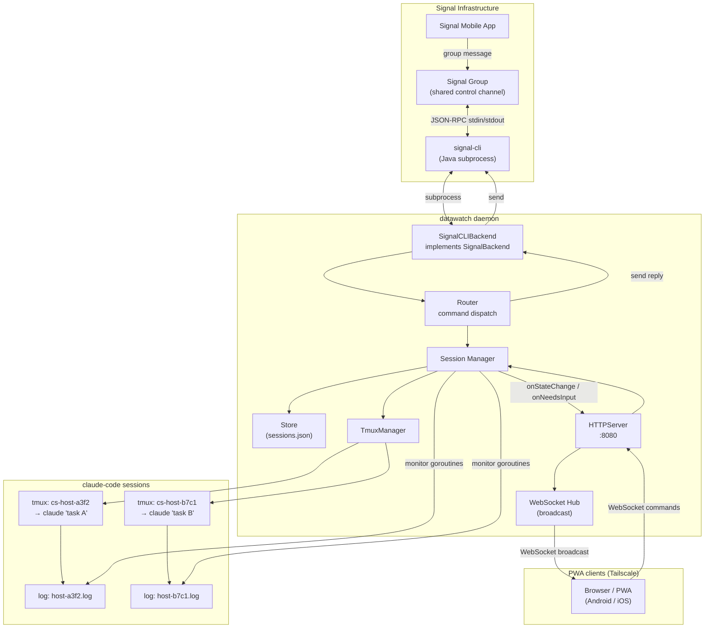
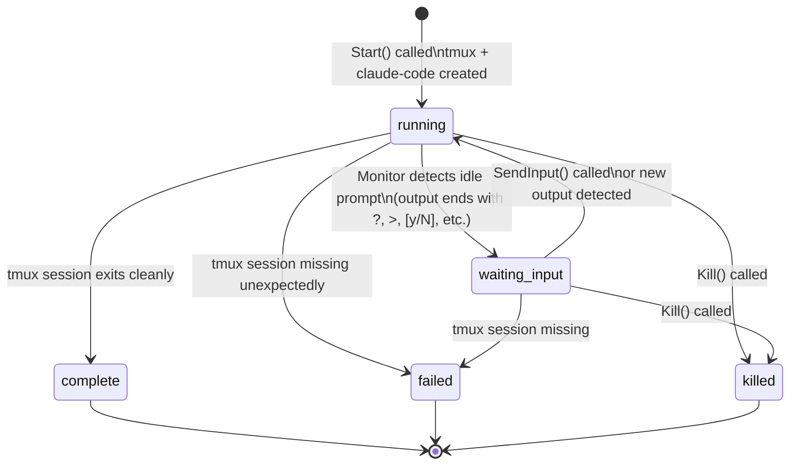

# Architecture

## Component Overview

`datawatch` is composed of five main packages plus the CLI entry point:

| Package | Path | Role |
|---|---|---|
| `config` | `internal/config` | Load, validate, and save YAML configuration |
| `signal` | `internal/signal` | Signal protocol abstraction (backend interface + signal-cli implementation) |
| `session` | `internal/session` | Session lifecycle, tmux management, persistent store |
| `router` | `internal/router` | Message parsing and command dispatch |
| `server` | `internal/server` | HTTP/WebSocket server serving the PWA and REST API |
| `main` | `cmd/datawatch` | CLI entry point (cobra commands) |

---

## Component Diagram



### Dual-interface callback wiring

When both Signal and the PWA server are active, `main.go` sets **composed callbacks** on the session manager so both interfaces are notified on every state transition:

```
onStateChange = router.HandleStateChange + httpServer.NotifyStateChange
onNeedsInput  = router.HandleNeedsInput  + httpServer.NotifyNeedsInput
```

This keeps the router and server packages independent — neither knows about the other.

---

## SignalBackend Interface

The `SignalBackend` interface (in `internal/signal/backend.go`) decouples the Signal protocol implementation from the rest of the application:

```go
type SignalBackend interface {
    Link(deviceName string, onQR func(qrURI string)) error
    Send(groupID, message string) error
    Subscribe(ctx context.Context, handler func(IncomingMessage)) error
    ListGroups(ctx context.Context) ([]Group, error)
    SelfNumber() string
    Close() error
}
```

**Current implementation:** `SignalCLIBackend` — runs `signal-cli` as a child process in `jsonRpc` mode, communicating over stdin/stdout with newline-delimited JSON-RPC 2.0 messages.

**Future implementation:** A native Go backend using libsignal-ffi bindings (see `docs/future-native-signal.md`).

This interface is the primary extension point of the application. Swapping backends requires no changes to the router, session manager, or CLI.

---

## Session Lifecycle State Machine



State transitions trigger the `onStateChange` callback, which the router uses to send Signal notifications.

---

## Data Directory Layout

All runtime data lives under `~/.datawatch/` (configurable via `data_dir`):

```
~/.datawatch/
├── config.yaml          # Main configuration file
├── sessions.json        # Persistent session store
└── logs/
    ├── myhost-a3f2.log  # Output log for session a3f2
    ├── myhost-b7c1.log  # Output log for session b7c1
    └── ...
```

**sessions.json** is a JSON array of `Session` objects. It is updated on every state transition so the daemon can resume monitoring after a restart without losing session context.

**Log files** are written by tmux via `pipe-pane`. The monitor goroutine tails the log file, reading new lines as they appear.

---

## Configuration System

Configuration is loaded by `internal/config.Load()`, which:
1. Starts with `DefaultConfig()` (sensible defaults for all optional fields)
2. Reads and unmarshals the YAML file over the defaults
3. Re-applies defaults for any fields that yaml.Unmarshal left as zero values

This means the config file only needs to specify the fields that differ from defaults. The minimum viable config for `start` is:

```yaml
signal:
  account_number: +12125551234
  group_id: <base64-group-id>
```

---

## Extension Points

| Point | How to extend |
|---|---|
| Signal protocol | Implement `SignalBackend` interface |
| Command parser | Add cases to `router.Parse()` |
| Output detection | Add patterns to `monitorOutput()` in `session.Manager` |
| Persistent storage | Replace `session.Store` JSON with SQLite or similar |
| Multi-group support | Add group routing logic to `router.Router` |
| PWA UI | Edit `internal/server/web/` — plain HTML/CSS/JS, no build step |
| PWA API | Add handlers to `internal/server/api.go` and wire in `server.go` mux |

---

## PWA Server

The `internal/server` package is an embedded HTTP/WebSocket server serving:

| Path | Description |
|---|---|
| `GET /` | PWA static files (embedded via `//go:embed web`) |
| `GET /api/sessions` | JSON list of all sessions |
| `GET /api/output?id=<id>&n=<n>` | Last N lines of session output |
| `POST /api/command` | Execute a command (same syntax as Signal) |
| `GET /ws` | WebSocket endpoint — real-time session updates |

The WebSocket protocol uses typed JSON envelopes:

```json
{ "type": "sessions", "data": { "sessions": [...] }, "ts": "2026-03-25T..." }
```

All server-to-client messages broadcast to every connected client. The PWA subscribes to a specific session via `{ "type": "subscribe", "data": { "session_id": "..." } }` to receive output lines for that session.

See [docs/pwa-setup.md](pwa-setup.md) for deployment and usage instructions.
