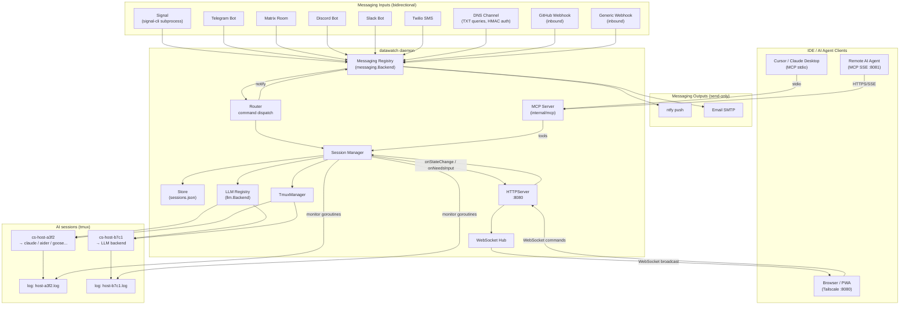
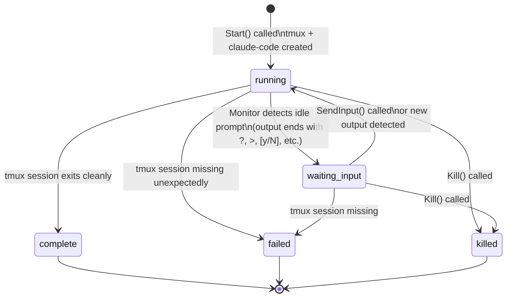
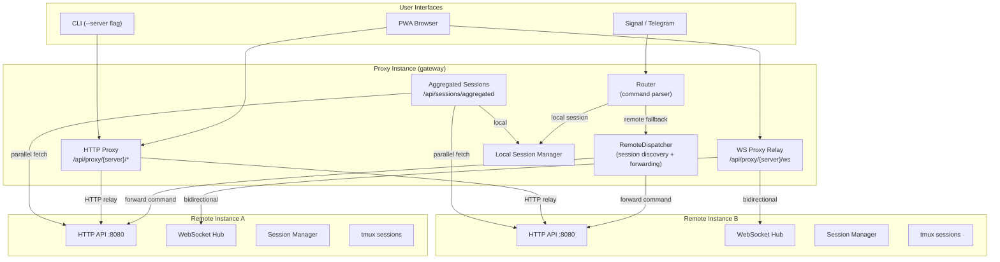
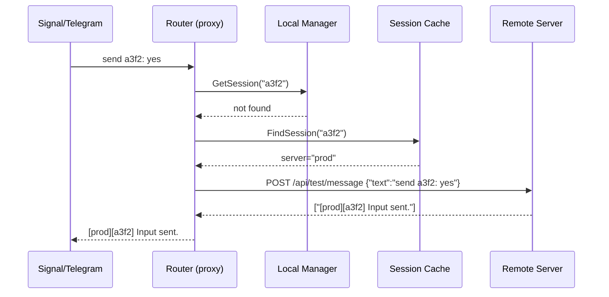
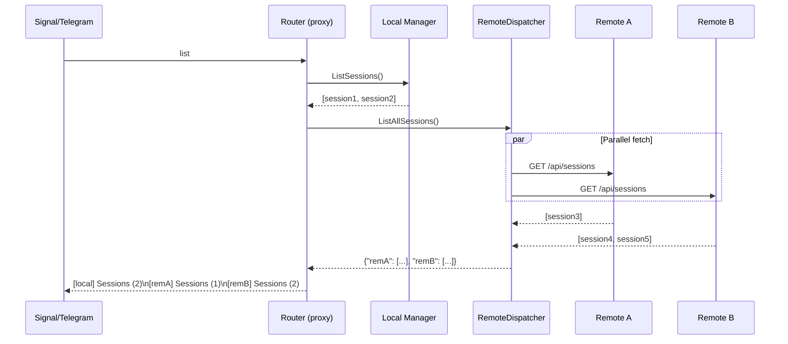
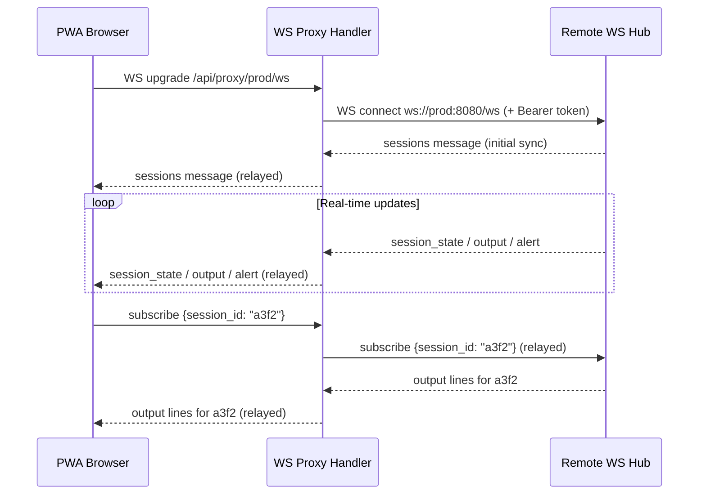

# Architecture

## Component Overview

`datawatch` is composed of these main packages plus the CLI entry point:

| Package | Path | Role |
|---|---|---|
| `config` | `internal/config` | Load, validate, and save YAML configuration |
| `messaging` | `internal/messaging` | Messaging backend interface, registry, and all backend implementations |
| `signal` | `internal/signal` | Signal-cli subprocess management (implements `messaging.Backend`) |
| `llm` | `internal/llm` | LLM backend interface, registry, and all backend implementations |
| `session` | `internal/session` | Session lifecycle, tmux management, persistent store |
| `router` | `internal/router` | Message parsing and command dispatch |
| `mcp` | `internal/mcp` | MCP server — stdio and HTTP/SSE transports for IDE and remote AI clients |
| `server` | `internal/server` | HTTP/WebSocket server serving the PWA and REST API |
| `proxy` | `internal/proxy` | Remote server communication — session discovery, command forwarding, aggregation |
| `transcribe` | `internal/transcribe` | Voice-to-text transcription via OpenAI Whisper |
| `metrics` | `internal/metrics` | Prometheus metrics registration and HTTP handler |
| `rtk` | `internal/rtk` | RTK (Rust Token Killer) integration — detection, stats, auto-init |
| `tlsutil` | `internal/tlsutil` | TLS configuration and auto-generated self-signed certificates |
| `main` | `cmd/datawatch` | CLI entry point (cobra commands) |

---

## Component Diagram



### Multi-interface callback wiring

`main.go` sets **composed callbacks** on the session manager so every active interface is
notified on every state transition:

```
onStateChange = router.HandleStateChange + httpServer.NotifyStateChange
onNeedsInput  = router.HandleNeedsInput  + httpServer.NotifyNeedsInput
```

This keeps the router, MCP server, and HTTP server packages independent — none knows
about the others. The MCP server queries the session manager directly via its tool handlers.

---

## messaging.Backend Interface

The `messaging.Backend` interface (in `internal/messaging/backend.go`) decouples all
messaging protocol implementations from the rest of the application:

```go
type Backend interface {
    Name() string
    Send(recipient, message string) error
    Subscribe(ctx context.Context, handler func(Message)) error
    Link(deviceName string, onQR func(qrURI string)) error
    SelfID() string
    Close() error
}
```

All messaging backends (Signal, Telegram, Matrix, Discord, Slack, Twilio, ntfy, email,
GitHub webhook, generic webhook) implement this interface and are registered in
`internal/messaging/registry.go`. Multiple backends can be active simultaneously.

**Signal implementation:** `SignalCLIBackend` runs `signal-cli` as a child process in
`jsonRpc` mode, communicating over stdin/stdout with JSON-RPC 2.0 messages.

**Future Signal implementation:** A native Go backend using libsignal-ffi bindings (see `docs/future-native-signal.md`).

## llm.Backend Interface

The `llm.Backend` interface (in `internal/llm/backend.go`) decouples AI coding tool
implementations from the session manager:

```go
type Backend interface {
    Name() string
    Launch(ctx context.Context, task, tmuxSession, projectDir, logFile string) error
    SupportsInteractiveInput() bool
    Version() string
}
```

All LLM backends (claude-code, aider, goose, gemini, opencode, ollama, openwebui, shell)
implement this interface and are registered in `internal/llm/registry.go`. The active
backend is selected via `session.llm_backend` in config.

---

## Session Lifecycle State Machine



State transitions trigger the `onStateChange` callback, which the router uses to send notifications to all active messaging backends.

---

## Data Directory Layout

All runtime data lives under `~/.datawatch/` (configurable via `data_dir`):

```
~/.datawatch/
├── config.yaml          # Main configuration file
├── sessions.json        # Persistent session store
└── logs/
    ├── myhost-a3f2.log  # Output log for session a3f2
    ├── myhost-b7c1.log  # Output log for session b7c1
    └── ...
```

**sessions.json** is a JSON array of `Session` objects. It is updated on every state transition so the daemon can resume monitoring after a restart without losing session context.

**Log files** are written by tmux via `pipe-pane`. The monitor goroutine watches the log file using **fsnotify** (interrupt-driven file watching) and reads new lines on write events, replacing the previous polling approach for lower latency and reduced CPU usage.

---

## Configuration System

Configuration is loaded by `internal/config.Load()`, which:
1. Starts with `DefaultConfig()` (sensible defaults for all optional fields)
2. Reads and unmarshals the YAML file over the defaults
3. Re-applies defaults for any fields that yaml.Unmarshal left as zero values

This means the config file only needs to specify the fields that differ from defaults. The minimum viable config for `start` with Signal is:

```yaml
signal:
  account_number: +12125551234
  group_id: <base64-group-id>
```

With auto-group creation (`datawatch link --create-group`), only the account number is
needed — the group is created automatically. For messaging backends that do not require
linking (Telegram, Discord, webhook, etc.), only the backend-specific tokens/addresses
need to be set.

---

## Extension Points

| Point | How to extend |
|---|---|
| New messaging backend | Implement `messaging.Backend`, register in `internal/messaging/registry.go`, add config to `internal/config/config.go`, document in `docs/messaging-backends.md` |
| New LLM backend | Implement `llm.Backend`, register in `internal/llm/registry.go`, add config to `internal/config/config.go`, document in `docs/llm-backends.md` |
| New MCP tool | Add tool definition and handler in `internal/mcp/server.go`, document in `docs/mcp.md` |
| Command parser | Add cases to `router.Parse()` |
| Output detection | Add patterns to `monitorOutput()` in `session.Manager` |
| Persistent storage | Replace `session.Store` JSON with SQLite or similar |
| PWA UI | Edit `internal/server/web/` — plain HTML/CSS/JS, no build step |
| PWA API | Add handlers to `internal/server/api.go` and wire in `server.go` mux |

---

## PWA Server

The `internal/server` package is an embedded HTTP/WebSocket server serving:

| Path | Description |
|---|---|
| `GET /` | PWA static files (embedded via `//go:embed web`) |
| `GET /api/sessions` | JSON list of all sessions |
| `GET /api/output?id=<id>&n=<n>` | Last N lines of session output |
| `POST /api/command` | Execute a command (same syntax as Signal) |
| `GET /ws` | WebSocket endpoint — real-time session updates |

The WebSocket protocol uses typed JSON envelopes:

```json
{ "type": "sessions", "data": { "sessions": [...] }, "ts": "2026-03-25T..." }
```

All server-to-client messages broadcast to every connected client. The PWA subscribes to a specific session via `{ "type": "subscribe", "data": { "session_id": "..." } }` to receive output lines for that session.

See [docs/pwa-setup.md](pwa-setup.md) for deployment and usage instructions.

---

## Proxy Mode Architecture

Proxy mode enables a single datawatch instance to relay commands and session output
to/from multiple remote datawatch instances.

### Connection Flow



### Data Flow: Remote Command Routing



### Data Flow: Aggregated Session List



### Data Flow: WebSocket Proxy Relay


