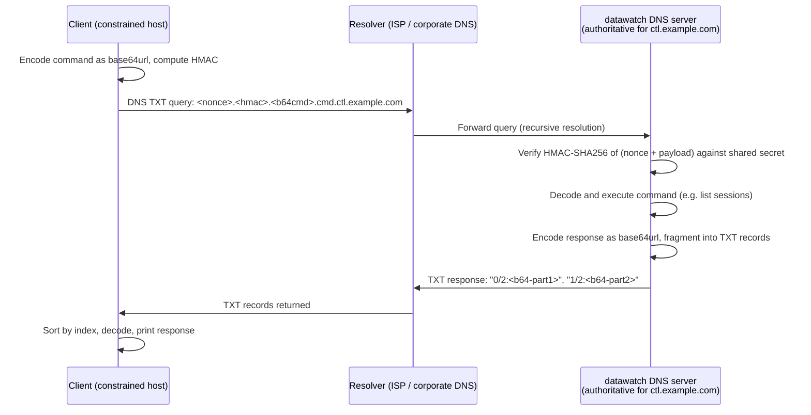

# Covert / Low-Profile Communication Channels — Research Notes

This document evaluates alternative communication channels for datawatch that
operate under constrained network environments (firewalls, outbound-only, no
open ports) or where a low observable footprint is desirable.

> **Status**: DNS tunneling is **implemented and validated** as of v0.7.0 (`internal/messaging/backends/dns/`).
> Other channels remain research/planning only. See `BACKLOG.md` for prioritisation.

---

## Motivation

datawatch's existing backends (Signal, Telegram, Slack, webhooks, web UI) all
require either inbound TCP (webhooks, web UI) or outbound HTTPS to third-party
services. In environments where:

- All inbound TCP is blocked by firewall
- Third-party messaging services are unavailable or undesirable
- Traffic must blend with existing infrastructure

…alternative channels may be needed.

---

## DNS Tunneling

**Concept:** Encode commands and responses in DNS queries/responses to a
controlled domain. The datawatch server runs an authoritative DNS resolver for
a subdomain (e.g. `ctl.example.com`); the client sends commands as DNS TXT
queries; the server responds via DNS TXT answers.

### Advantages

- DNS is rarely blocked outbound (UDP 53 / TCP 53)
- Blends with legitimate DNS traffic
- No inbound ports required on the server
- Works from heavily firewalled environments (corporate, cloud DMZ)

### Supported Command Subset

The DNS channel is stateless and low-bandwidth. Only short, query-response
commands are supported. Session output streaming is **not** supported.

| Command | Supported | Notes |
|---|---|---|
| `list` | Yes | Returns session IDs, states, and tasks |
| `status <id>` | Yes | Returns state + last N lines (truncated to `max_response_size`) |
| `tail <id> [n]` | Yes | Returns last N lines (truncated) |
| `new: <task>` | Yes | Starts a new session; returns session ID |
| `kill <id>` | Yes | Terminates a session |
| `alerts [n]` | Yes | Returns last N alert summaries |
| `version` | Yes | Returns daemon version |
| `send <id>: <msg>` | Yes | Sends input to a waiting session |
| `schedule <id>: <when> <cmd>` | Yes | Schedules a command |
| `attach <id>` | No | Requires interactive terminal |
| `history <id>` | No | Git log output too large |
| `setup <service>` | No | Wizard flows are multi-turn and too long |

### Query Format

Commands are encoded as DNS TXT queries using the following structure:

```
<nonce8>.<hmac8>.<b64-label-1>.<b64-label-2>...cmd.<domain>
```

Where:
- `<nonce8>` — 8 random hex chars, unique per query (prevents replay and cache collisions)
- `<hmac8>` — first 8 hex chars of HMAC-SHA256(`nonce + payload`, `secret`)
- `<b64-label-N>` — base64url-encoded command bytes, fragmented into ≤60-char labels
- `cmd` — fixed literal label identifying this as a command query
- `<domain>` — the configured authoritative subdomain (`ctl.example.com`)

**Example query** for `list` (base64url `bGlzdA`):

```
a3f2b7c1.d4e5f600.bGlzdA.cmd.ctl.example.com  TXT?
```

### Response Format

Responses are returned as TXT record sets. Each record is prefixed with a
sequence index so the client can reassemble fragmented responses:

```
"0/3:<b64-encoded-chunk-1>"
"1/3:<b64-encoded-chunk-2>"
"2/3:<b64-encoded-chunk-3>"
```

The client reads all TXT records, sorts by index, decodes each chunk, and
concatenates to recover the full response.

### Sequence Diagram



### Configuration Block

```yaml
dns_channel:
  enabled: false
  mode: server          # server | client
  domain: ctl.example.com   # delegated authoritative subdomain
  listen: ":53"             # server: UDP/TCP listen address
  upstream: 8.8.8.8:53      # client: resolver to use for queries
  secret: ""                # HMAC-SHA256 shared secret (min 32 chars recommended)
  ttl: 0                    # DNS TTL for responses in seconds (0 = non-cacheable)
  max_response_size: 512    # max response bytes before truncation
  poll_interval: 5s         # client polling interval for async responses
```

### Config Fields and Security

| Field | Sensitive | Description |
|---|---|---|
| `domain` | No | The delegated DNS subdomain |
| `listen` | No | Bind address for the authoritative DNS server |
| `upstream` | No | Resolver address used by the client |
| `secret` | **Yes** | HMAC shared secret — never log, mask in `/api/config` |
| `ttl` | No | DNS TTL; use 0 to prevent resolver caching of responses |
| `max_response_size` | No | Truncation limit for response payloads |
| `poll_interval` | No | Client polling frequency |

**Security model:**
- A passive observer (ISP, corporate DNS log) sees query labels but cannot decode the command without the `secret`
- HMAC-SHA256 provides integrity and authentication; a forged query without the correct HMAC is rejected
- Active MITM can suppress queries (denial-of-service) but cannot forge valid authenticated commands
- The `secret` should be a random 32-byte hex string: `openssl rand -hex 32`
- Store `secret` only in `config.yaml` (chmod 0600)
- DNS traffic is **not encrypted** — label names are visible to DNS resolvers and logs; use for low-sensitivity operational commands only

**Threat model summary:**

| Threat | Mitigated? | Method |
|---|---|---|
| Passive eavesdropping of command content | Partial | HMAC prevents decode without secret; payload labels are visible |
| Command forgery | Yes | HMAC-SHA256 authentication |
| Replay attack | Yes | Unique nonce per query; server tracks seen nonces (TTL-limited) |
| DNS cache poisoning of responses | Yes | Nonce in query name prevents cross-contamination |
| Denial of service (query suppression) | No | No protection — DNS can be blocked |
| Secret exfiltration | Out of scope | Protect `config.yaml` at rest |

### Limitations

| Limitation | Detail |
|---|---|
| Bandwidth | ~100 bytes/query; tail output truncated to `max_response_size` |
| Latency | 200ms–5s depending on resolver caching and TTL |
| Caching | Corporate resolvers may cache responses; use TTL=0 and unique nonces |
| Infrastructure | Requires NS delegation of a subdomain to a server you control |
| Stateless only | No session streaming, no wizard flows, no file transfers |
| No payload encryption | HMAC provides integrity only; labels are visible in DNS logs |
| Rate limiting | Resolvers may rate-limit repeated TXT queries from the same IP |
| Root access | Binding to port 53 requires root or `CAP_NET_BIND_SERVICE` |

### Implementation Sketch

1. `internal/messaging/backends/dns/` — new backend implementing `messaging.Backend`
2. Server mode: uses `miekg/dns` to serve authoritative TXT responses for configured subdomain
3. Client mode (CLI `--server <name>` with `type: dns`): encodes commands as TXT queries,
   polls for responses, reassembles TXT record fragments
4. Nonce store: bounded LRU of seen nonces to prevent replay (TTL matching DNS record TTL)
5. Commands are short enough (< 200 bytes) to fit in a single query; responses may be
   fragmented across multiple TXT records

### References

- [iodine](https://github.com/yarrick/iodine) — DNS tunnel reference implementation
- [dns2tcp](https://github.com/alex-sector/dns2tcp)
- [miekg/dns](https://github.com/miekg/dns) — Go DNS library
- RFC 4034 — DNSSEC Resource Records
- RFC 1464 — TXT record encoding

---

## ICMP Tunneling

**Concept:** Encode payloads in ICMP Echo Request/Reply packets.

**Advantages:** ICMP is permitted through many firewalls; no TCP state needed.

**Limitations:** Requires raw socket (root/CAP_NET_RAW); many cloud providers
and corporate networks drop ICMP or rate-limit it; implementation is complex.
Not recommended for production use.

---

## NTP-based Side Channel

**Concept:** Embed data in NTP timestamp fields or extension fields.

**Limitations:** Extremely low bandwidth; NTP traffic monitoring is increasingly
common; non-standard extension use triggers anomaly detection. Not practical.

---

## HTTPS to Inconspicuous Endpoints

**Concept:** Use legitimate-looking HTTPS POSTs to a controlled server endpoint
that mimics a CDN or analytics service.

**Advantages:**
- HTTPS port 443 is almost universally permitted outbound
- TLS encrypts payload content
- No special infrastructure beyond a VPS with a TLS cert

**Limitations:** Not meaningfully different from the existing webhook backend
except for the endpoint's appearance. This is essentially the current webhook
backend.

---

## Steganographic Channels

**Concept:** Embed commands in cover traffic — e.g. image EXIF data, HTTP
headers, DNS PTR records.

**Limitations:** Fragile, high engineering cost, low reliability, not
appropriate for an operations tool.

---

## Recommended Approach

For the backlog DNS channel, the minimum viable design is:

1. `internal/messaging/backends/dns/` — new backend implementing
   `messaging.Backend`
2. Server mode: uses `miekg/dns` to serve authoritative responses for a
   configured subdomain
3. Client mode (CLI `--server <name>` with `type: dns`): encodes commands as
   TXT queries, polls for responses
4. Config block: see "Configuration Block" above

Commands must be kept short enough (< 200 bytes) to fit in DNS; session output
tailing is truncated to `max_response_size` bytes.

---

## See Also

- `BACKLOG.md` — prioritisation of DNS channel implementation
- `docs/messaging-backends.md` — existing backend implementations
- `internal/messaging/backend.go` — Backend interface to implement
- `docs/testing-tracker.md` — validation status (DNS row: not implemented)
