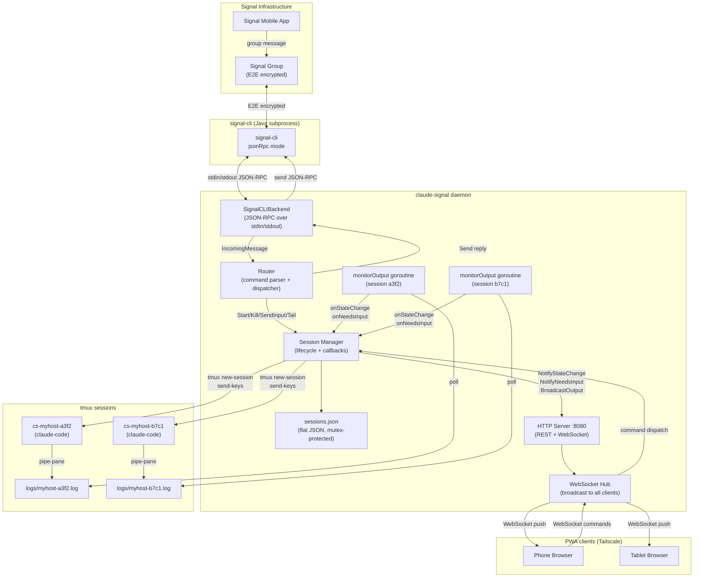
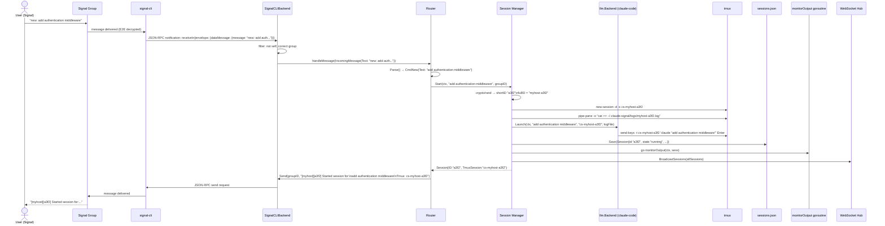
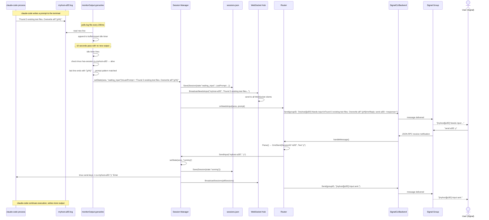
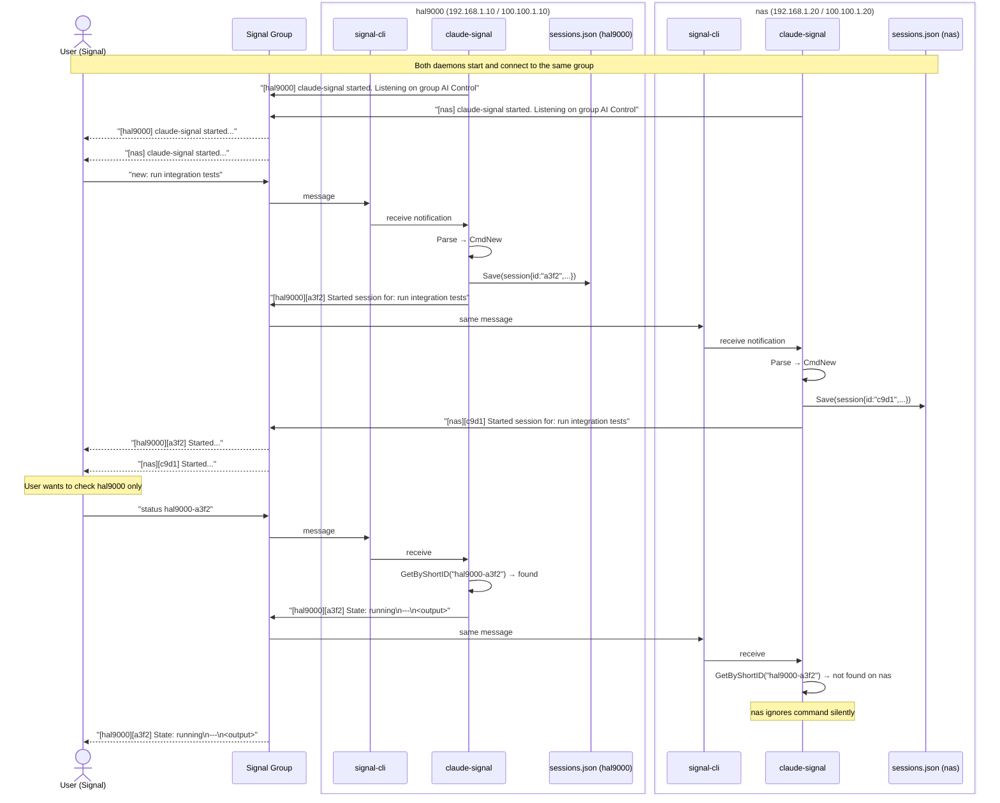
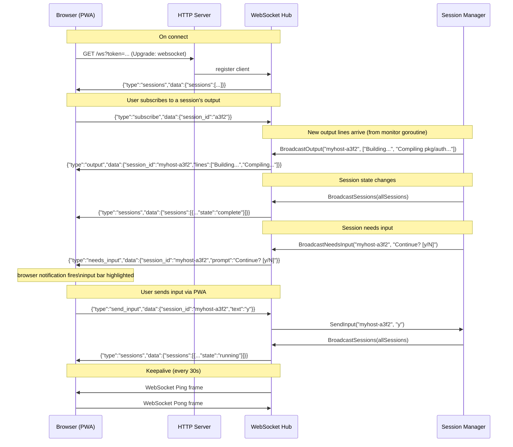
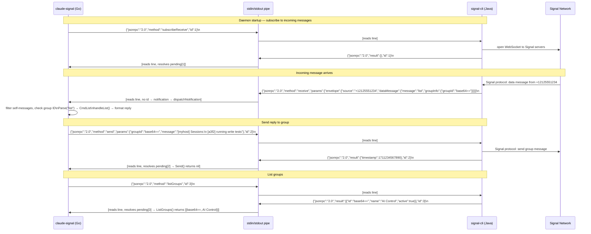
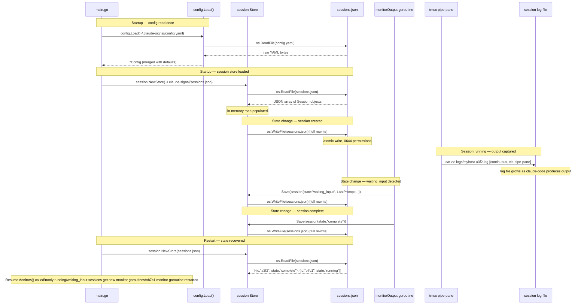

# Data Flow — claude-signal

Detailed diagrams showing how data moves through the system.

---

## 1. System Data Flow

Top-level component interaction diagram.

---

## 2. New Session Sequence

---

## 3. Input Required Sequence

---

## 4. Multi-Machine Sequence

Two hosts sharing one Signal group.

---

## 5. WebSocket Message Flow

What messages flow on key events.

---

## 6. signal-cli JSON-RPC Flow

The full JSON-RPC protocol between claude-signal and signal-cli.

---

## 7. Persistence Flow

When and why data is written to disk.

