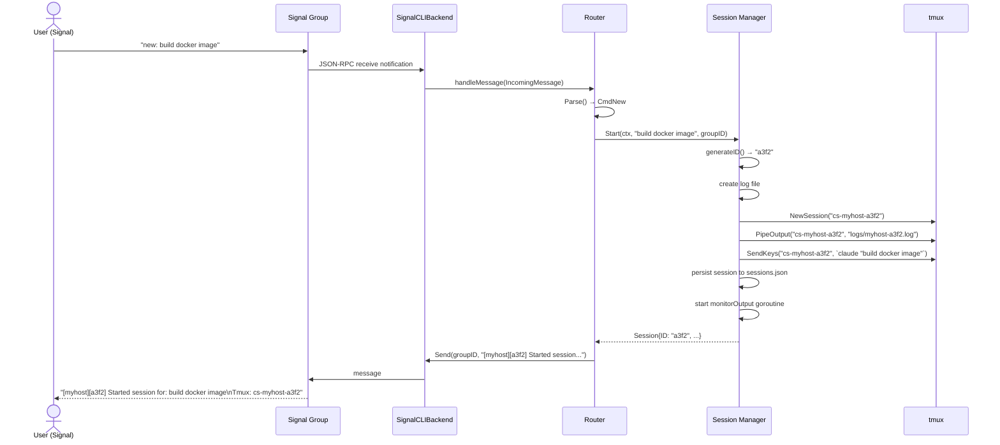
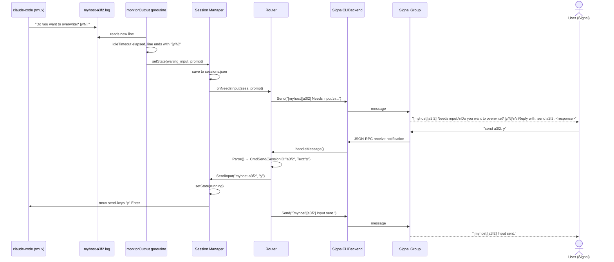
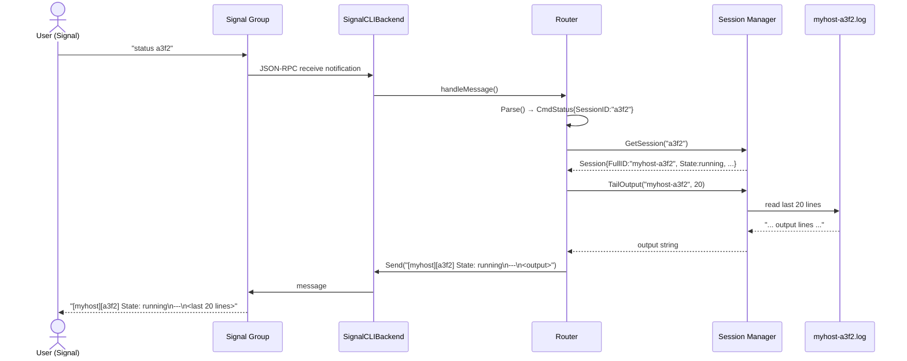
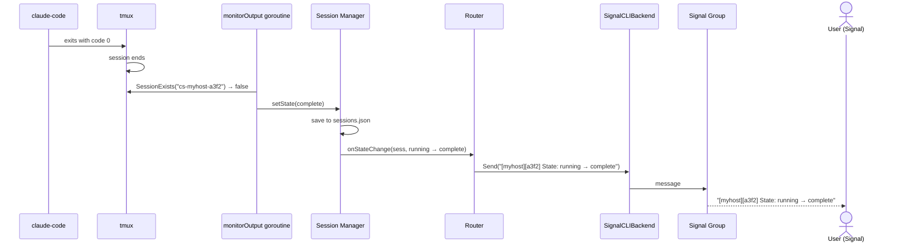
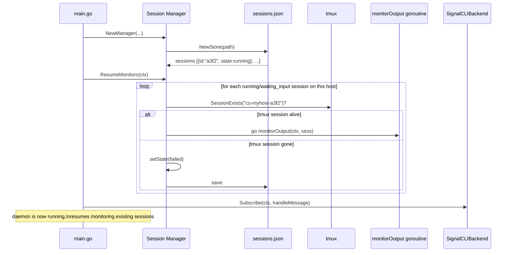

# Data Flow

Sequence diagrams for the major flows in `claude-signal`.

---

## 1. New Session Flow

User sends `new: build docker image` in Signal.

---

## 2. Input Required Flow

`claude-code` asks a question; the monitor detects the idle prompt and notifies the user.

---

## 3. Status Check Flow

User sends `status a3f2` to see current output.

---

## 4. Session Complete Flow

`claude-code` finishes; the monitor detects the tmux session is gone.

---

## 5. Startup / Resume Flow

Daemon restarts; existing sessions are re-monitored.

