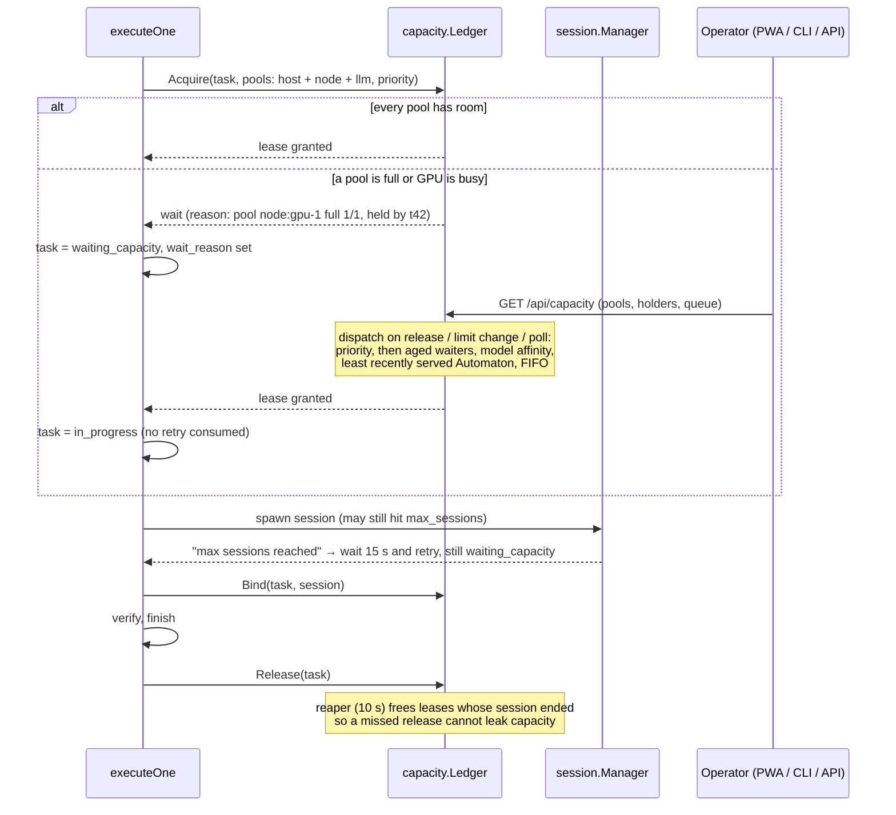

# Automata capacity admission flow

How a task gets a slot before its session starts, and what the operator
sees while it waits.

## Pools

| Pool | Limit from | Counts |
|---|---|---|
| `host` | `session.max_sessions` minus `session.reserved_interactive` | autonomous leases plus operator sessions on this host |
| `node:<name>` | node `max_concurrent_sessions` | autonomous sessions on that node |
| `llm:<name>` | LLM `max_inflight` | autonomous sessions on that LLM |

A limit of 0 means unlimited. Planning (decompose) sessions occupy a host
slot and wait for one to free instead of failing.
