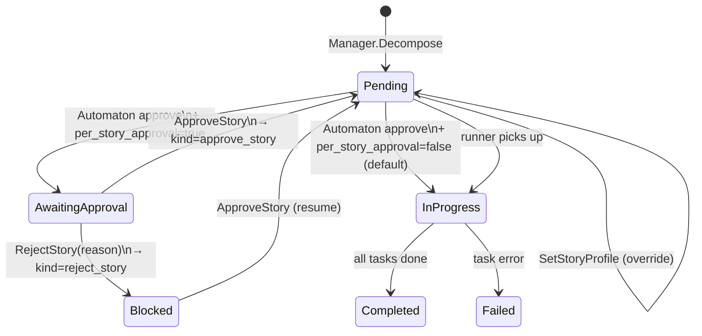
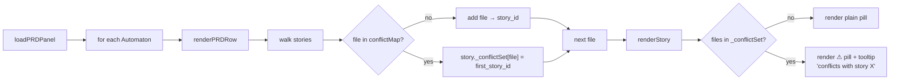

# Automaton execution — per-story approval + file association

End-to-end sequence covering per-story approval gates and file
association tracking during Automaton execution.

- **Per-story approval** — each story can gate on explicit operator
  sign-off before the runner picks it up.
- **File association** — decomposer extracts `FilesPlanned`; runner
  records `FilesTouched` via a post-session diff.

Operator surfaces: PWA story rows (Approve / Reject / profile /
files-edit pills), REST endpoints listed inline.

## Per-story approval state machine



## End-to-end sequence with files

```mermaid
sequenceDiagram
    participant Op as Operator (PWA / REST / MCP)
    participant API as REST /api/autonomous/prds
    participant Mgr as Autonomous Manager
    participant Dec as Decomposer (LLM)
    participant Run as Runner (Manager.Run)
    participant Sess as session.Manager
    participant Git as ProjectGit (post-session)

    Op->>API: POST /prds {spec, project_profile?, cluster_profile?, decomposition_profile?}
    API->>Mgr: CreatePRD
    Mgr-->>Op: prd_id, status=draft
    Op->>API: POST /prds/{id}/decompose
    API->>Dec: ask LLM with DecompositionPrompt\n(asks for files: [...] per story/task)
    Dec-->>API: JSON {stories: [{title, files, tasks: [{spec, files}]}]}
    API->>Mgr: store stories + tasks (FilesPlanned populated)
    Mgr-->>Op: status=needs_review
    Op->>API: PUT/POST /set_story_profile {story_id, profile} (optional)
    Op->>API: POST /set_story_files {story_id, files} (optional override)
    Op->>API: POST /prds/{id}/approve
    API->>Mgr: Approve
    alt per_story_approval=true
        Mgr->>Mgr: stories: pending → awaiting_approval
        Op->>API: POST /approve_story {story_id} (per story)
        Mgr->>Mgr: story.Approved=true; awaiting_approval → pending
    else per_story_approval=false (default)
        Mgr->>Mgr: stories stay pending (auto-approved)
    end
    Op->>API: POST /prds/{id}/run
    API->>Run: Manager.Run
    loop for each pending task in topo order
        Run->>Run: flattenTasks (skips awaiting_approval + blocked)
        Run->>Sess: spawn worker (project_profile or story.execution_profile)
        Note over Sess: worker session runs;<br/>writes to project_dir
        Sess-->>Run: SessionEnd → state=complete
        Run->>Git: ProjectGit.DiffNames()
        Git-->>Run: ["a.go", "b.go", ...]
        Run->>Mgr: RecordTaskFilesTouched(prd, task, files)
        Mgr->>Mgr: Task.FilesTouched populated
    end
    Mgr-->>Op: status=completed (broadcast)
```

## File-conflict detection (PWA-side)



## REST surface summary

| Endpoint | Purpose | Body |
|---|---|---|
| `POST /set_story_profile` | Override per-story execution profile | `{story_id, profile, actor?}` |
| `POST /approve_story` | Approve a story for execution | `{story_id, actor?}` |
| `POST /reject_story` | Reject / block a story | `{story_id, actor?, reason}` |
| `POST /set_story_files` | Override planned files | `{story_id, files: [...], actor?}` |
| `POST /set_task_files` | Override per-task files | `{task_id, files: [...], actor?}` |
| `PUT /api/config { autonomous.per_story_approval: bool }` | Toggle approval gate | boolean |

All gated by `needs_review` / `revisions_asked` (operator-edit) or
`approved` / `running` (per-story approval). Each appends a
`Decision` to the Automaton's audit timeline.

## See also

- [docs/howto/autonomous-planning.md](../howto/autonomous-planning.md) — the operator walkthrough.
- [docs/flow/agent-spawn-flow.md](agent-spawn-flow.md) — session lifecycle.
