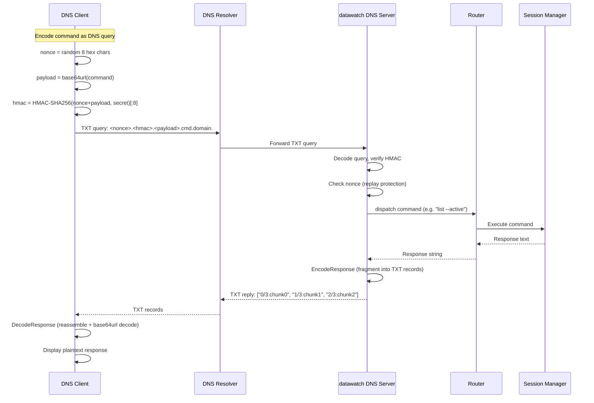

# DNS Channel Flow

Command/response cycle for the DNS covert channel backend.

🔍 <a href="https://mermaid.live/view#pako:eNp1VMFO4zAQ_ZWRT61os9DdRShiK6GWFRc4bDkgEQ6DM20sEjtrO9AK8e87iWNa2m0uzjjvzXjem_hdSJOTSIWjvw1pSXOFK4tVpoGfGq1XUtWoPcxKRbygg_ndoo8OUX_ImfKVbMTF-BC5INvjcvT4hl4WHSPs_yezaXzAh7dDxC1qXAXIgpxTRsetTAf0nfEEpi0bzp_CtW77B2mqCnUeT81S2E2gBOB4Oo0MbVgl-AWW8aaCCyhoDbJA644QatyUBnOmPKOj8x-NLQd9veERSlGhZPzN7dVsvLi5mvw8H3RlT_pcI3AkLfnhY3rxtJcjKp7C_cN96CSFy44-TS7bzLz0eaaJrPKE20ClkyhSTMC5ghcp_Db2DW2-zRiQ4fMObk6dmh1kBLyllpuuiyP4WUHypVd0YKkucQO1ZZOkZ_eGe6zgewq5cnU3LtG1ASWrBDJRKudhPEZmv1Imen6gMb8fBjZ9TZL3Ij_A-q_jnUKsRG20I_C09l-S7fTwCXLeKr2KKh70GibtEz1YWlxV7R-ltDedspbVs7n72vaBo61M7OhjJk6_fU9l0eiX00yMuP2zGJ-FeBLjSSae9rzdGbad0kfGMdi6PboldI6q55LgZDvUkHewYzM9Z9c6f0setlZQLhoSipGoyPIM5nwPvX9w2NR8J9B1rryxIl1i6WgksPFmsdFSpN42FEH9fdWjPv4BaE6g4A">View this diagram fullscreen (zoom &amp; pan)</a>

**Error cases:**
- Invalid HMAC → DNS REFUSED response
- Replayed nonce → DNS REFUSED response
- Command timeout (>10s) → DNS SERVFAIL response

