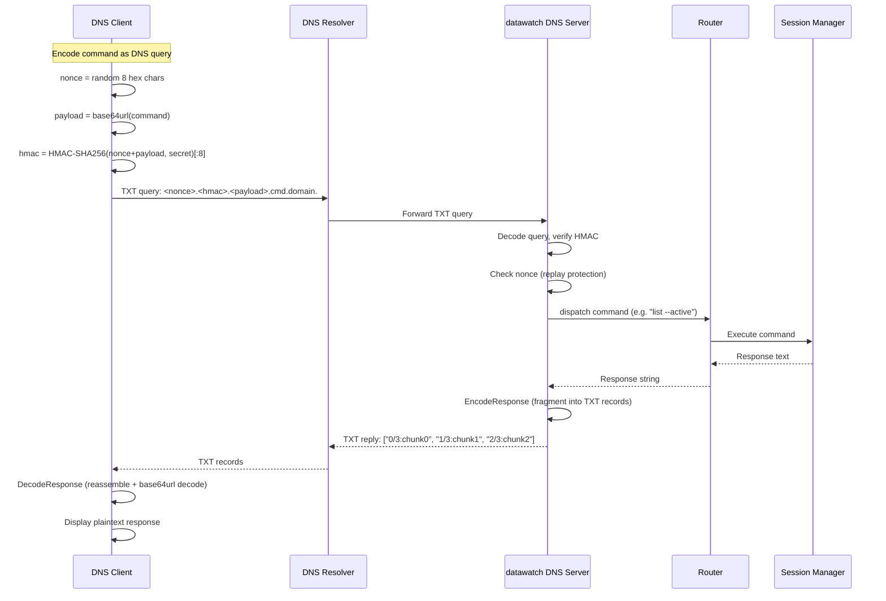

# DNS Channel Flow

Command/response cycle for the DNS covert channel backend.

**Error cases:**
- Invalid HMAC → DNS REFUSED response
- Replayed nonce → DNS REFUSED response
- Command timeout (>10s) → DNS SERVFAIL response

