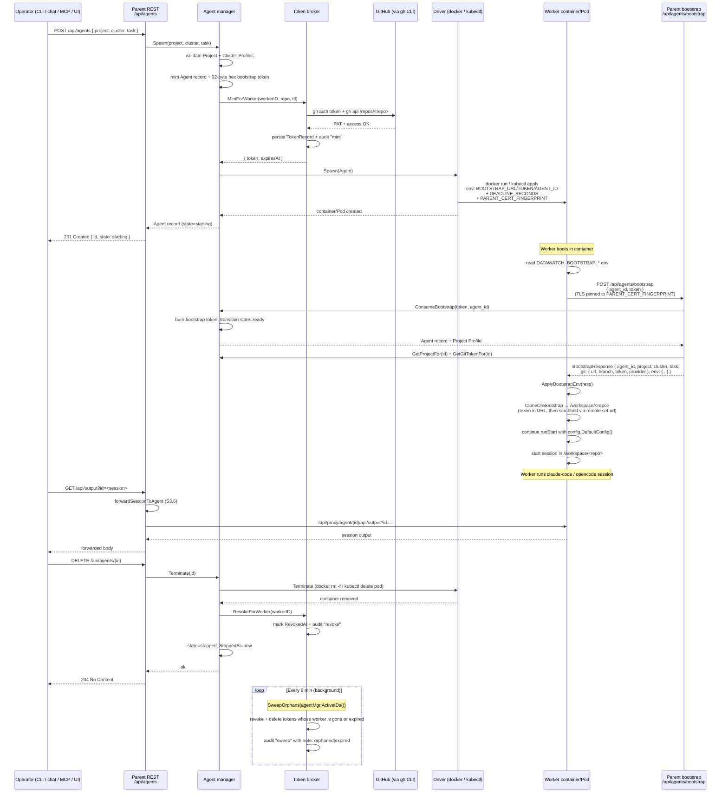

# F10 Agent Spawn Flow — sprints 3-5

End-to-end sequence covering the F10 ephemeral-agent lifecycle as
shipped through Sprint 3 + 4 + Sprint 5 (4 of 6 stories): profile
selection → token mint → container spawn → worker self-registration
→ TLS-pinned bootstrap → git clone → session run → terminate +
revoke + sweep.

This diagram covers the parent-side and worker-side responsibilities
in a single picture; refer to [docs/agents.md](../agents.md) for the
prose surface.

🔍 <a href="https://mermaid.live/view#pako:eNp9Vl1z2jgU_St3eDJbEm-zHzPLNNlxwSVMU2CwO33JTEbYCmgDklaSoRmW_75XkgUGp-UBsHzu1f0450r7TiFK2ul3NP23orygQ0aWimweOeBHEmVYwSThBqYSiMZvqogRCqLBwxhiKFbE4M-XwQy_v467bbtkNraGM6IoPs3TLP-wUPFdTCSLyRLXdNvmy1JZm8S-hg3hiFNt1EclXqgD5viHw8I9t3Gje4sZMXNfLSDaMgLLFWD4bwQ7VFuLHSq2Rc9RKQq7Qwwv1YIWZv2GxUyU1uKbUBZZCG4I41TFuP5GxEIYbRSRjYoswtplWeLjm0fuXU3l1d0d1rMPs2mWQwMLe5BK_IMx9qBYV9pQ1QND9AscvClaoS3WtQ-ZJDsevQ2vE0RcQG_JmpXEUJh5A3gHA29hV57ZmuqWzYbZvrvmKVoIVaLRbzdXi1d0s6LfTymDsY1r2vue9uELuvgklC9rtHM_42EP_UmBoR5b4fFoOLrv27aSyqy8V9zTPksGsTXS8Qf7c-fNRvdXjc1mSY5oUhRUI8M_X3gOKGS-Ztp4ss1DXqQqmYHHjs35sXNmGsqx9wH1gH6XTFGdmNAVnzOSLnTFFa1ODZfxJfKoDzUPVcVPXMTU5PrVkYZydPBxOs2zfJ7Mnr7OH-J8-jmdxMkoneRP46FDvYNhmgwfxpP0KUsH08kwq5dnydzCBuk8f_o0nozS-Ww-nuSnKEIiZ-yGQlHkRXnKJJDzrPORNoi6xW-UAV92T3RE-FT24ebX9zDwrrBSrOyBs-hDMLHF8lYTgQQSVpmuKrXmHJuA8VN4Ho2YUD90X8IwyZNvST64fzqV6hfA2jXhR4W2NRafK3UPbvnJRuwJd3DrUf6QgWScYz5G_Ki4gb7BZSjxQHBdbehxPaqpE_ZqC3RRKX6pKIxIEa6ZYYL7ct7aErye9aqR6oVWg9Rrgf8g1BE1NRCFGmFoaIlrOGedQurFS-PQkuPKnGqJSVNoFvTt6dRzBV4yYzVVqXUPRz7hxaoXskazLSuRE4ceOFHsr6-vDycCNSiRWPUcg0j5NkJlym4LN1gLTqf8NLkfq5v3f91AbGeSlqSg9WDxzfdMQDKiCDGsFT7oQlWLBbLBnjyKbiyJNTVXmEB7O8thxitqtZ5ZAcCO4UTD5We2vB7SZ1KtzcA9RW1rJxl0rrVtPEbRivLnUsJNNZYcZxq9svcCnDZC4q3A_q29ts-iUVrLRFRGVuZvVt5-qMF3zcPHgZ-F2hFVZv59Ljzzouy36z-7TbCLynnFnn5_9RKM96w8XGyFDT6VIewSKuBhrZFTB4EtWQgrisuMhulDmqdn2rc7t07SnCoc-6iu6EKYbqIf3x7vEWoDV8-NCV7SNcXXUpTdnwxbx5ltc9CezqQ53eKf9kHZ_cEZtiHqpTYqE9M4vpRbCwdYY7yE8S2kpCjMzP9JzC0Xu_boFy9vzPffkW12sBmsZCj2WggJKfLvFf6w9wWIFqR4WSpR8VCMc5qGDLIdpXKq5ArnW-Sag_tfJ4XBG9t4qKNuw7qVvs8S064r79SqYbcSOH987YBpWKLkAe-4_rwuf-IwlE_bqB47Xqxc2ONLuBhp-d-ZF8rLTq-zQWoQVuK1e3_Ax0raG1aKroTq9J_JWtNeB28yInvlRadvVEUDqL6e16jD_7VO4yE">View this diagram fullscreen (zoom &amp; pan)</a>

## Notes

- **Bootstrap is the only unauthenticated parent endpoint.** The
  worker has no session token yet; the bootstrap-token + agent-ID
  pair is the auth signal, single-use, burned on first acceptance.
- **TLS pinning happens before bootstrap.** The parent injects its
  leaf-cert SHA-256 fingerprint into the spawn env so the worker's
  bootstrap HTTP client refuses any cert that doesn't match — no
  fallback to system trust store, no TOFU.
- **Git token never lands on disk.** It travels in the bootstrap
  response over the pinned-TLS connection, gets injected into the
  HTTPS clone URL with `x-access-token` username, then `git remote
  set-url origin <url-without-token>` strips it from `.git/config`.
- **Termination is idempotent.** If the parent missed the explicit
  Terminate (crash, missed signal), the periodic SweepOrphans
  catches it within 5 min using `agentMgr.ActiveIDs()` as the
  source of truth.
- **Failure mode visibility.** Mint failure, container failure,
  bootstrap rejection — all surface via `Agent.FailureReason`
  (visible in `/api/agents/{id}` JSON), via the broker's
  `audit.jsonl`, and via the daemon log.

## Pending steps in this flow

- **S5.4 — shipped** (commit pending). Wired via
  `Manager.SetOnSessionEnd` → `PostSessionPRHook`: when the
  session's bound agent has a Project Profile with `git.auto_pr`
  true, the parent pushes the worker's branch (token injected
  into the URL ephemerally, scrubbed via `remote set-url` after)
  and opens a PR via `git.Provider.OpenPR`. The hook fires
  *before* Terminate revokes the token, so the push window is
  guaranteed.
- **S5.2** — bootstrap token replaced with a PQC-secured envelope
  (Cloudflare CIRCL ML-KEM 768 + ML-DSA 65). Same flow shape; the
  token field becomes structured.

See [docs/agents.md](../agents.md) for the surface API, MCP, CLI,
and comm-channel commands that wrap each REST call above.
