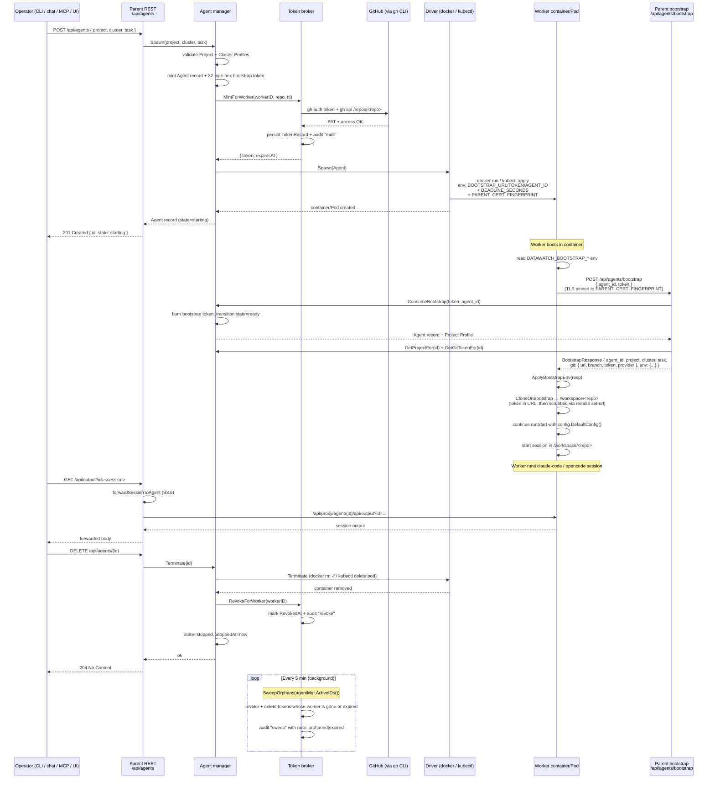

# F10 Agent Spawn Flow — sprints 3-5

End-to-end sequence covering the F10 ephemeral-agent lifecycle as
shipped through Sprint 3 + 4 + Sprint 5 (4 of 6 stories): profile
selection → token mint → container spawn → worker self-registration
→ TLS-pinned bootstrap → git clone → session run → terminate +
revoke + sweep.

This diagram covers the parent-side and worker-side responsibilities
in a single picture; refer to [docs/agents.md](../agents.md) for the
prose surface.

## Notes

- **Bootstrap is the only unauthenticated parent endpoint.** The
  worker has no session token yet; the bootstrap-token + agent-ID
  pair is the auth signal, single-use, burned on first acceptance.
- **TLS pinning happens before bootstrap.** The parent injects its
  leaf-cert SHA-256 fingerprint into the spawn env so the worker's
  bootstrap HTTP client refuses any cert that doesn't match — no
  fallback to system trust store, no TOFU.
- **Git token never lands on disk.** It travels in the bootstrap
  response over the pinned-TLS connection, gets injected into the
  HTTPS clone URL with `x-access-token` username, then `git remote
  set-url origin <url-without-token>` strips it from `.git/config`.
- **Termination is idempotent.** If the parent missed the explicit
  Terminate (crash, missed signal), the periodic SweepOrphans
  catches it within 5 min using `agentMgr.ActiveIDs()` as the
  source of truth.
- **Failure mode visibility.** Mint failure, container failure,
  bootstrap rejection — all surface via `Agent.FailureReason`
  (visible in `/api/agents/{id}` JSON), via the broker's
  `audit.jsonl`, and via the daemon log.

## Pending steps in this flow

- **S5.4** — after the session ends, the worker would `gh pr
  create` against `git.url` so the changes land as a PR back on
  the project repo. Token gets revoked the moment the session
  terminates, so the PR open has to happen *before* Terminate;
  plan is to wire it via `Manager.SetOnSessionEnd`.
- **S5.2** — bootstrap token replaced with a PQC-secured envelope
  (Cloudflare CIRCL ML-KEM 768 + ML-DSA 65). Same flow shape; the
  token field becomes structured.

See [docs/agents.md](../agents.md) for the surface API, MCP, CLI,
and comm-channel commands that wrap each REST call above.
