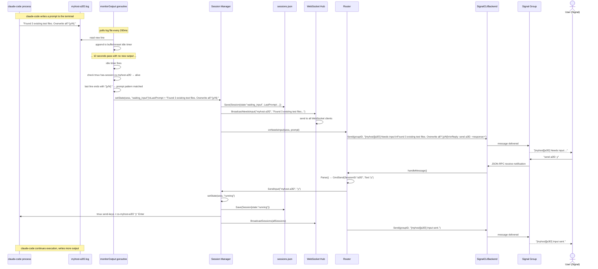

# Input Required Sequence

🔍 <a href="https://mermaid.live/view#pako:eNqtVu9P40YQ_VdG_hSkOOW4T7V6nHRwbak4QKTVfcCoWuyJs8Xedb1rIEL87327601yMUH9hZBw8Js3b-fNzOY5KXTJSZYY_rNnVfCpFFUnmlwRflrRWVnIVihLJ7XoSyZhqPBPqQukttMFGzOGn-vKYZvVUhubiveLo1mtqzHui1bS6s5jw-Nlb9veUqU73Vup-JUYoUTFPmaO5FKr-K8xdg5Gr9oEpJn9YbQa437u7xzqK9_NdXHP_h9j1DUkhcThaYz41Mmy8gnnslKiPjk_-yRAqMox9iecsN1Aw-cAE4Urym8mJPN_JwF1kA_qL7Rl0g94E6yZouTZN-Y8dtKyIeFcalpLVpNdMkF3I8EUaEJwenzsw_PkR92rkt4TP0mD8leAG0sLWbOZ0SXSeVYSdf2RblbfXdwiZlfQYGpGra5rQzDeExDj5YqODg-boWMGYMzesShJ8SPVa983iDWpaFuU053mrl8sYEKuOjawTJbIYWUTfXlF0Gw2o3eHaIZCq9LADWPoUdolKe0T69B8gO1Nv8mCQyHxXmCx5OKebNM_0VKYdGhAKky6NRWU90fvvj9CPeXD_iPXAh64ohA72V5xnsTyR47B5lZYWKyoERYSyhFpGJUMRbBzKyxPnLIpeB6FdI7_LhVqkCcHKOw5El8F2g__qTmGrMjvJzKjuXjgyTC-z8bpyEYKprTJn8GTl4NdMkxphpnToiyAvGAuzZmLneTJVpEd09vi4XcykIMyEpuhz3Cerc1Q1JKVNbtSwkbISKstGaG0wZiBP-AQEFYFKoEsk8rN_tmp03kTlN_eOOm35NnIVySDI__YAsTg95rbejWcyPFm9AN6t8VC5OP10YMiSPObKKMG6nE6Ktl1Zxd7yb9NAXN7KXtbsa9sXFkOv2HPky01q9gogXxTnV_mlxfp9dUJlkPBUIFJtXIhC2Fl3ONr2dGCpVAY0i9B_WS37hF1JTqDt3F6TprSOfE89OTZKfoxNs-v_ITiJxD5skO2niYXu7f1VusSb_pl_xx2vVJw9pWYt2ZnHTWekrDjs7CLXNHTe14ZSu1oGTml9Fmtr7Z9kzYkNxP0WXz-l_3ti-ZU2dn_3YjfUP_dWxM3A-aqx8XJT1z0rs2m8Spt3JeJcEck0wRXQCNkiW9Pzy_42LclnPhcuj2bZAtRG54mord6vlJFktmu5wgavmUNqJe_AFwQP1c">View this diagram fullscreen (zoom &amp; pan)</a>

