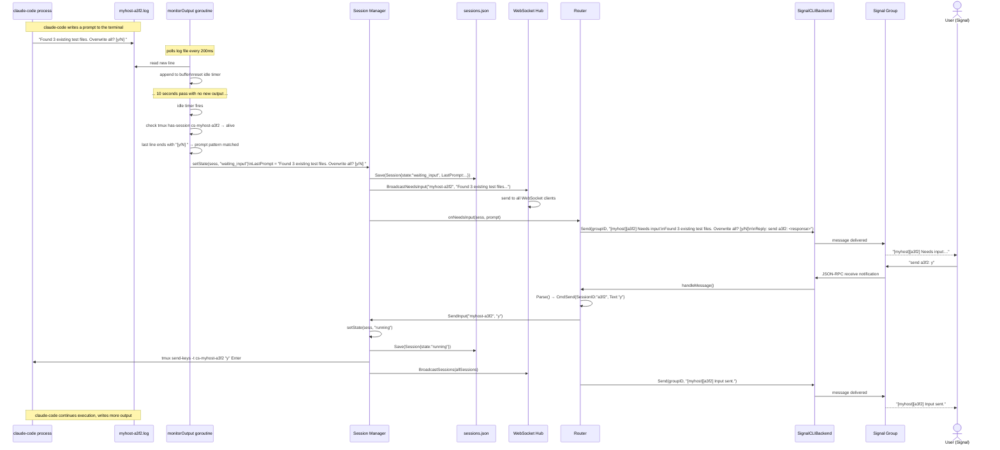

# Input Required Sequence

```mermaid
sequenceDiagram
    participant Claude as claude-code process
    participant Log as myhost-a3f2.log
    participant Monitor as monitorOutput goroutine
    participant Manager as Session Manager
    participant Store as sessions.json
    participant Hub as WebSocket Hub
    participant Router as Router
    participant Bridge as SignalCLIBackend
    participant Group as Signal Group
    actor User as User (Signal)

    Note over Claude,Log: claude-code writes a prompt to the terminal
    Claude->>Log: "Found 3 existing test files. Overwrite all? [y/N] "
    Note over Monitor: polls log file every 200ms
    Monitor->>Log: read new line
    Monitor->>Monitor: append to buffer\nreset idle timer
    Note over Monitor: ... 10 seconds pass with no new output ...
    Monitor->>Monitor: idle timer fires
    Monitor->>Monitor: check tmux has-session cs-myhost-a3f2 → alive
    Monitor->>Monitor: last line ends with "[y/N] " → prompt pattern matched
    Monitor->>Manager: setState(sess, "waiting_input")\nLastPrompt = "Found 3 existing test files. Overwrite all? [y/N] "
    Manager->>Store: Save(Session{state:"waiting_input", LastPrompt:...})
    Manager->>Hub: BroadcastNeedsInput("myhost-a3f2", "Found 3 existing test files...")
    Hub->>Hub: send to all WebSocket clients
    Manager->>Router: onNeedsInput(sess, prompt)
    Router->>Bridge: Send(groupID, "[myhost][a3f2] Needs input:\nFound 3 existing test files. Overwrite all? [y/N]\n\nReply: send a3f2: <response>")
    Bridge->>Group: message delivered
    Group-->>User: "[myhost][a3f2] Needs input:..."

    User->>Group: "send a3f2: y"
    Group->>Bridge: JSON-RPC receive notification
    Bridge->>Router: handleMessage()
    Router->>Router: Parse() → CmdSend{SessionID:"a3f2", Text:"y"}
    Router->>Manager: SendInput("myhost-a3f2", "y")
    Manager->>Manager: setState(sess, "running")
    Manager->>Store: Save(Session{state:"running"})
    Manager->>Claude: tmux send-keys -t cs-myhost-a3f2 "y" Enter
    Manager->>Hub: BroadcastSessions(allSessions)
    Router->>Bridge: Send(groupID, "[myhost][a3f2] Input sent.")
    Bridge->>Group: message delivered
    Group-->>User: "[myhost][a3f2] Input sent."
    Note over Claude,Log: claude-code continues execution, writes more output
```

