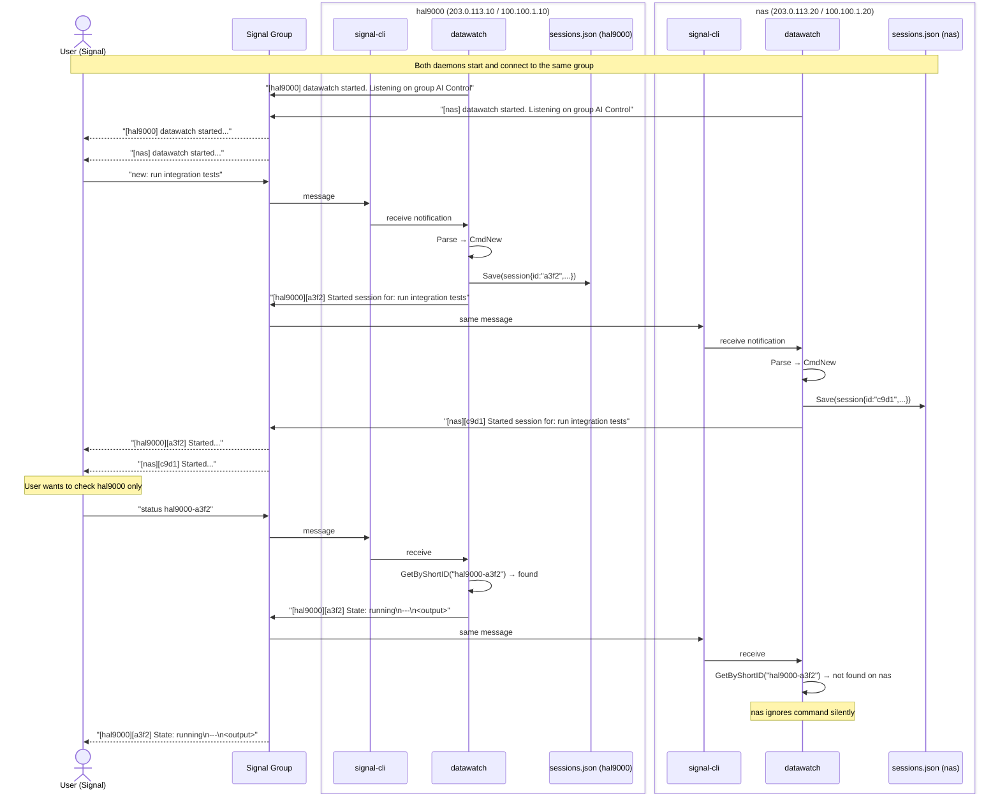

# Multi-Machine Sequence

Two hosts sharing one Signal group.

🔍 <a href="https://mermaid.live/view#pako:eNqlVl1v2kAQ_CsrPxEJu4Y8xaqQ8lGlkSKrEupTHFXX8wLX2nfUtw6Novz37vkMxWACTZEwMp4b78zOrf0SSJNjkAQWf9WoJd4oMa9EmWngj5BkKvhqsQJh_e9gquZaFGcesBQVKamWQhPcVqZeOpxH-PNMe-B38xsWoriI4xgG4_g8iqPR6DwaxfABRjGfuC8fW95d7uv7u2-fHbdtuENZqH7g5Rw1eWguSKwEyUU_csrSsCVFa5XRNvphjYZBW2dbCup8W4Rm_JaAcVfA-C0B6ekC0pMFpD0CuMb94lNDCOYJfT-H7eoErgwt-FZY8nqwxDcAoXOQRmuUBGSAFghWlAhz31HH1vocTiZNmxPIgofWt8e_hXs-zCO4V5ZQKz0HLrDhgcs7uDaaKlNkwTZp2iFlLe8nbGhC5nOSj9UYRYeXHajCL_GLHHa7co2rBKpag9KEvKWIGwSElmz3NpNJE-4ESm6imKO_1vzH11qfmQklqicEbUjNlGzodluxAX8RlUXI6vHoYgzXZZ7iahfbxj-BqXjCQRugF5UnWSDOZ-MsGLK617Pj3X5w8EdOY2PJOoowM9Ub8vcN4CQ2GdtzId0IS4-70AEfcSHduJD2uSAv8lGfC_vxfHDQ_3GgL6BdW4-Gs1tDJ5jdjZ_4Mb7iCWLd5pYLlD83o9no4rk_zhx5qu0aGPqMvD_HB6N7i3T1PF2Yiu5uBlnQvd_ZupszU7vJdno2CZteuIGRZToMQz5-NDUta5r06finOB5M4GliOMxekBtl3Mzdtm3o3LOHHx8cWcvzuSzdnLaq4Kuua6cn6m0zgmFQYlUKlfNrwcsrn9ZLHn34KVe8W4JkJgqLw0DUZKbPWgYJVTWuQe3rQ4t6_QM0aLMb">View this diagram fullscreen (zoom &amp; pan)</a>

