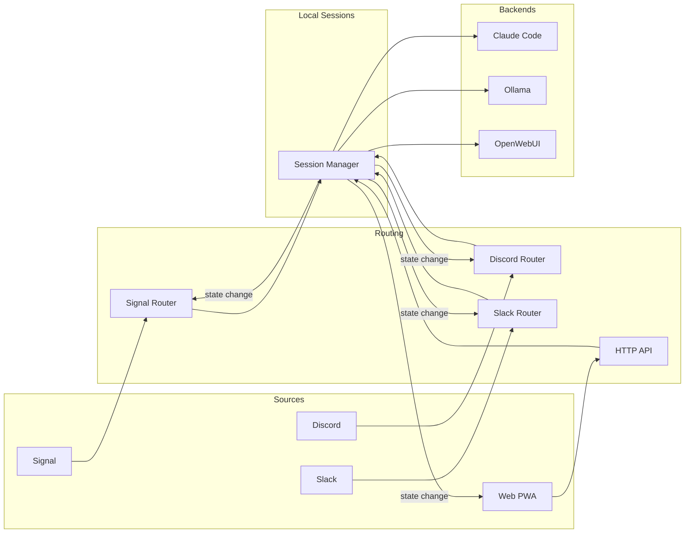
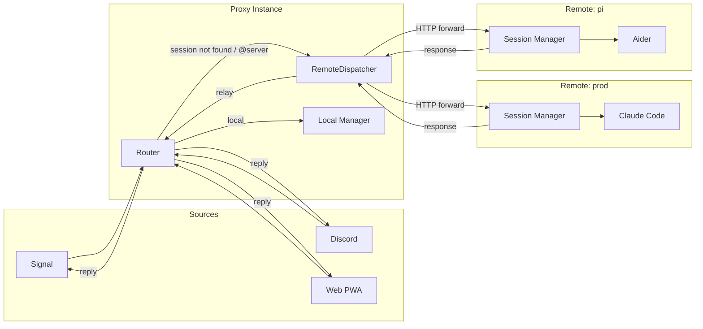

# Multi-Source Message Flow

## With Proxy Mode (Remote Servers)

When remote servers are configured, the routing layer can forward commands to remote
instances if the session is not found locally.

