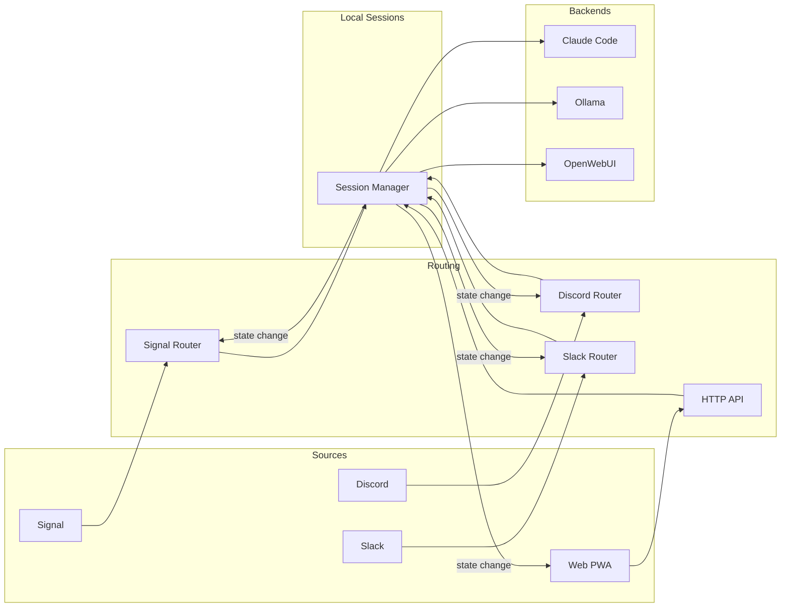
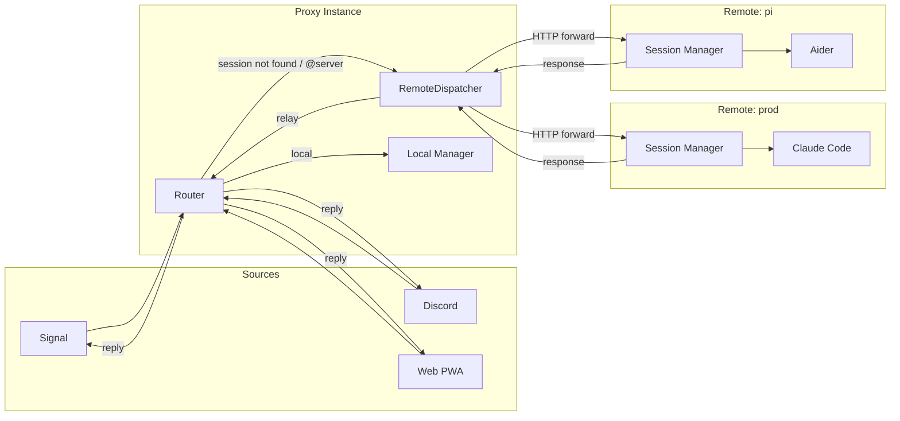

# Multi-Source Message Flow

🔍 <a href="https://mermaid.live/view#pako:eNp9kt9uwiAUxl-FcK0v4MWSrV2yJTQ1xYUL3AUCVjIKhj9ZFvXdh22ddEa5Kd_vOznfySkHyK2QcAG32n7zHXMBoGZtQDo-blrH9juAbXRc-oGeD6ZYtYbpzysqaak8t05kDCOKNeNfGSKUyA1YkueRSSP-hTU2BmXarEszpvWWdHloc0m99TBqhvRb63n5Tt9Wq-X5cneONUSWp1AsvVfW-DW8NqjoSEHFDGv_mt92eUkDJJrtrihooVkUEhRp8dlUNaK11qxjOSO03kuTdvYxmXS4YjCfP6X99J9qYGUvygnDaChEE0p6kVZwgQOuelkUuarRRJFJ7dEHFiRIb8e08pjGue-VDzyMHpgEzmAnXceUSE_1cEoy7kWqeBUqWAcXW6a9nEEWg8U_hsNFcFFeikrF0t_oxqrTLzNW3KI">View this diagram fullscreen (zoom &amp; pan)</a>

## With Proxy Mode (Remote Servers)

When remote servers are configured, the routing layer can forward commands to remote
instances if the session is not found locally.

🔍 <a href="https://mermaid.live/view#pako:eNqNUkFrgzAY_Ssh55ZRjx7Gig42qFC04CHukJqvbSAmksR1pfa_L9a00yJlOeV77_Hel6dnXCoGOMQ7oY7lgWqLVmkhkTum2e41rQ8oU40uwfRodzKS8b2k4usPiknMTak0G2A5yWGL1vnSYyDZg3OB11r9nNCnNJbKEgo8CElJqhoLeuCYxiSFSllwYTW15WHErhKyUiUVKKGS7u_UVGzvEqJaKzYMTZMFycAYruSDS3eiaEEiQRsGKHKt_cefj92Dp-4BWXI23ru_Zmg-f3WN9FM8mvL75LVpB7Sia6J1nYzQAhufL5VFO9VIhl7QmwH9DbrArWu416fXkPZjs1k7mT5Szdqunads4Nlkcd3J1XUDAg8Ety29ptVgaiUNDJJ78RQTe0LQU3t_v3-Zhlp06BQYT4E5nuEKdEU5c7__-eLGpmbUwjvjVmkc7qgwMMO0sSo7yRKHVjdwE8Wcum9dedXlFz0d-vc">View this diagram fullscreen (zoom &amp; pan)</a>
