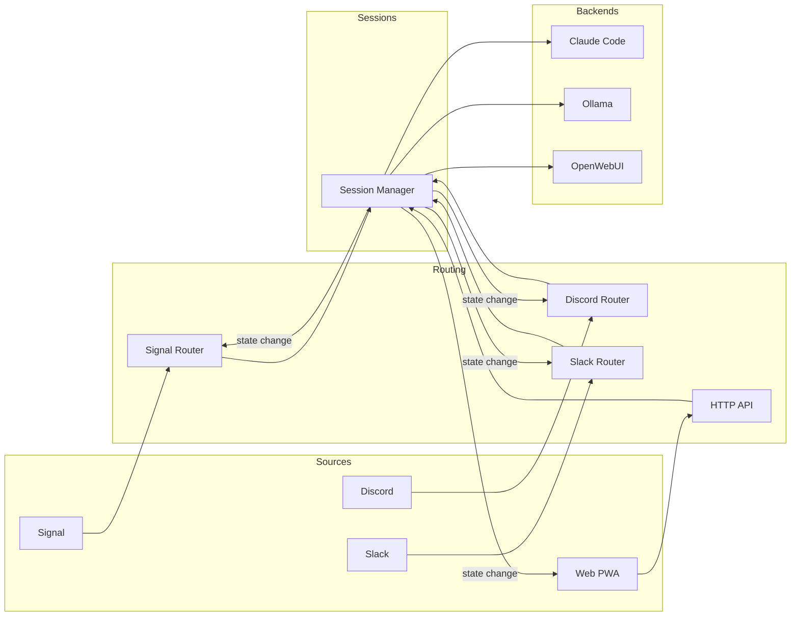

# Multi-Source Message Flow

```mermaid
flowchart LR
    subgraph Sources
        S[Signal]
        D[Discord]
        SL[Slack]
        W[Web PWA]
    end
    subgraph Routing
        SR[Signal Router]
        DR[Discord Router]
        SLR[Slack Router]
        API[HTTP API]
    end
    subgraph Sessions
        M[Session Manager]
    end
    subgraph Backends
        CC[Claude Code]
        OL[Ollama]
        OW[OpenWebUI]
    end

    S --> SR --> M
    D --> DR --> M
    SL --> SLR --> M
    W --> API --> M

    M --> CC
    M --> OL
    M --> OW

    M -->|state change| SR
    M -->|state change| DR
    M -->|state change| SLR
    M -->|state change| W
```
