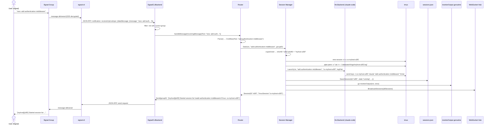

# New Session Sequence

```mermaid
sequenceDiagram
    actor User as User (Signal)
    participant Group as Signal Group
    participant CLI as signal-cli
    participant Bridge as SignalCLIBackend
    participant Router as Router
    participant Manager as Session Manager
    participant LLM as llm.Backend (claude-code)
    participant Tmux as tmux
    participant Store as sessions.json
    participant Monitor as monitorOutput goroutine
    participant Hub as WebSocket Hub

    User->>Group: "new: add authentication middleware"
    Group->>CLI: message delivered (E2E decrypted)
    CLI->>Bridge: JSON-RPC notification: receive\n{envelope: {dataMessage: {message: "new: add auth..."}}}
    Bridge->>Bridge: filter: not self, correct group
    Bridge->>Router: handleMessage(IncomingMessage{Text: "new: add auth..."})
    Router->>Router: Parse() → CmdNew{Text: "add authentication middleware"}
    Router->>Manager: Start(ctx, "add authentication middleware", groupID)
    Manager->>Manager: crypto/rand → shortID "a3f2"\nfullID = "myhost-a3f2"
    Manager->>Tmux: new-session -d -s cs-myhost-a3f2
    Manager->>Tmux: pipe-pane -o "cat >> ~/.datawatch/logs/myhost-a3f2.log"
    Manager->>LLM: Launch(ctx, "add authentication middleware", "cs-myhost-a3f2", logFile)
    LLM->>Tmux: send-keys -t cs-myhost-a3f2 'claude "add authentication middleware"' Enter
    Manager->>Store: Save(Session{id:"a3f2", state:"running", ...})
    Manager->>Monitor: go monitorOutput(ctx, sess)
    Manager->>Hub: BroadcastSessions(allSessions)
    Manager-->>Router: Session{ID:"a3f2", TmuxSession:"cs-myhost-a3f2"}
    Router->>Bridge: Send(groupID, "[myhost][a3f2] Started session for:\nadd authentication middleware\nTmux: cs-myhost-a3f2")
    Bridge->>CLI: JSON-RPC send request
    CLI->>Group: message delivered
    Group-->>User: "[myhost][a3f2] Started session for:..."
```

