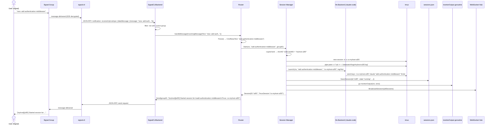

# New Session Sequence

🔍 <a href="https://mermaid.live/view#pako:eNqNVU1T2zAQ_SsaXwgzcZimp2qmHCC0TYevIXR6wByEtElUZMmVZAKTSX97V5YcTEwLvliS3369XT2vM24EZDRz8LsGzWEi2cKystAEH8a9seSHA0uYi-_BTC40U_sRUDHrJZcV0558taauAi4i4r4POz6dBpBrQDlXsg85slIs4NkVmhwxfg9a9LFXpvYxvbjqI86YZosImYFz0uj2qI89PT0LOKXKUYpIBlyxWkAeeHql6uuyfgwmHt_9rzPkrynExchu9MsZ_UqORstANSLLuLyofVV7sjDIopca-jbf6ruA_wl3M4OpNgdF8h1alR8eNi2gpMg0rChhQhBW-yVo9MF8IKKUQihYMQtFFi0bEzRFzikpMWskighQ8gEsIBsn4xPccvtUeRCJD8SiRewaJd9nF-f51eUx0cbLeYpEiQUO6KQo9Br0AyhTIXYtmGdnMQruyna1k_FoNCqyzWYTw8VAnYhzqbDzNAREotV8SLixGA_pe57BrVWcE0qWTGPtKfhgqrkppV6k_foaHv0_8khVRz8dh5fMOhjsk6Ief_g0JselOIfV1tEb7G92nKYRpThC2PMB94_Dt50MY8HTSUoxOem6azpnDiwW3ybqlsb66SS4_zgf4yAUel4rhSef8ax8Whrn8_Rpx22YfuQdVnkacJILkjvCXd61e9WqkhXkOMlAcoNxsBxyeEj-HIzCTKyY58sDZRbuoONohAf9JPDSUnLKas2X7-YJ471MEc_Q-Rep2kuOXrepOhSC_B6eHMn9Tm1kL-rD20H3yIneCtRz9o1EYJvZAwySPq2loG0zhsR55gH3ttYaBzQc4Rxu-i2OwkFRM16KSCQlNKhng5JB8WYYJjhzPoV3A6ZUu94x6Yx7m-x00kk28JU-0D7Hu0PeXuAZ8jtIoxt6cxOtbm-C2W28Aig-7YzNsUoc0v_zXejYu90c9nfkoBG6rWaFTqNU4b_Q-a64JSXtCWJXNBEWdJe-r4BGS7JhVoItmRT4C15vcFtXOP5wIkL7MjpnysEwwyrN7EnzjHpbQwtKv-qE2vwFRbynzg">View this diagram fullscreen (zoom &amp; pan)</a>

