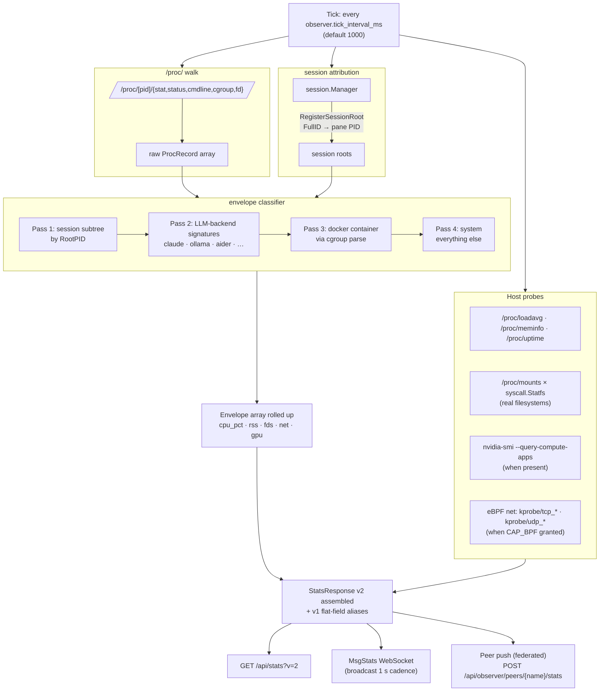

# Observer tick pipeline

How one collection tick turns into a `StatsResponse v2` payload + WebSocket broadcast.

## Envelope classification order

1. Session subtree (root pid → walkSubtree → all descendants claimed).
2. Backend shallowest match (by `comm` / cmdline[0] basename against `observer.backend_signatures`).
3. Container via `/proc/<pid>/cgroup` fallback.
4. System catch-all.

First-match wins per-PID; session attribution outranks backend so claude-code running inside a tmux session counts as session CPU, not free-floating backend CPU.

## Degradation modes

| Missing component | What happens |
|---|---|
| `/proc` not mounted (non-Linux) | `processes.tree` + `envelopes[]` are empty; host/cpu/mem/disk/gpu/sessions/backends still render |
| `nvidia-smi` not in PATH | `gpu[]` empty; envelopes don't gain `gpu_pct` |
| CAP_BPF not granted | `net.per_process[]` empty; envelopes don't gain `net_rx_bps` / `net_tx_bps`; CPU + memory still roll up |
| Docker socket not reachable | container correlation falls back to `/proc/<pid>/cgroup` parsing; `envelope.image` may be empty |
| Session root PID not registered | session envelope never appears; processes that would have joined fall through to backend/system |
