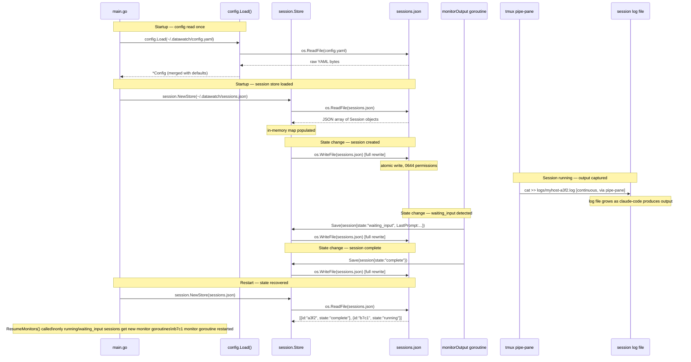

# Persistence Flow

When and why data is written to disk.

```mermaid
sequenceDiagram
    participant Main as main.go
    participant Config as config.Load()
    participant Store as session.Store
    participant Disk as sessions.json
    participant Monitor as monitorOutput goroutine
    participant Tmux as tmux pipe-pane
    participant Log as session log file

    Note over Main,Config: Startup — config read once
    Main->>Config: config.Load(~/.datawatch/config.yaml)
    Config->>Disk: os.ReadFile(config.yaml)
    Disk-->>Config: raw YAML bytes
    Config-->>Main: *Config (merged with defaults)

    Note over Main,Disk: Startup — session store loaded
    Main->>Store: session.NewStore(~/.datawatch/sessions.json)
    Store->>Disk: os.ReadFile(sessions.json)
    Disk-->>Store: JSON array of Session objects
    Note over Store: in-memory map populated

    Note over Store,Disk: State change — session created
    Store->>Disk: os.WriteFile(sessions.json) [full rewrite]
    Note over Disk: atomic write, 0644 permissions

    Note over Tmux,Log: Session running — output captured
    Tmux->>Log: cat >> logs/myhost-a3f2.log [continuous, via pipe-pane]
    Note over Log: log file grows as claude-code produces output

    Note over Monitor,Disk: State change — waiting_input detected
    Monitor->>Store: Save(session{state:"waiting_input", LastPrompt:...})
    Store->>Disk: os.WriteFile(sessions.json) [full rewrite]

    Note over Store,Disk: State change — session complete
    Monitor->>Store: Save(session{state:"complete"})
    Store->>Disk: os.WriteFile(sessions.json) [full rewrite]

    Note over Main,Disk: Restart — state recovered
    Main->>Store: session.NewStore(sessions.json)
    Store->>Disk: os.ReadFile(sessions.json)
    Disk-->>Store: [{id:"a3f2", state:"complete"}, {id:"b7c1", state:"running"}]
    Note over Main: ResumeMonitors() called\nonly running/waiting_input sessions get new monitor goroutines\nb7c1 monitor goroutine restarted
```

