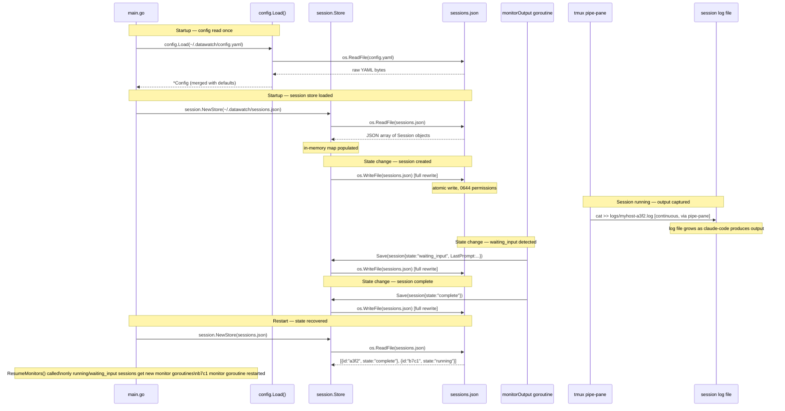

# Persistence Flow

When and why data is written to disk.

🔍 <a href="https://mermaid.live/view#pako:eNqtVtlu00AU_ZUrPyXIcdpSgeSHSIjCA0pb1CAh1FRoOr52ptgzZpaaKCrfzh0v2WwQW168nXt9zrmLswm4SjCIA4NfHUqOF4JlmhVLCfQrmbaCi5JJC5dMSGAGCjpGmeoDXiuZisxDeH0WzRVLRuM-cGGVRo8zaIxQMqpv9HEXwnzZg5nowSg5QExJQQlqbs3ptbOls5AprZwVciD1h8J98wHWH0tR4oRuD-DmKttjADldpiInYAO9UhZBPaKu3QkbB2ISSClcCUt3dnJ63toBGlkCiixuYn3EZDbrYvY9-z6NEmZZxSxfTdsHa1bkrZdNCMV6g2JQJrqh1G-J16gP9pjJ3ns0q-DTq8s53K8tmoOEhPKkYnjWlnJUoM4wgUrYFSSYMpdbM_6J-IbMkfTOOFOXPCdxmBzIr0sfbzvhCqv6zqEFBw3Q6qphgx4MoTsX2te9W1xfAdOarUGlsGhJqvsH5NYcq2tjiG6BhdJrmoASSlW6nFmvZhC_s4Nu8xWTGR57wqkhbGdHT85HLSwO6IHb1OU5NVPlAXfHL2_imVWF4FBDQjh5cX4OJepCNIn6lP04hNTr8dYL7aQUMus4q2aiOCut0x1nH0WU6zjOLMxmfkDMtFivlLET9jw9i_zE3FJX0hg65UwIj4LtBq5Hv87VTRlkWlWmXig5cwlO_KqCUqvEcTQtp4FubJbALypQMUF8ss9CelEJWir7ti-b6F2vLNjjtgYb47PFy-AgwzIIYc6Mfa9VUdo4iqKn8b9W9a-biijkJOhPxGxjgv_Pe2813KDxy2HLuFahkXvcb26F_74IbjciIQd8q_oqDjgSQgO5f8lP9yHtgBDibkhzLdcV2FbAjMY0InlOOpdSyXzdDdj0sBc7ypChBYlV90XbfcsMJfBc-k_Iy9pgTIIwoM1NH-qEPuybJ7p0JW1TfJP4iCBOWW4wDJizarGWPIitdtiB2j8ALerpBxAA0ro">View this diagram fullscreen (zoom &amp; pan)</a>

