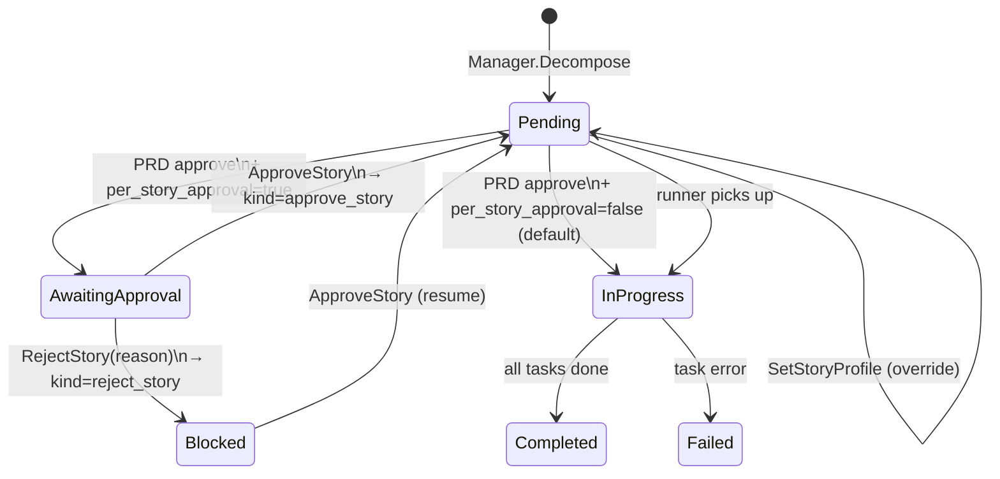
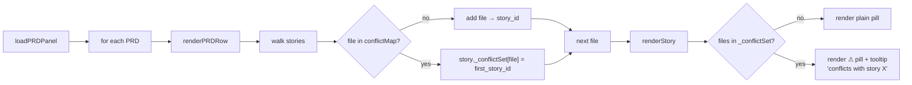

# PRD Phase 3 + Phase 4 — per-story approval + file association

End-to-end sequence covering the operator-asked PRD-flow rework
shipped across v5.26.30 → v5.26.67.

- **Phase 3** — per-story execution profile + per-story approval
  gate (v5.26.60–62).
- **Phase 4** — file association via decomposer-extracted
  `FilesPlanned` + post-session diff `FilesTouched` (v5.26.64 +
  follow-ups in v5.26.67).

Operator surfaces: PWA story rows (Approve / Reject / profile /
files-edit pills), REST endpoints listed inline.

## Per-story approval state machine



## End-to-end sequence with files

```mermaid
sequenceDiagram
    participant Op as Operator (PWA / REST / MCP)
    participant API as REST /api/autonomous/prds
    participant Mgr as Autonomous Manager
    participant Dec as Decomposer (LLM)
    participant Run as Runner (Manager.Run)
    participant Sess as session.Manager
    participant Git as ProjectGit (post-session)

    Op->>API: POST /prds {spec, project_profile?, cluster_profile?, decomposition_profile?}
    API->>Mgr: CreatePRD
    Mgr-->>Op: prd_id, status=draft
    Op->>API: POST /prds/{id}/decompose
    API->>Dec: ask LLM with DecompositionPrompt\n(asks for files: [...] per story/task — Phase 4)
    Dec-->>API: JSON {stories: [{title, files, tasks: [{spec, files}]}]}
    API->>Mgr: store stories + tasks (FilesPlanned populated)
    Mgr-->>Op: status=needs_review
    Op->>API: PUT/POST /set_story_profile {story_id, profile} (Phase 3 — optional)
    Op->>API: POST /set_story_files {story_id, files} (Phase 4 — optional override)
    Op->>API: POST /prds/{id}/approve
    API->>Mgr: Approve
    alt per_story_approval=true
        Mgr->>Mgr: stories: pending → awaiting_approval
        Op->>API: POST /approve_story {story_id} (per story)
        Mgr->>Mgr: story.Approved=true; awaiting_approval → pending
    else per_story_approval=false (default)
        Mgr->>Mgr: stories stay pending (auto-approved)
    end
    Op->>API: POST /prds/{id}/run
    API->>Run: Manager.Run
    loop for each pending task in topo order
        Run->>Run: flattenTasks (skips awaiting_approval + blocked)
        Run->>Sess: spawn worker (project_profile or story.execution_profile)
        Note over Sess: worker session runs;<br/>writes to project_dir
        Sess-->>Run: SessionEnd → state=complete
        Run->>Git: ProjectGit.DiffNames() (Phase 4)
        Git-->>Run: ["a.go", "b.go", ...]
        Run->>Mgr: RecordTaskFilesTouched(prd, task, files)
        Mgr->>Mgr: Task.FilesTouched populated
    end
    Mgr-->>Op: status=completed (broadcast)
```

## File-conflict detection (PWA-side)



## REST surface summary

| Endpoint | Phase | Body |
|---|---|---|
| `POST /set_story_profile` | 3 | `{story_id, profile, actor?}` |
| `POST /approve_story` | 3 | `{story_id, actor?}` |
| `POST /reject_story` | 3 | `{story_id, actor?, reason}` |
| `POST /set_story_files` | 4 | `{story_id, files: [...], actor?}` |
| `POST /set_task_files` | 4 | `{task_id, files: [...], actor?}` |
| `PUT /api/config { autonomous.per_story_approval: bool }` | 3 | toggle gate |

All gated by `needs_review` / `revisions_asked` (operator-edit) or
`approved` / `running` (per-story approval). Each appends a
`Decision` to the PRD's audit timeline.

## See also

- [docs/howto/autonomous-planning.md](../howto/autonomous-planning.md) — the operator walkthrough.
- [docs/plans/2026-04-27-prd-phase3-per-story-execution.md](../plans/2026-04-27-prd-phase3-per-story-execution.md) — Phase 3 design doc.
- [docs/plans/2026-04-27-prd-phase4-file-association.md](../plans/2026-04-27-prd-phase4-file-association.md) — Phase 4 design doc.
- [docs/flow/agent-spawn-flow.md](agent-spawn-flow.md) — F10 agent lifecycle (orthogonal; Phase 3/4 sit above this).
