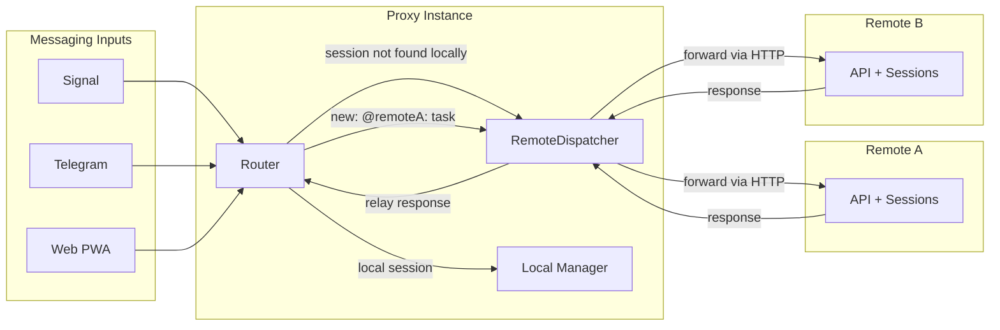

# Proxy Mode — Remote Server Routing

When proxy mode is configured (`servers:` in config), the router can forward commands to remote instances.

**Routing logic:**
1. Command arrives (e.g. `send a3f2: yes`)
2. Router checks local session manager for `a3f2`
3. If not found locally, asks `RemoteDispatcher.FindSession("a3f2")`
4. Dispatcher checks session discovery cache (refreshes from all remotes every 30s)
5. Returns server name → router forwards command via `ForwardCommand(server, text)`
6. Response relayed back to messaging channel

**Explicit routing:**
- `new: @prod: deploy pipeline` → creates session on remote "prod" directly
- `list` → aggregates sessions from local + all remotes
