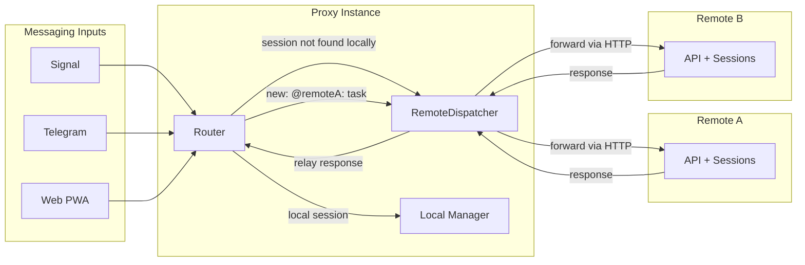

# Proxy Mode — Remote Server Routing

When proxy mode is configured (`servers:` in config), the router can forward commands to remote instances.

🔍 <a href="https://mermaid.live/view#pako:eNqNkk1ugzAQha8y8rbJBVhUBVGpkRIJkUhZ1F1MYEKsGhvZpilKcveaQFLoj4QXyDPv43n84MQynRMLWGGwOsAy5Qr8svWua3C2ImuxEKqAhapqZznrkHatRaFQvnLWbTh7-9Y2JMl7lF69bUf6lnZe8k9ItuFdIZVz9WuGxOjPxp9vHaqMhhOk3iPVtSMzMo_bNpXaUSxshS47_ACSlSeWOkMJK1RYDOS_R-jcIBwdHnqTMFnAA6x9SkIrO80lGrlEk1y6iGE-f4T-I91iHfbaPPuya6RteeZMXu9quwM4O_sExkAvgdIO9rpWOVxfkU0Lx2NW0TGAJ3O9TBiAQ_s-oOKe2mtzRJPDh0B42WySFknDCUx0Hz7sMUO28rnQcJbofy2-SxIbGAIpm7GSTIki9z_96eLLusrR0XMunDYs2KO0NGNYO71uVMYCZ2q6QbHANvCeunwBqbn9Wg">View this diagram fullscreen (zoom &amp; pan)</a>

**Routing logic:**
1. Command arrives (e.g. `send a3f2: yes`)
2. Router checks local session manager for `a3f2`
3. If not found locally, asks `RemoteDispatcher.FindSession("a3f2")`
4. Dispatcher checks session discovery cache (refreshes from all remotes every 30s)
5. Returns server name → router forwards command via `ForwardCommand(server, text)`
6. Response relayed back to messaging channel

**Explicit routing:**
- `new: @prod: deploy pipeline` → creates session on remote "prod" directly
- `list` → aggregates sessions from local + all remotes
