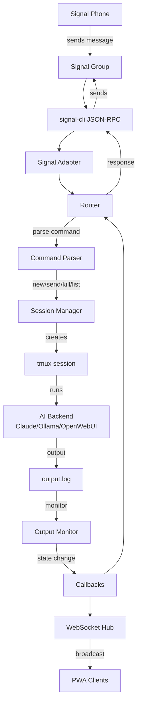

# Signal Message Flow

```mermaid
flowchart TD
    Phone[Signal Phone] -->|sends message| SG[Signal Group]
    SG --> SC[signal-cli JSON-RPC]
    SC --> SA[Signal Adapter]
    SA --> R[Router]
    R -->|parse command| P[Command Parser]
    P -->|new/send/kill/list| M[Session Manager]
    M -->|creates| T[tmux session]
    T -->|runs| AI[AI Backend\nClaude/Ollama/OpenWebUI]
    AI -->|output| LOG[output.log]
    LOG -->|monitor| MON[Output Monitor]
    MON -->|state change| CB[Callbacks]
    CB --> R
    CB --> WS[WebSocket Hub]
    R -->|response| SC
    SC -->|sends| SG
    WS -->|broadcast| PWA[PWA Clients]
```
