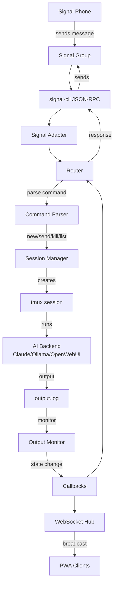

# Signal Message Flow

🔍 <a href="https://mermaid.live/view#pako:eNpVkk1v2zAMhv8K4XNT33MY4KhDlmGJjShDDkoOjK2mRvVh6APtUPe_j5ZsbDVgQCQfyi_5-qNobSeLdfGs7Fv7gi7A6eligJ7mxRopeH83qHJwhdXq2-il6Txo6T3e5Qh8uzBbZ-Nwzc18O7HAmfCpuGpVDz95fVgdG7YwLDPVckHV4RCkW8pVKh_F0cZ_2WPSMKDzElqrNZpuhEawfIRmKixsk1gj38pJc_naK1Wq3ocR9oKT_t4a2KOhMZaOfeponcQg_QgnEXR8B5_ZmTklxkVDQLUT1Q422L7SBy4XwxTGTpa1UqixrAdpzvL2ezd3Ejq10jhDJBG_6q3I50dl7zNDyQRpa_pgHUmtD6JOFOxzbtFaH7IfgcQCeWcmO9hGMFTqRpL8DLJNXuSX6MwFSeOWlAf4EW9f1uukH6zxk7vsf6-y95PnOXvmKXtzFrsWp8U250rQC0z10gR_LR4KLZ3GvqN_7OOTwjh0pPd7N01SrJ9ReflQYAyW_zFtsQ4uygV66vHuUM_U51_-NN7O">View this diagram fullscreen (zoom &amp; pan)</a>
