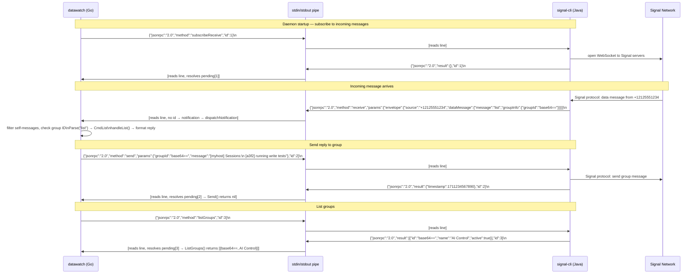

# signal-cli JSON-RPC Flow

The full JSON-RPC protocol between datawatch and signal-cli.

🔍 <a href="https://mermaid.live/view#pako:eNqdVU1v2zAM_SuCTinmbrXTj9VABwztEGToimI57BD7oMh0otWWPElOUQT576Ms20uaNu3ig2FRJPX4-CivKFcZ0Jga-FOD5HAj2FyzMpEEn4ppK7iomLRkpAgzJGOWPTLLF2QwUke7XveiAudnbCbkJ3yr2pIKjbuuk-vbceMq5pIVx7wQZPCdLdkLWSeNi3Nuv-7APir9kEjve6csELUEjSgDlzcmNwxKJREHpqkrktTRSXhKTD0zXIsZEKuIkFyVQs5JCcawORifbKSOv3xxdcRkldDfRkld8YTGCY0-niQ0SGgJdqGyxtQn_AkcxBKafeH2wnXSwXPJMKcHNtXAMkMKISH1287utpvSYqIqkOQXzCaKP4B1QNuiDWgs0WwF7cWpwdSFRdNq_TqqkdrCFBCMUsUSDEEc2MT5NEzTl4luAY-f8UiY1khFB9S3tyu_raXSyiquMNopqo_MtSrJhzAKo7OzszAanr6_2I2m6I1eoIxYaRwHCQW5hALp9Sujas2hCdg60UU5UD88Ju9c9ouEFsLYxmuuVV2NZa68j196CDNm4Pz06iqha_e8SbpEOWZOpeFlhAsrcsGZFajg1pYJU7m5u9vYSzcE6zLmorDYGgNFftxpOiB8AfyBNODI-AaR3DNtYNDVcdSdcF1mt86SyAWTWQFuMeh3c6VLZlEcVfG0Z-wmqBnv5ITbHHrIVGGWne69TG-w3Ztp-bRQxqYIxBikyMSJO3_KhnmUEl1L6YRKHrVA6BaMxeT9cESHjuyOqF0BLeUdugOmNqFWYLhlZeVG9yJ0-jw7v_h8ebIH89sDjUy0XXXtwh5rsLWWhkhRpHua6xThqzrkqnRyG_ng_pIc_i_j72NuumrzP1OKZKWXydcxuVbSalU0dsZtc1_EVtewTl9H9za3w57b277eDYanqw5QQP6BWKcpDZArHDGR4c94tcZlXeEtBN8yYZWmcc4KAwFltVWTJ8k91M6p_Wm3Xuu_vj6Riw">View this diagram fullscreen (zoom &amp; pan)</a>

