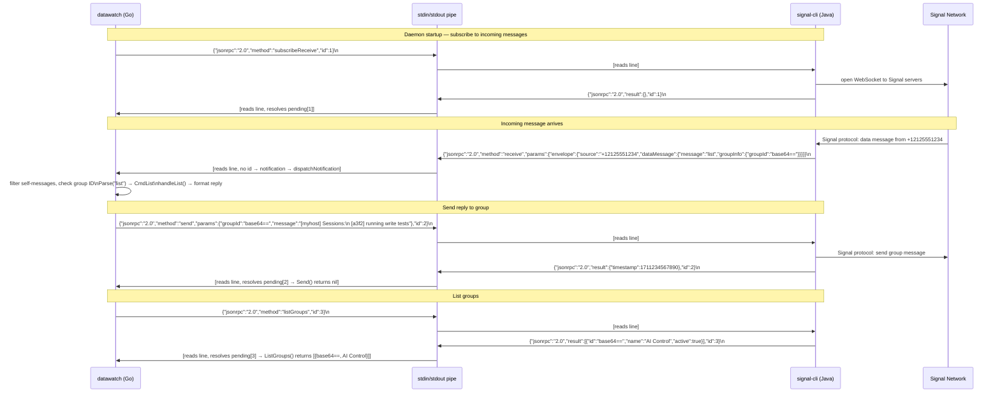

# signal-cli JSON-RPC Flow

The full JSON-RPC protocol between datawatch and signal-cli.

```mermaid
sequenceDiagram
    participant Go as datawatch (Go)
    participant Pipe as stdin/stdout pipe
    participant SCLI as signal-cli (Java)
    participant Signal as Signal Network

    Note over Go,SCLI: Daemon startup — subscribe to incoming messages
    Go->>Pipe: {"jsonrpc":"2.0","method":"subscribeReceive","id":1}\n
    Pipe->>SCLI: [reads line]
    SCLI->>Signal: open WebSocket to Signal servers
    SCLI->>Pipe: {"jsonrpc":"2.0","result":{},"id":1}\n
    Pipe->>Go: [reads line, resolves pending[1]]

    Note over Go,Signal: Incoming message arrives
    Signal->>SCLI: Signal protocol: data message from +12125551234
    SCLI->>Pipe: {"jsonrpc":"2.0","method":"receive","params":{"envelope":{"source":"+12125551234","dataMessage":{"message":"list","groupInfo":{"groupId":"base64=="}}}}}\n
    Pipe->>Go: [reads line, no id → notification → dispatchNotification]
    Go->>Go: filter self-messages, check group ID\nParse("list") → CmdList\nhandleList() → format reply

    Note over Go,SCLI: Send reply to group
    Go->>Pipe: {"jsonrpc":"2.0","method":"send","params":{"groupId":"base64==","message":"[myhost] Sessions:\n  [a3f2] running  write tests"},"id":2}\n
    Pipe->>SCLI: [reads line]
    SCLI->>Signal: Signal protocol: send group message
    SCLI->>Pipe: {"jsonrpc":"2.0","result":{"timestamp":1711234567890},"id":2}\n
    Pipe->>Go: [reads line, resolves pending[2] → Send() returns nil]

    Note over Go,SCLI: List groups
    Go->>Pipe: {"jsonrpc":"2.0","method":"listGroups","id":3}\n
    Pipe->>SCLI: [reads line]
    SCLI->>Pipe: {"jsonrpc":"2.0","result":[{"id":"base64==","name":"AI Control","active":true}],"id":3}\n
    Pipe->>Go: [reads line, resolves pending[3] → ListGroups() returns [{base64==, AI Control}]]
```

