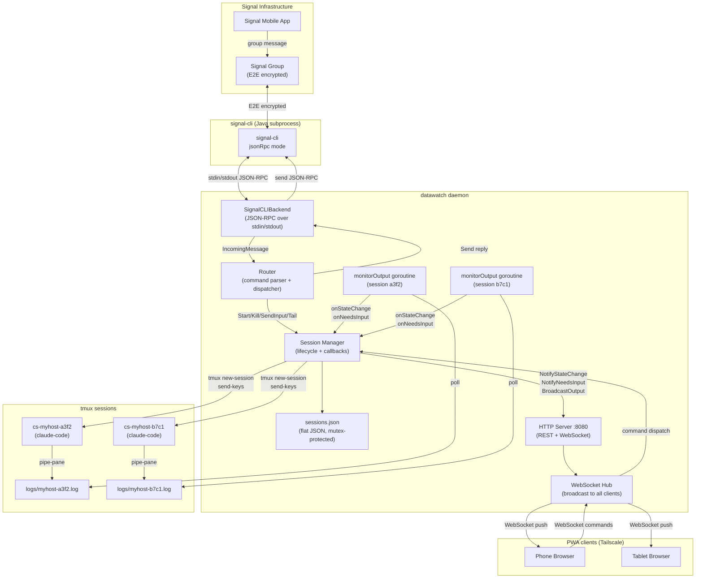

# System Data Flow

Top-level component interaction diagram.

🔍 <a href="https://mermaid.live/view#pako:eNqVVVtP2zAU_itWnkAQCt3DUDVN4lINGJeqicQD3YPruKmHY0e2A1SE_75z4qRJWjZGH6rY_r5z-XzO8WvAdMKDUZAami9JfD5TBH62mPuNWRCJVFFJLtXCUOtMwVxh-CzwOPxNllrxhzXwRs-F5OQkz2fBrxb1w-gib1HVcjZTO-PhmHDFzCp3PNldU7hKZmorFluRQyYF2bmiTxTPcqMZt3a3G1J0dn350IWDp99Wq2nOSAb5fuAmoY4-U8eWJKE806pr-tSIJG3TBUenlD2iHUjmKrq7DaeTM6KfuCHWJUIN4F8XbrcnxhR2uAEj_gOpTGcZVQnJqbHA3SOJsDnGwE2fe0MVTStyBGkLrZodtCLFgrMVA_33CKNSziE22-dHThuM33q2PUBhkLuQ1BHMYJ9kENVLCMo6znrXUgWglQAbR2Aj8593hcsLR1INl-qE4mitNk_ol8XwXf7w__jzr-yoz7-I40nEzVOlAS6IX5HR8eHxIXKn4ygGAe75PNJwNxviXxRzIK4PcY2kudE0YVDixGkC0hEoG66c_agmXVa8kEbMbqXEqBCzYbZaautCFKK6aEmLhIfYdv244mEPj4n_E3-N9qVO7aDj4QA2-qjhBgrt9lDvpzW5P2kUIDsxFdJCPfFelwEEQ6j6H_pCP0Ph9nwDAL3HdC5B501Ex683EYbfyxTnAslATijpsh4Taj1AyDcE9WZGWXW7x-CXh3R7jzRtWdbd68H-u_J6qaD9hEpvGr91X6q2WStc5Khxg59CykEE4V8qKNsBilOum3CLAjhieC5Xf_VuEdLG2KZT20SQb9ut7bKqPsWfw7oCoWLQXPjIV7aEEvw0Y-gZ8VEFzkXOw5wqkOS6thUPt05qTjMY_LmWsiU1Pd89eo-lFUjs-NmSqhTHgFa3nCe2EnpD457Jz_A6WtxqJxarPtXvtXTYOm1Ggx9UZWcEeZvturornCiqHjWVn3bY5IVdllXnfIio9UHsBqR-K-C6tjw1z0jzeqyTD_aDjJuMigQe-9c3WBY5vHN8nKCKwWhBpeX7AS2cjlaKBSN46nkDOhcU5kJWo97-AP-3sI8">View this diagram fullscreen (zoom &amp; pan)</a>

