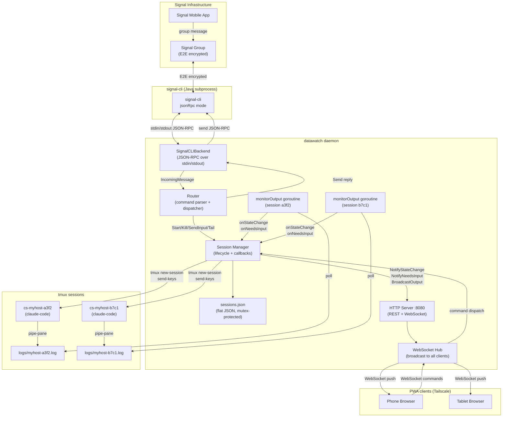

# System Data Flow

Top-level component interaction diagram.

```mermaid
graph TD
    subgraph "Signal Infrastructure"
        Phone["Signal Mobile App"]
        Group["Signal Group\n(E2E encrypted)"]
    end

    subgraph "signal-cli (Java subprocess)"
        SCLI["signal-cli\njsonRpc mode"]
    end

    subgraph "datawatch daemon"
        Bridge["SignalCLIBackend\n(JSON-RPC over stdin/stdout)"]
        Router["Router\n(command parser + dispatcher)"]
        Manager["Session Manager\n(lifecycle + callbacks)"]
        Store["sessions.json\n(flat JSON, mutex-protected)"]
        Monitor1["monitorOutput goroutine\n(session a3f2)"]
        Monitor2["monitorOutput goroutine\n(session b7c1)"]
        HTTPServer["HTTP Server :8080\n(REST + WebSocket)"]
        Hub["WebSocket Hub\n(broadcast to all clients)"]
    end

    subgraph "tmux sessions"
        T1["cs-myhost-a3f2\n(claude-code)"]
        T2["cs-myhost-b7c1\n(claude-code)"]
        L1["logs/myhost-a3f2.log"]
        L2["logs/myhost-b7c1.log"]
    end

    subgraph "PWA clients (Tailscale)"
        PWA1["Phone Browser"]
        PWA2["Tablet Browser"]
    end

    Phone -->|group message| Group
    Group <-->|E2E encrypted| SCLI
    SCLI <-->|stdin/stdout JSON-RPC| Bridge
    Bridge -->|IncomingMessage| Router
    Router -->|Start/Kill/SendInput/Tail| Manager
    Router -->|Send reply| Bridge
    Bridge -->|send JSON-RPC| SCLI
    Manager --> Store
    Manager -->|tmux new-session\nsend-keys| T1
    Manager -->|tmux new-session\nsend-keys| T2
    T1 -->|pipe-pane| L1
    T2 -->|pipe-pane| L2
    Monitor1 -->|poll| L1
    Monitor2 -->|poll| L2
    Monitor1 -->|onStateChange\nonNeedsInput| Manager
    Monitor2 -->|onStateChange\nonNeedsInput| Manager
    Manager -->|NotifyStateChange\nNotifyNeedsInput\nBroadcastOutput| HTTPServer
    HTTPServer --> Hub
    Hub -->|WebSocket push| PWA1
    Hub -->|WebSocket push| PWA2
    PWA1 -->|WebSocket commands| Hub
    Hub -->|command dispatch| Manager
```

