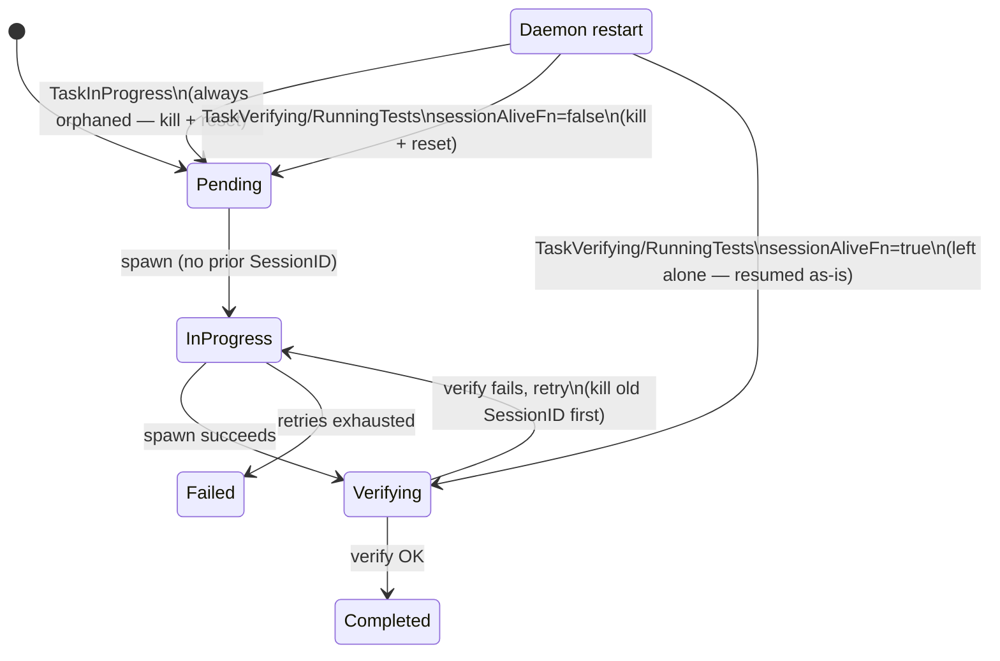
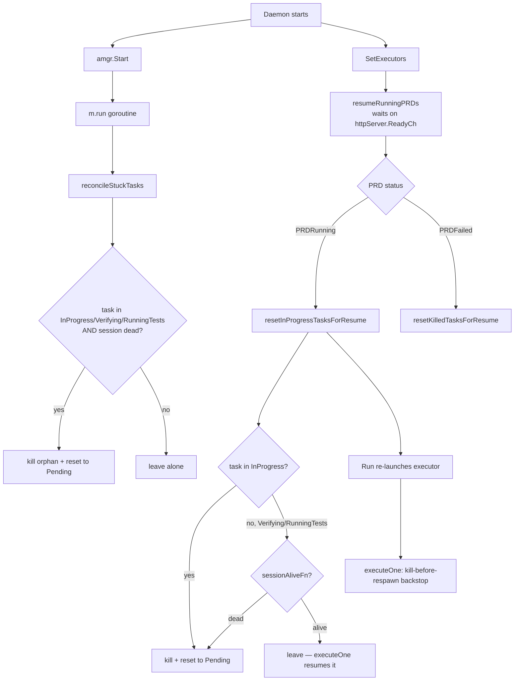

# Task session reconciliation — retry cleanup + daemon-restart recovery

How the Automaton executor keeps exactly one live session per task,
even across failed-verification retries and daemon restarts. Fixed
2026-09-22 after a duplicate-session leak surfaced during PRD
execution: a retry spawned a replacement session without killing the
one it was replacing, leaving the old backend process (opencode/claude)
running in tmux — orphaned, but still consuming compute and counting
toward `session.max_sessions`.

## Where a duplicate could form

```mermaid
sequenceDiagram
    participant Run as executeOne (executor.go)
    participant Sess as session.Manager
    participant Tmux as tmux + backend process

    Run->>Sess: spawn(task) → SessionID=A
    Sess->>Tmux: create session A, launch backend
    Run->>Run: t.SessionID = A; Status = verifying
    Run->>Run: verify(task) → OK=false
    Note over Run: retry: attempt+1
    Run->>Sess: spawn(task) → SessionID=B
    Sess->>Tmux: create session B, launch backend
    Run->>Run: t.SessionID = B (overwrites A)
    Note over Tmux: session A never told to stop —<br/>orphaned, still running, still billed
```

The same gap existed on the daemon-restart path: if
`sessionAliveFn(t.SessionID)` returned false for a task parked in
`verifying` (session manager hadn't yet reloaded that session's state,
or it genuinely died), the executor treated it as a fresh task and
spawned a new session — again without touching the old `SessionID`.

## Fix — kill-before-respawn + consistent boot reconciliation



Two changes, same invariant — **never overwrite `Task.SessionID`
without killing whatever it currently points at**:

1. **`executor.go` / `executeOne`** — immediately before every spawn
   (any retry attempt, or a fresh spawn after the boot-time liveness
   check says the inherited session is dead), if `t.SessionID != ""`
   the executor calls `sessionKillerFn` on it and clears the field
   first. This is the backstop: it fires regardless of *why* a respawn
   is happening, so a wrong liveness check elsewhere can no longer leak
   a session.
2. **`manager.go` / `resetInProgressTasksForResume`** — previously only
   reset `TaskInProgress` tasks on `PRDRunning` boot-resume, silently
   skipping `TaskVerifying`/`TaskRunningTests`. It now handles all
   three: `TaskInProgress` is always reset (its spawn goroutine died
   with the prior daemon before reaching `verifying`, so any session is
   necessarily orphaned); `TaskVerifying`/`TaskRunningTests` are reset
   **only** when `sessionAliveFn` confirms the session is gone — a
   genuinely live session is left alone so `executeOne`'s own
   skip-spawn check resumes it directly instead of duplicating it. This
   now matches `reconcileStuckTasks` (the `m.run()` boot-time pass), so
   the two reconciliation entry points agree.

## Boot-time reconciliation — two passes, one rule



`reconcileStuckTasks` runs unblocked as soon as `amgr.Start()` fires;
`resumeRunningPRDs` waits on the HTTP server's ready channel, so it
runs later. Both converge on the same rule (kill dead, leave alive),
and `executeOne`'s kill-before-respawn guard is the final backstop if
either pass's liveness check is stale.

## Verifying the fix

`internal/autonomous/executor_retry_kill_test.go` —
`TestExecutor_RetrySpawn_KillsStaleSessionBeforeRespawn` drives a task
through one failed verification + one retry with a fake
`sessionKillerFn`, and asserts the first session was killed before the
second was spawned. Reverting the `executeOne` guard makes this test
fail (confirmed while writing the fix), so it's a real regression
catch, not just a smoke test.

## See also

- [`docs/howto/autonomous-planning.md`](../howto/autonomous-planning.md) — operator walkthrough, § Common pitfalls.
- [`docs/howto/daemon-operations.md`](../howto/daemon-operations.md) — restart/reload behavior.
- [`docs/flow/automata-phase-flow.md`](automata-phase-flow.md) — per-story approval + file association.
