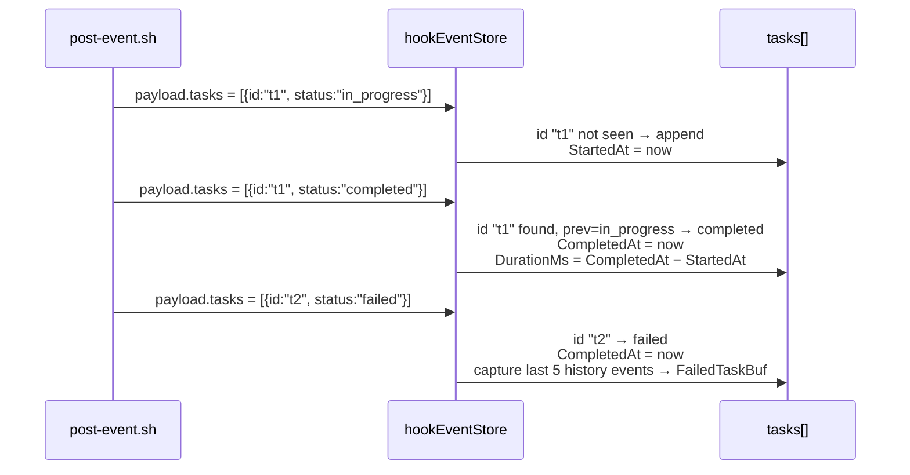

# Session Telemetry Flow

End-to-end view of how hook events become structured telemetry.

```mermaid
flowchart TD
    HookScript["post-event.sh<br/>(claude-code hook)"]
    TodoWrite["TodoWrite stdin<br/>(Claude task list)"]
    StateJSON[".claude/sprint/state.json"]

    TodoWrite -->|jq parse → tasks[]| HookScript
    StateJSON -->|cat + merge| HookScript

    HookScript -->|"POST /api/sessions/{id}/hook-event<br/>{event, tool, payload}"| HookEndpoint

    subgraph Daemon["daemon — hookEventStore"]
        HookEndpoint["handleSessionHookEvent()"]
        Record["hookEventStore.record()"]
        MergeTelemetry["mergeTelemetry()<br/>merge fields<br/>stamp task transitions"]
        FailedBuf["failedBuf[id]<br/>last 5 events before task→failed"]
        History["history[id]<br/>last 50 events"]
        Board["SessionStatusBoard<br/>.Telemetry = &SessionTelemetry{}"]

        HookEndpoint --> Record
        Record --> History
        Record --> MergeTelemetry
        MergeTelemetry --> Board
        MergeTelemetry -->|"task status → failed"| FailedBuf
        FailedBuf -->|"board.Telemetry.FailedTaskBuf"| Board
    end

    Board -->|"GET /api/sessions/{id}/telemetry"| TelemetryEndpoint["handleSessionTelemetry()"]
    TelemetryEndpoint --> Client["Client<br/>PWA · MCP · CLI · comm"]

    Board -->|"Stop event + persist_telemetry_on_stop=true"| Flush["flushTelemetryToMemory()"]
    Flush --> Memory["episodic memory<br/>(memory_recall searchable)"]
```

## Task transition stamping



## Key properties

- **Client sends status, daemon stamps time.** The hook script sends
  task `id` + `title` + `status`. The daemon records `started_at`,
  `completed_at`, and `duration_ms` on each transition; hook scripts
  have no timing logic.
- **Merge by ID, not replace.** Each hook event payload extends the
  task list. Tasks not present in a given payload retain their last
  known state. A task entry is only added once per `id`.
- **Failure buffer.** The store maintains a `failedBuf` per session
  (last 5 events). On task → `failed`, these events are copied into
  `board.Telemetry.FailedTaskBuf` for drill-down.
- **Ephemeral by default.** `SessionTelemetry` is in-memory;
  `session.persist_telemetry_on_stop: true` triggers
  `flushTelemetryToMemory()` on `Stop` / `SubagentStop`.

See also: [`docs/api/sessions.md`](../api/sessions.md) §telemetry,
[`docs/howto/session-telemetry.md`](../howto/session-telemetry.md),
[`docs/howto/claude-hooks.md`](../howto/claude-hooks.md).
