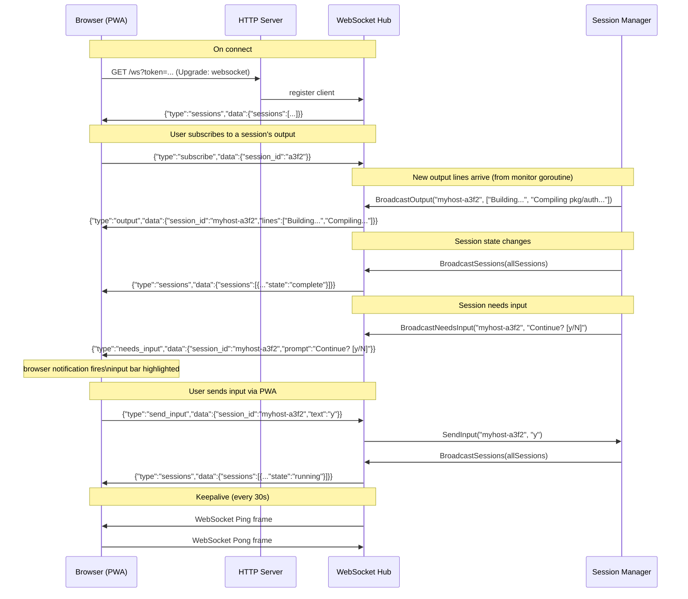

# WebSocket Message Flow

What messages flow on key events.

🔍 <a href="https://mermaid.live/view#pako:eNrFVWFr2zAQ_SuHviyFtB3rN8Na1q1sYywtpKUfolBk--KI2pInyc1MyH_fSZbbdEmabgwWCHF0T3fvvTtLS5bpHFnCLP5oUGX4SYrCiIoroE8tjJOZrIVycG70wqIBYR8fB1e3Hw42kV-ur688LPyO0Tyg2QJqUo-5xXSss3sMC5uo70KJois6RmulVv0SVx16pB2CphI9qyElSuBSQaaVwsx1sBg8PD31rBL4fHENxwt75vQ9qvdHR0cwuKlJeI4JLDC1gVPU5nf4jT6vwUJaR9WyUqKKySlC8VgigSVnrq2Rs4STrYG15WzIWS6coNXl-nIyoeLT1WqPnhvvt21SmxmZogWnQUDM8saCblzdbEr1O5-x6RNsp3Mn8wATJ7N3nG3jFM3vOI1wEQtDKRWREsbIB4TBzOgKKq2k0wYKbQhE8ehmTNHTI7Yiz4R1lyHTgLOqnWvrDjsSQ5hwdt7IMpeqIKf8CmcfdVVLqllAfV8ci8bNQ2h6sLcf0agX5T8nwFkQ5zv1O5M1Il39vZb1Q2ydoHg2F6qg1C_6ErfYgSjL_vngX8zdMnAOTMKWjLSU6P-sXi9EIeYWpHqcvl0yRh74VW1tsfdR0Yg0eAaT9ng05Wy_wlD5rqv8R-2saTprF0IbZb3urW9hAmk89JR2ciYz4bz8mTTUP64CDUiFgbks5iV9HeaveqVR9f7BgxRAJ-r-t5j2_I1whz872e2T0M7g2DTfVpXvbFL72Jb_PqumUeR5sWtUn_n8DbEWZTiYkIItnLzdQerpMrryZ8uM7kHc2o01oO6BbMgqNJWQOd2myxX9bWoSgxe5PwZZMhOlxSGjw0qPW5WxxJkGe1C8dSNq9QsOQ5Jt">View this diagram fullscreen (zoom &amp; pan)</a>

