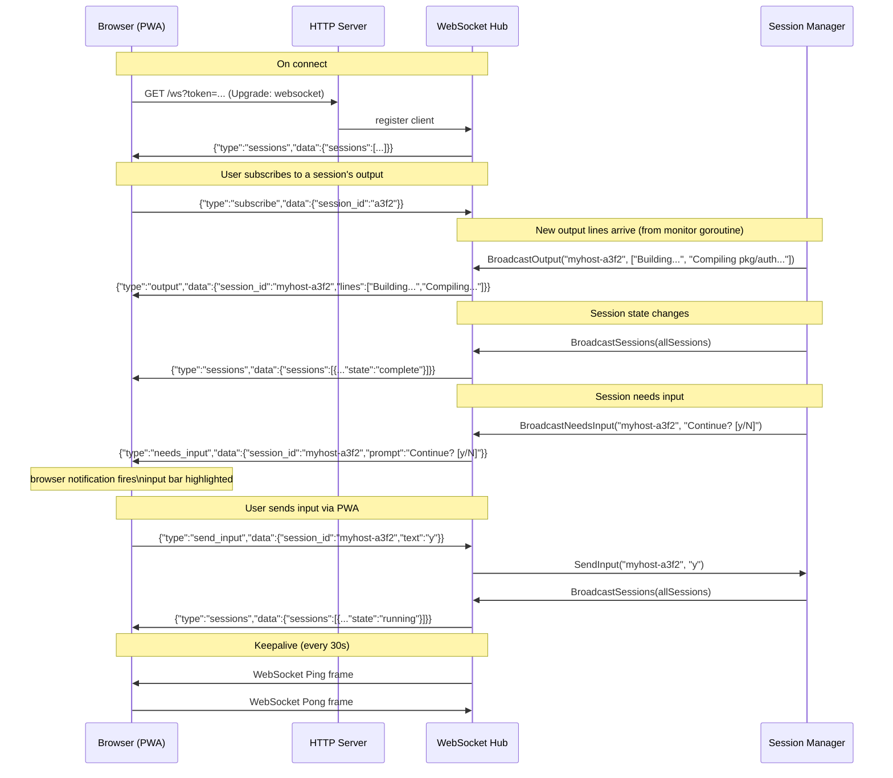

# WebSocket Message Flow

What messages flow on key events.

```mermaid
sequenceDiagram
    participant Browser as Browser (PWA)
    participant HTTP as HTTP Server
    participant Hub as WebSocket Hub
    participant Manager as Session Manager

    Note over Browser,Hub: On connect
    Browser->>HTTP: GET /ws?token=... (Upgrade: websocket)
    HTTP->>Hub: register client
    Hub->>Browser: {"type":"sessions","data":{"sessions":[...]}}

    Note over Browser,Hub: User subscribes to a session's output
    Browser->>Hub: {"type":"subscribe","data":{"session_id":"a3f2"}}

    Note over Manager,Hub: New output lines arrive (from monitor goroutine)
    Manager->>Hub: BroadcastOutput("myhost-a3f2", ["Building...", "Compiling pkg/auth..."])
    Hub->>Browser: {"type":"output","data":{"session_id":"myhost-a3f2","lines":["Building...","Compiling..."]}}

    Note over Manager,Hub: Session state changes
    Manager->>Hub: BroadcastSessions(allSessions)
    Hub->>Browser: {"type":"sessions","data":{"sessions":[{..."state":"complete"}]}}

    Note over Manager,Hub: Session needs input
    Manager->>Hub: BroadcastNeedsInput("myhost-a3f2", "Continue? [y/N]")
    Hub->>Browser: {"type":"needs_input","data":{"session_id":"myhost-a3f2","prompt":"Continue? [y/N]"}}
    Note over Browser: browser notification fires\ninput bar highlighted

    Note over Browser,Hub: User sends input via PWA
    Browser->>Hub: {"type":"send_input","data":{"session_id":"myhost-a3f2","text":"y"}}
    Hub->>Manager: SendInput("myhost-a3f2", "y")
    Manager->>Hub: BroadcastSessions(allSessions)
    Hub->>Browser: {"type":"sessions","data":{"sessions":[{..."state":"running"}]}}

    Note over Browser,Hub: Keepalive (every 30s)
    Hub->>Browser: WebSocket Ping frame
    Browser->>Hub: WebSocket Pong frame
```

