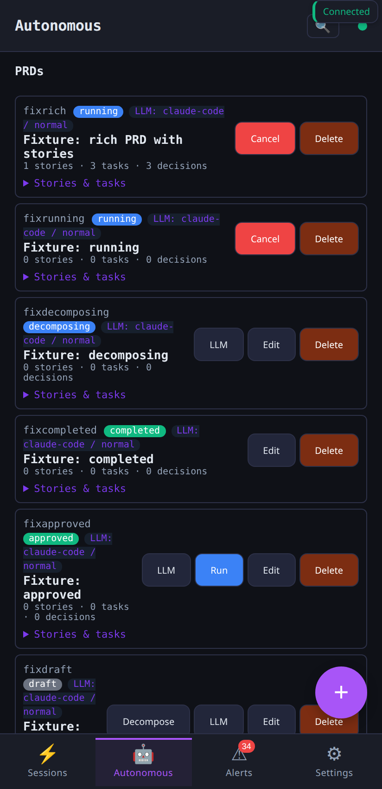

# How-to: Autonomous planning

Describe a feature in plain English; datawatch decomposes it into a
small graph of stories and tasks, runs each task as a real worker
session, and has an independent verifier attest each result before
the next step starts.

## Base requirements

- A running daemon you can reach (`datawatch ping` returns `pong`).
- An LLM backend configured (`session.llm_backend` in your config or
  `autonomous.decomposition_backend` if you want a different one for
  decomposition).
- `autonomous.enabled: true` in your config (or set via the
  Settings UI / `PUT /api/config`).

## Setup

```bash
# 1. Confirm the daemon sees your LLM backend.
datawatch backends list
#  → claude   enabled
#    ollama   enabled
#  …

# 2. Turn the autonomous loop on (default off).
datawatch config set autonomous.enabled true
datawatch config set autonomous.decomposition_backend claude
datawatch config set autonomous.verification_backend  claude
datawatch config set autonomous.max_parallel_tasks    3

# 3. (Optional) Pick how aggressive the auto-fix retry should be.
datawatch config set autonomous.auto_fix_retries 2
```

You can do all of the above from Settings → General → Autonomous in
the web UI instead — same config keys.

In the PWA, the **Autonomous** tab in the bottom nav is where the
PRDs live once you start submitting specs:


> **Header layout (v5.26.36+):** the tab header carries a "PRDs" label
> and a filter toggle (⛁) on the right. Filter row (status dropdown +
> templates checkbox) is hidden by default — click ⛁ to expose it.
> "New PRD" lives in a Floating Action Button (+) at the bottom-right
> of the panel; same size + safe-area handling as the Sessions tab
> FAB (v5.26.37). The old top-of-panel "+ New PRD" button is gone.

Each row shows the PRD ID, status pill, story/task counters, decisions
count, and a per-PRD "LLM" button (BL203 — pick backend / effort /
model per PRD). The contextual buttons change with status (Decompose
on draft, Approve/Reject/Revise on needs_review, Run on approved,
Cancel on running).

Click "Stories & tasks" on any PRD card to expand the inline
story+task tree:


Same surface on mobile (PWA installs as a native-feeling app on
Android via the manifest):



## Walkthrough

### 1. Submit a spec

#### From the PWA (v5.26.30+ unified Profile dropdown)

Click the **(+)** FAB on the Autonomous tab. The New PRD modal asks for:

- **Title** (optional headline).
- **Spec** (free-form description; mic input available for voice).
- **Profile** — single dropdown that drives the rest of the form:
  - First option: `— project directory (local checkout) —`. Picks the
    classic mode: type a path, optionally pin Backend/Effort/Model.
  - Subsequent options: every configured project profile by name.
    Picking one *hides* the directory + Backend/Effort row (the
    profile's `image_pair` carries the worker LLM) and *shows* a
    Cluster dropdown.
- **Cluster** (only shown when a project profile is selected). First
  option `— Local service instance (daemon-side) —` (v5.26.34) means
  the daemon clones the repo into `<data_dir>/workspaces/` and runs
  the worker in a local tmux. Subsequent options are configured
  cluster profiles (Docker / Kubernetes); picking one dispatches
  through `/api/agents` instead of local.

For full profile setup details see
[`docs/howto/profiles.md`](profiles.md).

#### From the CLI

```bash
datawatch autonomous prd create \
  --title "RTK token-savings widget" \
  --spec  "Add a RTK Token Savings card to the Settings → Monitor tab. \
  It should show: total tokens saved, average savings %, command count. \
  Pull from /api/rtk/savings (already exists). Mobile parity not required."
#  → {"id":"prd_a3f9","status":"draft", …}
```

With profile / cluster:

```bash
datawatch autonomous prd create \
  --title "Add MQTT to discovery pipeline" \
  --spec  "…" \
  --project-profile datawatch-smoke \
  --cluster-profile smoke-testing
```

Same call from the chat channels:

```
new prd: title="RTK token-savings widget" spec="Add a RTK Token Savings card …"
```

### 2. Decompose

```bash
datawatch autonomous prd decompose prd_a3f9
#  → calling decomposition LLM (claude, effort=normal) …
#  → {"id":"prd_a3f9","status":"decomposed", "stories":[
#      {"id":"st_01","title":"Add /api/rtk/savings client wiring", "tasks":[…]},
#      {"id":"st_02","title":"Render the card in app.js", "tasks":[…]}
#    ]}
```

Inspect what the LLM produced before running anything:

```bash
datawatch autonomous prd get prd_a3f9 | jq '.stories[].title'
#  "Add /api/rtk/savings client wiring"
#  "Render the card in app.js"
```

#### Story-level review + edit (v5.26.32+)

The PWA renders each story's title + description below the PRD row
when expanded. While the PRD is in `needs_review` or
`revisions_asked`, every story carries a small **✎** edit button
that opens a modal with title + description fields (mic input on the
description). Save round-trips through
`POST /api/autonomous/prds/{id}/edit_story` and appends an
`edit_story` audit decision.

#### Per-story execution profile + per-story approval gate (v5.26.60–62, Phase 3)

Two new operator capabilities sit alongside the story edit affordance:

- **Per-story execution profile override.** Each story carries a small
  `prof: (inherit)` pill while the PRD is in `needs_review`. Click it
  to pick a different project profile from the configured set; empty
  inherits the PRD's default. Save round-trips through
  `POST /api/autonomous/prds/{id}/set_story_profile`. Useful when
  story 1 should run on `agent-claude` and story 2 on `agent-opencode`.
- **Per-story approval gate.** Off by default (preserves prior
  behavior). Toggle Settings → General → Autonomous → "Per-story
  approval gate" or `datawatch config set autonomous.per_story_approval true`.
  When ON, PRD approval transitions every story to `awaiting_approval`;
  the runner skips those until you Approve / Reject each one
  individually. Approve / Reject buttons appear on each story row
  while the PRD is `approved` / `running`. Reject requires a reason.

REST endpoints:

```
POST /api/autonomous/prds/{prd_id}/set_story_profile
  { story_id, profile, actor? }    # empty profile clears

POST /api/autonomous/prds/{prd_id}/approve_story
  { story_id, actor? }

POST /api/autonomous/prds/{prd_id}/reject_story
  { story_id, actor?, reason }     # reason required
```

Audit trail: `set_story_profile`, `approve_story`, and `reject_story`
each append a `Decision` with the actor + relevant fields.

#### File association (v5.26.64–67, Phase 4)

PRDs now track which files each story / task is expected to touch
(`files_planned`, surfaced as `📝` pill) and which it actually
touched after the worker session ran (`files_touched`, surfaced as
`✅` pill on the task row). Two sources:

- **LLM-extracted at decompose time.** The decomposer prompt asks
  the LLM to emit `files: [...]` per story and per task. Empty array
  is fine when paths are unknown ahead of time.
- **Post-session diff.** When the worker session finishes, the
  daemon runs `git diff --name-only HEAD~1..HEAD` against the
  worker's project_dir and writes the result to
  `Task.FilesTouched`. Up to 50 paths.

PWA affordances while the PRD is in `needs_review` /
`revisions_asked`:

- Each story carries a `📝 ✎ files` button that opens a modal
  with a textarea (one path per line) + mic input. Up to 50.
  Save → `POST .../set_story_files`.
- Each task carries a smaller `✎` next to its file pill →
  `POST .../set_task_files`.

**Conflict detection.** If two pending stories both list the same
file in `files_planned`, the second story's pill renders the path
with a `⚠` marker and a tooltip naming the conflicting story id.

REST endpoints:

```
POST /api/autonomous/prds/{prd_id}/set_story_files
  { story_id, files: [...], actor? }

POST /api/autonomous/prds/{prd_id}/set_task_files
  { task_id, files: [...], actor? }
```

Audit kinds: `set_story_files`, `set_task_files`. The post-session
hook is silent — the `files_touched` field is the evidence.

CLI / REST equivalent:

```bash
curl -k -X POST https://localhost:8443/api/autonomous/prds/prd_a3f9/edit_story \
  -H "Content-Type: application/json" \
  -d '{"story_id":"st_01","new_title":"Wire client to /api/rtk/savings","new_description":"…","actor":"operator"}'
```

Empty `new_description` preserves the existing one (title-only
edits don't clobber the description).

Tasks have the same affordance — ✎ on each task row opens the
existing task-edit modal (`POST .../edit_task`).

### 3. Run

```bash
datawatch autonomous prd run prd_a3f9
#  → run started (fire-and-forget); poll status with `prd get`
```

The runner topo-sorts the tasks, spawns one ephemeral worker per
task (you'll see new sessions appear in the PWA), waits for each
to finish, runs verification (the verifier is its own LLM session
with a focused prompt), and either marks the task `done` or feeds
the verifier's findings back into a retry, up to
`autonomous.auto_fix_retries`.

### 4. Watch progress

```bash
watch -n 2 'datawatch autonomous prd get prd_a3f9 | jq ".status, .stories[].tasks[] | {id,status}"'
```

Or open the PWA → Settings → Autonomous: each PRD shows a small
progress bar + per-task status.

### 5. Inspect verifier verdicts

```bash
datawatch autonomous prd get prd_a3f9 | jq '.stories[].tasks[].verdicts'
```

Each entry has `outcome` (pass / warn / block), `severity`, the
verifier's `summary`, and a list of `issues`. A `block` halts the
PRD and waits for operator input — datawatch will not auto-retry
past the configured limit, and it will not silently override a
block.

## Where the data lives

- PRD records: `<data_dir>/autonomous/prds.json`
- Per-task session output: regular session log under
  `<data_dir>/sessions/<session-id>/`
- Verdict log: append-only, accessible via
  `GET /api/autonomous/prds/<id>` (`stories[].tasks[].verdicts`).

## Reachability across channels

| Channel | Action | Command |
|---------|--------|---------|
| CLI | create | `datawatch autonomous prd create --title … --spec …` |
| CLI | run | `datawatch autonomous prd run <id>` |
| REST | create | `POST /api/autonomous/prds {"title":…, "spec":…}` |
| REST | run | `POST /api/autonomous/prds/<id>/run` |
| MCP | create | tool `autonomous_prd_create` |
| MCP | run | tool `autonomous_prd_run` |
| Chat | create | `new prd: title=… spec=…` |
| PWA | all | Autonomous tab → (+) FAB at bottom-right |

## See also

- [`docs/api/autonomous.md`](../api/autonomous.md) — full REST + MCP reference
- [`docs/flow/orchestrator-flow.md`](../flow/orchestrator-flow.md) — when you want to compose multiple PRDs into a graph with guardrails (PRD-DAG)
- [How-to: PRD-DAG orchestrator](prd-dag-orchestrator.md) — compose multiple PRDs
- [How-to: Cross-agent memory](cross-agent-memory.md) — share context between PRD workers
