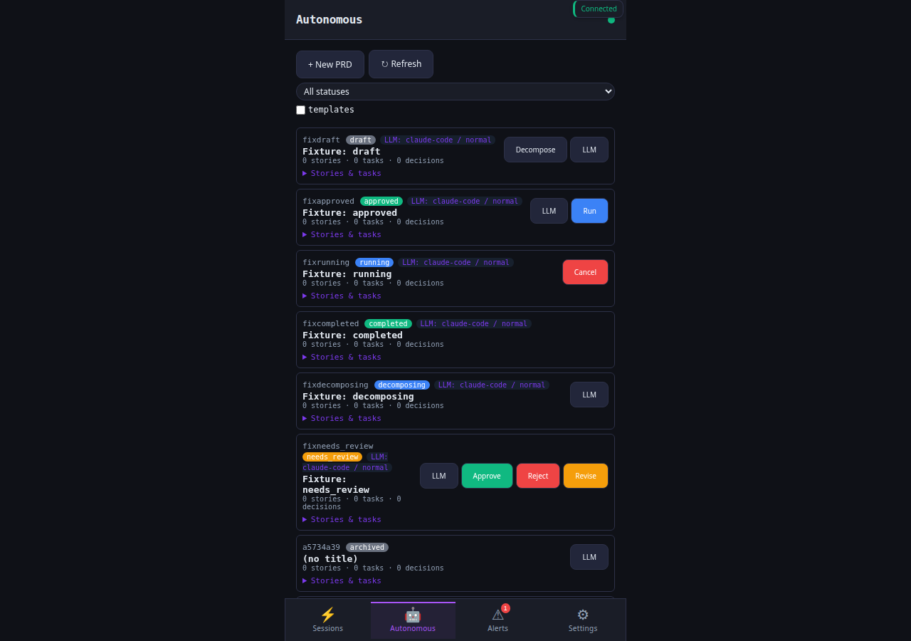
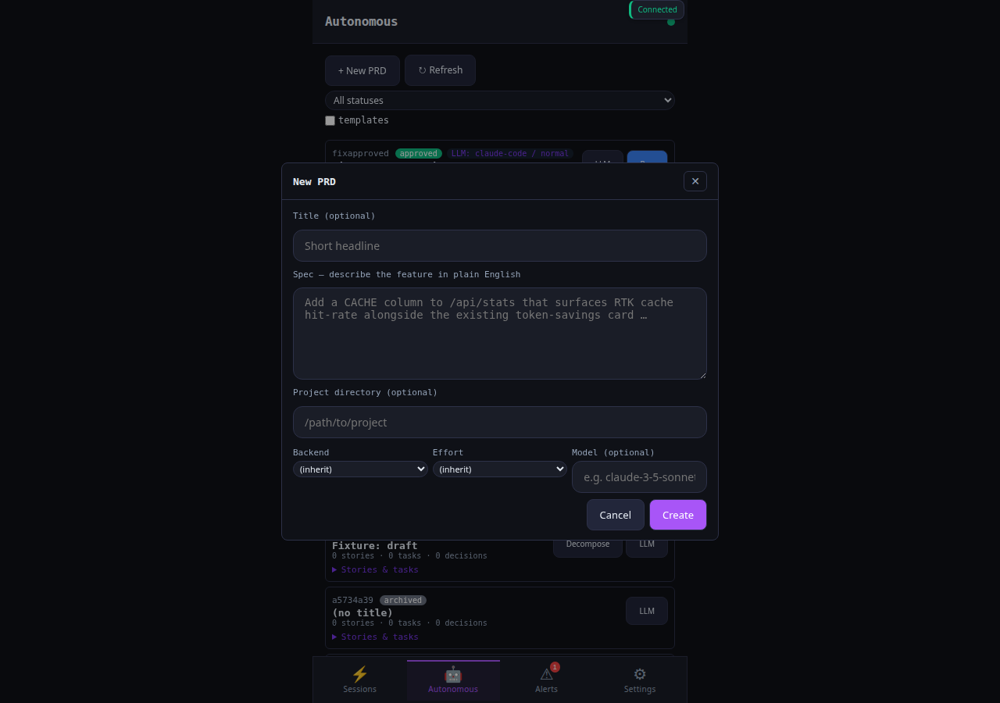
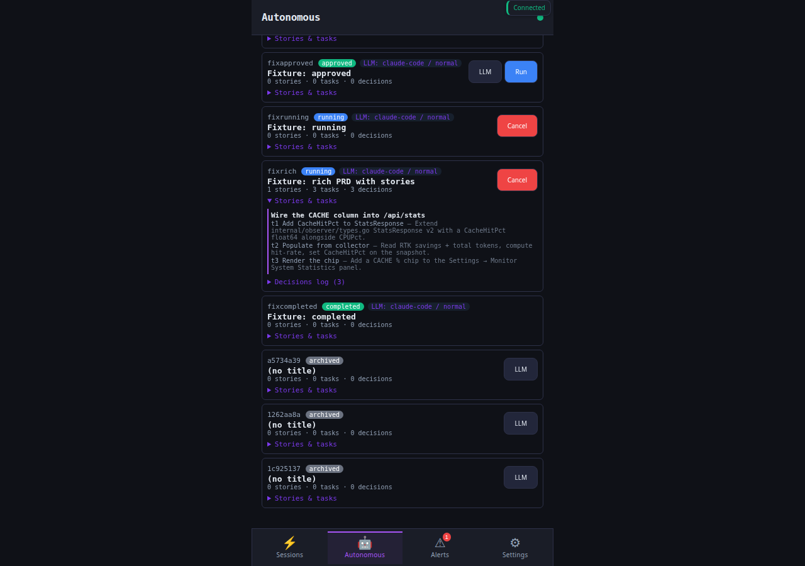
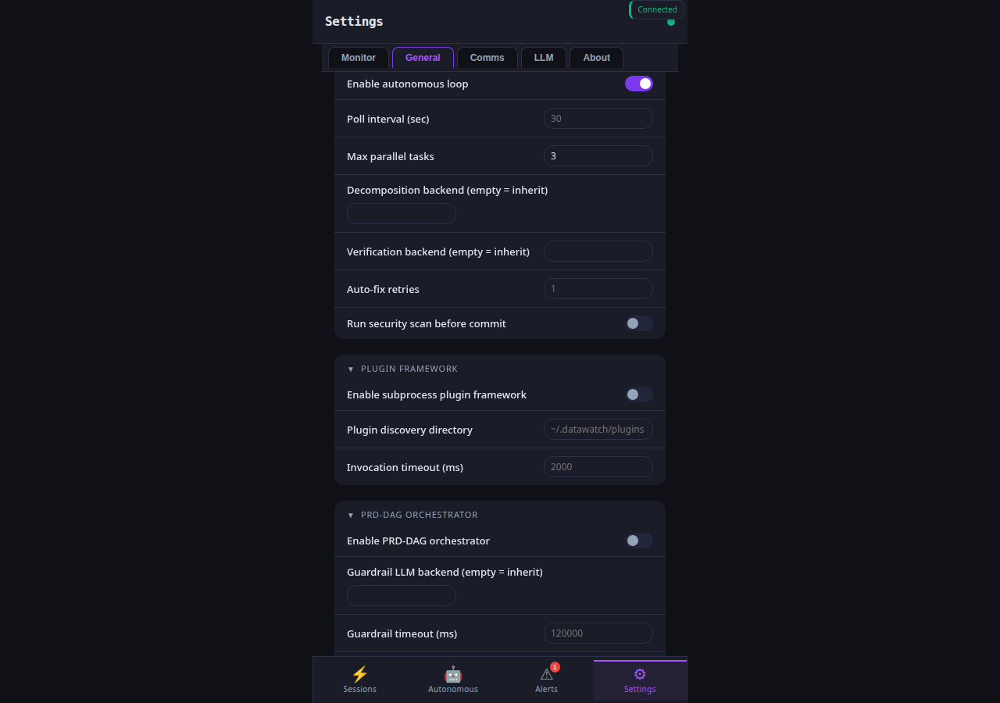

# How-to: Review and approve an autonomous PRD (BL191)

[autonomous-planning](autonomous-planning.md) shows the
straight-line `create → decompose → run` flow. As of v5.2.0
(BL191) the loop is gated by an explicit operator review step so a
loose decomposition never spawns workers without you signing off.

## When to use this

- You want to read the LLM's stories+tasks before any worker runs.
- You want to rewrite a task spec the LLM got wrong.
- You want to keep an audit trail of who approved what.
- You want to save a PRD as a template and re-instantiate it later.

## The lifecycle

```
draft → decomposing → needs_review ──── approved ─── running ─── completed
                          │   ▲
                          │   │ (Decompose again)
                          ▼   │
                    revisions_asked
                          │
                          ▼
                       rejected   (terminal)
```

`Run` refuses unless status is `approved`. Templates skip the LLM
call: they instantiate directly into `needs_review` with substituted
vars.

## Walkthrough

The PWA Autonomous tab is the bottom-nav entry point — every PRD
created through CLI / chat / REST shows up here with its status pill,
story/task counts, and a per-PRD "LLM" button (BL203):



The "+ New PRD" button opens the create modal with backend / effort /
model dropdowns pulled live from `/api/backends`:



Once decomposed, the PRD's story+task tree expands inline so you can
review what landed before approving:



Settings → General → Autonomous block holds the operator-facing
config knobs (`enabled`, `decomposition_backend`, `verification_backend`,
`max_parallel_tasks`, `auto_fix_retries`, recursion + guardrail keys
from BL191 Q4/Q6):



### 1. Create + decompose

```bash
datawatch autonomous prd create \
  --title "Add a CACHE column to /api/stats" \
  --spec  "Surface RTK cache hit-rate alongside the existing token-savings card …"
#  → {"id":"prd_a3f9", "status":"draft", …}

datawatch autonomous prd decompose prd_a3f9
#  → {"id":"prd_a3f9", "status":"needs_review",
#      "stories":[ … ],
#      "decisions":[
#        {"at":"…","kind":"decompose","backend":"claude-code","prompt_chars":820,"response_chars":1140,"actor":"autonomous"}
#      ]}
```

### 2. Inspect what landed

```bash
datawatch autonomous prd get prd_a3f9 | jq '.stories[] | {title, tasks: [.tasks[] | {id,title,spec}]}'
```

### 3. Edit a task spec the LLM got wrong

```bash
datawatch autonomous prd-edit-task prd_a3f9 \
  --task st_01.t02 \
  --spec "Render the cache hit-rate as a percentage using the existing rtk-savings card style; do not add a new card"
#  → status stays needs_review; Decisions log gains an edit_task entry
```

### 4. Approve (or reject / request revision)

```bash
# Approve — Run will accept after this.
datawatch autonomous prd-approve prd_a3f9 --note "looks tight"

# Reject — terminal; the PRD stays for inspection but never runs.
datawatch autonomous prd-reject prd_a3f9 --reason "wrong scope, will redo"

# Request revision — bumps a counter, status → revisions_asked. Re-decompose.
datawatch autonomous prd-request-revision prd_a3f9 --note "split task 2"
datawatch autonomous prd decompose prd_a3f9   # back to needs_review with fresh stories
```

### 5. Run

```bash
datawatch autonomous prd run prd_a3f9
#  → status: running
#  → workers fan out per the topo-sorted tasks
```

### 6. Inspect the audit timeline

```bash
datawatch autonomous prd get prd_a3f9 | jq '.decisions'
#  [
#    {"at":"…","kind":"decompose","backend":"claude-code","prompt_chars":820, …},
#    {"at":"…","kind":"edit_task","actor":"alice","note":"task=st_01.t02 spec_chars=132"},
#    {"at":"…","kind":"approve","actor":"alice","note":"looks tight"},
#    {"at":"…","kind":"run","actor":"autonomous"},
#    …
#  ]
```

## Saving a PRD as a template

Operator gap from BL191 Q2: recurring patterns. Mark a PRD as a
template, declare the substitutable vars, then instantiate per-feature.

```bash
# Author a template PRD by hand (or take an existing PRD and flip the flag).
# This example shows the REST shape; the CLI helper is queued.
curl -sk -H "Authorization: Bearer $(cat ~/.datawatch/token)" \
  -H "Content-Type: application/json" \
  -X POST https://localhost:8443/api/autonomous/prds \
  -d '{"spec":"Add a {{feature}} card to Settings → Monitor",
       "title":"{{feature}} card template",
       "is_template":true,
       "template_vars":[
         {"name":"feature","required":true},
         {"name":"endpoint","default":"/api/stats"}
       ]}'
#  → {"id":"prd_tpl_xyz", "is_template":true, …}
```

Instantiate:

```bash
datawatch autonomous prd-instantiate prd_tpl_xyz --vars "feature=cache hit-rate,endpoint=/api/rtk/savings"
#  → fresh PRD with {{feature}} / {{endpoint}} substituted; lands in needs_review
```

The instantiated PRD's `template_of` field points back to the
template ID for traceability.

## Reachability across channels

| Channel | Action | Command |
|---------|--------|---------|
| CLI | approve | `datawatch autonomous prd-approve <id> --note …` |
| CLI | reject | `datawatch autonomous prd-reject <id> --reason …` |
| CLI | request-revision | `datawatch autonomous prd-request-revision <id> --note …` |
| CLI | edit-task | `datawatch autonomous prd-edit-task <id> --task <task-id> --spec …` |
| CLI | instantiate | `datawatch autonomous prd-instantiate <template-id> --vars k=v,…` |
| REST | each above | `POST /api/autonomous/prds/{id}/{approve\|reject\|request_revision\|edit_task\|instantiate}` |
| MCP | each above | `autonomous_prd_{approve,reject,request_revision,edit_task,instantiate}` |
| Chat | each above | `autonomous {approve\|reject\|request-revision\|edit-task\|instantiate} <id> …` (also under `prd` alias) |
| PWA | each above | Settings → Autonomous → PRD detail (queued — see [BL202](../plans/README.md)) |

## See also

- [How-to: Autonomous planning](autonomous-planning.md) — the upstream flow
- [How-to: PRD-DAG orchestrator](prd-dag-orchestrator.md) — composing multiple PRDs into a guardrail-gated DAG
- [`docs/api/autonomous.md`](../api/autonomous.md) — full REST + MCP reference (incl. Decisions[] shape)
- [BL191 design doc](../plans/2026-04-26-bl191-autonomous-prd-lifecycle.md) — the operator-answered question set behind the flow
