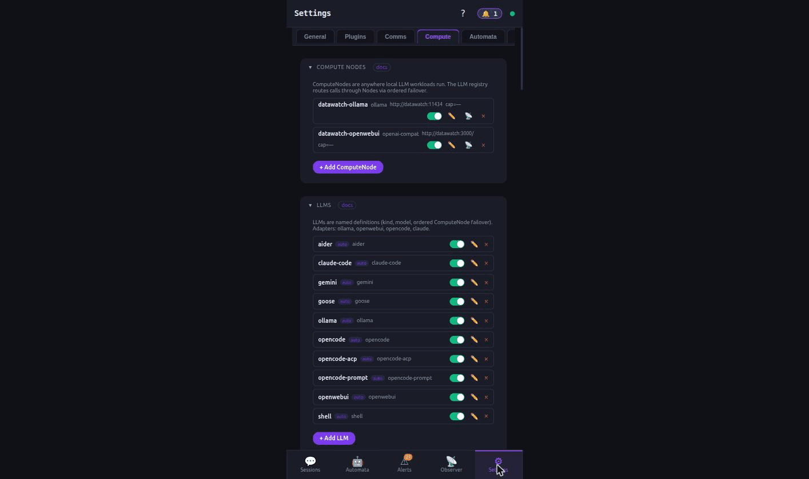
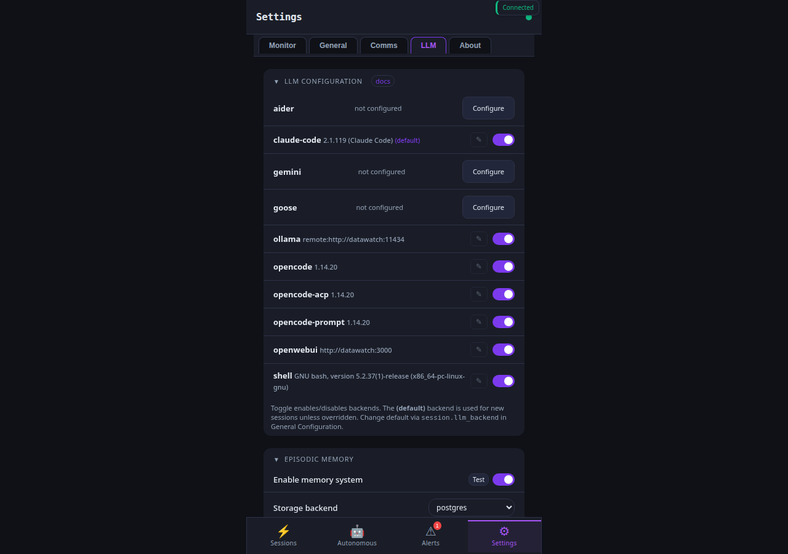
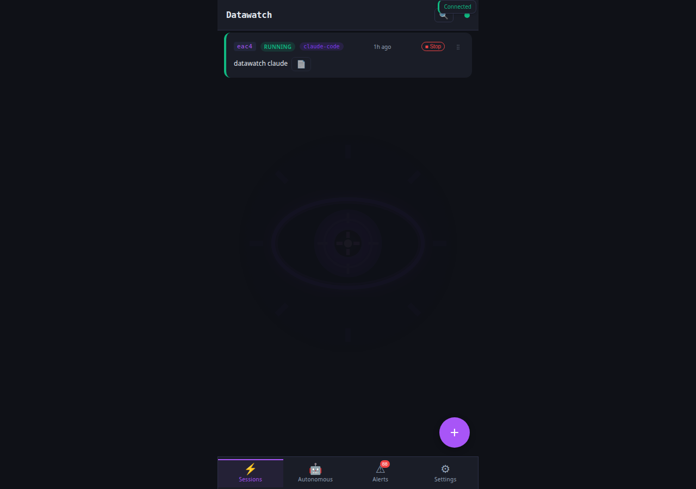
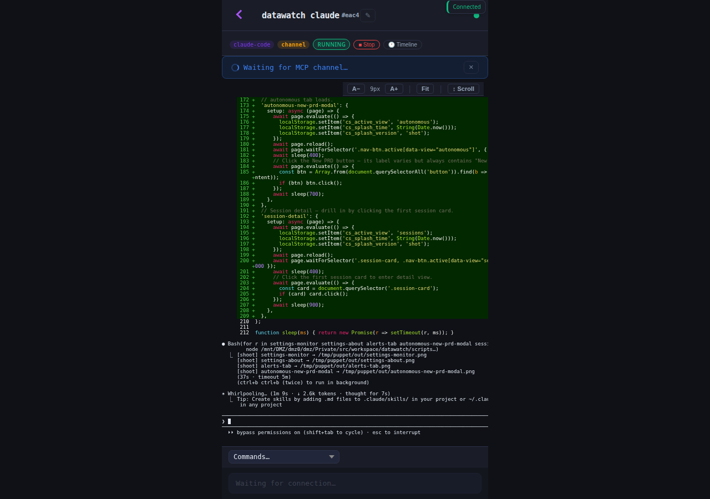
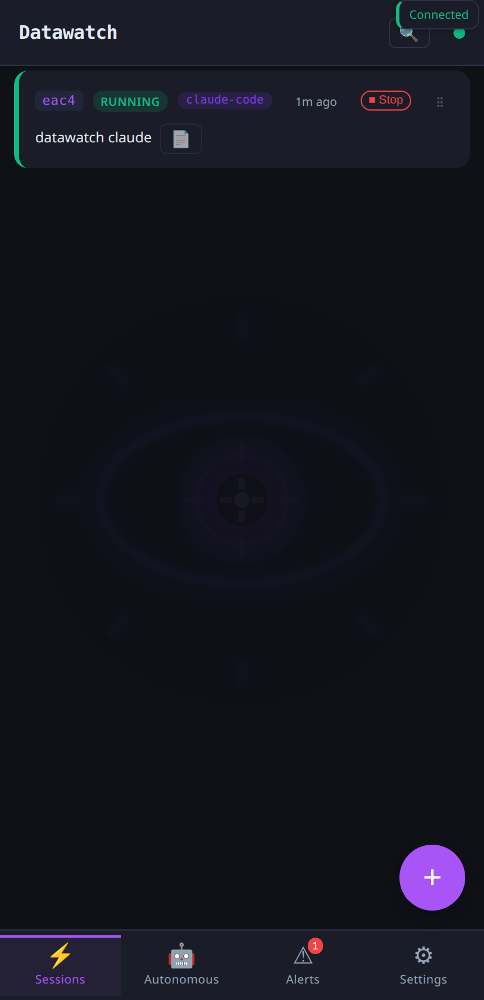

# How-to: Chat + LLM quickstart

You have a daemon running ([setup-and-install](setup-and-install.md)).
Now wire one LLM backend and one chat channel so you can talk to
datawatch from your phone or laptop without opening a terminal.

This how-to covers the two highest-coverage combinations:

- **Local-first**: ollama + Signal (no cloud, runs on your hardware)
- **Cloud-assisted**: claude-code + Telegram (lowest setup friction)

Pick one, finish the smoke test, then read the bottom for additional
backends/channels.

## Local-first: ollama + Signal

### 1. Install ollama (if you don't already have it)

```bash
curl -fsSL https://ollama.com/install.sh | sh
ollama serve &           # starts on http://localhost:11434
ollama pull llama3.1     # ~4 GB; pick any model you have GPU/RAM for
```

### 2. Tell datawatch about ollama

```bash
datawatch config set ollama.endpoint http://localhost:11434
datawatch config set ollama.default_model llama3.1
datawatch config set session.llm_backend ollama
datawatch reload
```

The PWA picks up the change immediately under Settings → LLM:



Scrolled to the Ollama block — endpoint, default model, console layout,
detection rules:



Verify:

```bash
datawatch backends list
#  → ollama   enabled (http://localhost:11434, model=llama3.1)
datawatch session start --task "respond with the word PONG and nothing else"
#  → session ses_a3f9 started
datawatch session response ses_a3f9
#  → "PONG"
```

### 3. Wire Signal as the chat channel

Signal-cli is the broker. Install + register it once per box:

```bash
datawatch setup signal
```

The wizard asks for your Signal phone number (with country code,
e.g. `+15551234567`), sends an SMS verification, you paste the code
back. After registration:

```bash
datawatch config set signal.enabled true
datawatch config set signal.username "+15551234567"
datawatch reload
```

Add yourself (or anyone you want to grant access) to the allow-list:

```bash
datawatch config set signal.allowed_recipients '["+15551234567"]'
datawatch reload
```

Smoke test from another Signal app:

```
You → datawatch's number: ping
datawatch → you:           pong
You → datawatch's number: new: write a haiku about goroutines
datawatch → you:           session ses_b1c2 started · waiting on ollama
datawatch → you:           [haiku text once ready]
```

Each `new:` message lands as a session row under the Sessions tab in
the PWA, with status badge + age + a click-through to the live tmux
output:



Click the row to drill into the live session — tmux pane mirror,
saved-commands quick row, response viewer, and the chat-channel
panel for replying back through the comms backend that started it:



The same Sessions tab on a phone-sized viewport (the PWA installs
to the home screen via the manifest):



The Comms sub-tab under Settings shows per-channel reachability with
a "docs" deep-link per backend:


## Cloud-assisted: claude-code + Telegram

### 1. Install Claude Code (if you don't already have it)

Follow https://docs.anthropic.com/en/docs/claude-code; once `claude --version` works:

```bash
datawatch config set session.llm_backend claude-code
datawatch reload

datawatch session start --task "say hello"
datawatch session response <session-id>
```

### 2. Wire Telegram

Create a bot via [@BotFather](https://t.me/BotFather) on Telegram → it
hands you a token. Then:

```bash
datawatch config set telegram.enabled true
datawatch config set telegram.bot_token "1234567890:abc…"
datawatch config set telegram.allowed_chat_ids '[123456789]'   # your Telegram user ID
datawatch reload
```

Smoke test by messaging your bot from Telegram:

```
You → bot: ping
bot → you: pong
You → bot: new: list 3 ways to debug a flaky CI test
bot → you: session ses_c3d4 started
bot → you: [response]
```

## Other backends + channels

| Backend | One-line config |
|---------|----------------|
| `claude` (API) | `datawatch config set anthropic.api_key sk-ant-…` then `session.llm_backend claude` |
| `aider` | `pip install aider-chat`, then `datawatch config set session.llm_backend aider` |
| `goose` | `cargo install goose`, then `datawatch config set session.llm_backend goose` |
| `gemini` | `datawatch config set google.api_key …`, then `session.llm_backend gemini` |
| `opencode` | install opencode, then `session.llm_backend opencode` |
| `openwebui` | `datawatch config set openwebui.endpoint http://host:3000`, then `session.llm_backend openwebui` |

| Channel | One-line config |
|---------|----------------|
| Discord | `datawatch setup discord` (bot token + guild ID) |
| Slack | `datawatch setup slack` (bot token + signing secret) |
| Matrix | `datawatch setup matrix` (homeserver URL + access token) |
| Ntfy | `datawatch config set ntfy.topic <your-topic>` |
| Email | `datawatch setup email` (SMTP wizard) |
| Twilio (SMS) | `datawatch config set twilio.{sid,token,from} …` |
| GitHub Webhook | `datawatch config set github.webhook_secret …` |
| Generic Webhook | `datawatch config set webhook.endpoint …` |
| DNS Channel | `datawatch setup dns` (covert TXT-record channel) |

Channel-by-channel reachability lives in
[`docs/messaging-backends.md`](../messaging-backends.md). The PWA
also exposes every channel under Settings → Comms with a per-channel
"docs" link.

## Verify the end-to-end loop

```bash
datawatch diagnose
```

Returns one JSON record per backend + channel:

```jsonc
{
  "llm": {
    "ollama":      { "reachable": true,  "latency_ms":   8 },
    "claude-code": { "reachable": true,  "latency_ms":  42 }
  },
  "channels": {
    "signal":   { "reachable": true,  "last_ok_unix_ms": 1730000000000 },
    "telegram": { "reachable": true,  "last_ok_unix_ms": 1730000005000 }
  }
}
```

Anything `reachable: false` shows a one-line error.

## Reachability across channels

| Channel | Action | Command |
|---------|--------|---------|
| CLI | configure | `datawatch config set <key> <val>` / `datawatch setup <component>` |
| CLI | verify | `datawatch backends list` / `datawatch diagnose` |
| REST | configure | `PUT /api/config` (same keys as YAML) |
| REST | verify | `GET /api/diagnose` |
| MCP | (no setup tools — daemon must already be running) | — |
| Chat | (after first wire-up: `ping` / `new: <task>` / `status`) | from any allowed sender |
| PWA | configure | Settings → General (LLM card) + Settings → Comms |

## See also

- [How-to: Setup + install](setup-and-install.md) — first-time install
- [How-to: Autonomous planning](autonomous-planning.md) — once your LLM is wired, turn the autonomous loop on
- [How-to: Cross-agent memory](cross-agent-memory.md) — share decisions between sessions
- [`docs/llm-backends.md`](../llm-backends.md) — backend matrix reference
- [`docs/messaging-backends.md`](../messaging-backends.md) — per-channel deep dive
