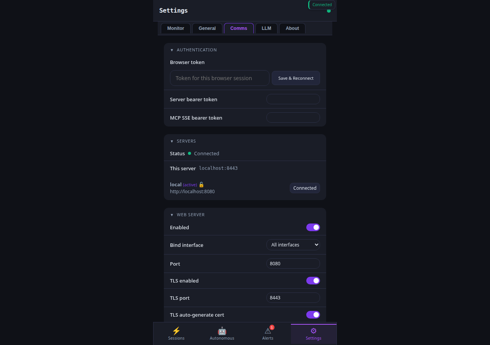
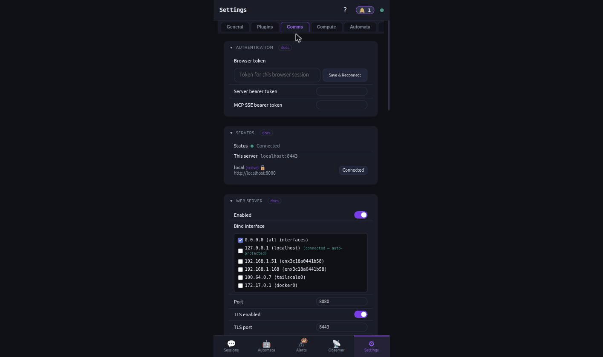

# How-to: Communication channels (Signal / Telegram / Discord / Slack / Matrix / etc.)

datawatch can listen for commands and push notifications across
ten messaging backends. Each one is wired the same way: configure
keys, allowlist who can talk to it, restart, smoke-test.

## Quick chooser

| Backend | Best for | Auth model | Setup time |
|---------|----------|-----------|------------|
| **Signal** | Private 1:1, end-to-end encrypted, US/EU phones | phone number + signal-cli | ~5 min (SMS verify) |
| **Telegram** | Lowest setup friction, public bot list | bot token from @BotFather | ~2 min |
| **Discord** | Server / channel notifications | bot token + guild ID | ~5 min |
| **Slack** | Workspace notifications + slash commands | bot token + signing secret | ~10 min |
| **Matrix** | Self-hosted, federated, e2ee optional | homeserver URL + access token | ~5 min |
| **Ntfy** | Push to phone via topic, no auth needed | shared topic name | ~1 min |
| **Email** | Async digest, audit trail | SMTP credentials | ~5 min |
| **Twilio (SMS)** | SMS to anywhere, no app required | account SID + token + from-number | ~5 min |
| **GitHub Webhook** | Auto-react to PR / issue events | webhook secret | ~3 min |
| **Generic Webhook** | Bridge to anything that accepts HTTP POST | endpoint URL + (optional) bearer | ~1 min |
| **DNS Channel** | Covert; works through restrictive firewalls | DNS zone you control | ~15 min |

## Common shape (all 10)

Every backend honours these keys (replace `<backend>` with `signal`,
`telegram`, etc.):

```yaml
<backend>:
  enabled: true
  allowed_recipients: ["<id1>", "<id2>"]   # operator-allowed senders
  rate_limit_per_min: 30                    # default; lower if abuse-prone
```

`allowed_recipients` is the security boundary: messages from any
sender NOT on the list are dropped + audit-logged. Empty list ≡
disabled.

## 1. Signal (most common — private + e2ee)

```bash
datawatch setup signal
# Wizard: enter your Signal phone number with country code (e.g. +15551234567).
# Signal sends an SMS verification code; paste it back.
```

Then:

```bash
datawatch config set signal.enabled true
datawatch config set signal.username "+15551234567"
datawatch config set signal.allowed_recipients '["+15551234567"]'
datawatch reload
```

Smoke test from the operator's Signal app:

```
You → datawatch:           ping
datawatch → you:           pong
You → datawatch:           new: list git branches with stale CI
datawatch → you:           session ses_a3f9 started
datawatch → you:           [response when ready]
```

The same setup is reachable from the PWA — Settings → Comms scrolled
to the Signal block surfaces the live config + reachability dot:



## 2. Telegram (lowest friction)

Talk to [@BotFather](https://t.me/BotFather), `/newbot`, copy the token.

```bash
datawatch config set telegram.enabled true
datawatch config set telegram.bot_token "1234567890:abc…"
datawatch config set telegram.allowed_chat_ids '[123456789]'   # your numeric Telegram user ID
datawatch reload
```

Find your numeric ID by messaging [@userinfobot](https://t.me/userinfobot).

## 3. Discord (server + DM)

Create a bot in https://discord.com/developers/applications, copy the token, invite to a server with `Read Messages` + `Send Messages`.

```bash
datawatch setup discord     # interactive: token + guild ID
datawatch config set discord.allowed_channel_ids '["123456789012345678"]'
datawatch reload
```

## 4. Slack

Create a Slack app at https://api.slack.com/apps. Required scopes: `chat:write`, `app_mentions:read`, `commands`.

```bash
datawatch setup slack       # bot token + signing secret + (optional) slash command path
datawatch config set slack.allowed_user_ids '["U01ABC..."]'
datawatch reload
```

## 5. Matrix

Get an access token from your Matrix client (Element → Settings → Help & About → Advanced → Access Token).

```bash
datawatch setup matrix      # homeserver URL + access token
datawatch config set matrix.allowed_user_ids '["@you:matrix.org"]'
datawatch reload
```

## 6. Ntfy (push notifications, zero auth)

Pick a hard-to-guess topic name (anyone with the topic can send/receive — that's the entire access control).

```bash
datawatch config set ntfy.enabled true
datawatch config set ntfy.topic "datawatch-${USER}-$(openssl rand -hex 6)"
datawatch reload

# Subscribe on your phone via the ntfy.sh app or:
curl -sN https://ntfy.sh/<your-topic>
```

## 7. Email (digest / audit)

```bash
datawatch setup email   # interactive: SMTP host, port, TLS, user, pass, from
datawatch config set email.allowed_senders '["operator@example.com"]'
datawatch reload
```

Email is mostly outbound (alerts, daily digests); inbound polling
is opt-in via `email.poll_inbox: true`.

## 8. Twilio SMS

```bash
datawatch config set twilio.account_sid "AC..."
datawatch config set twilio.auth_token "..."
datawatch config set twilio.from_number "+15551234567"
datawatch config set twilio.allowed_senders '["+15557654321"]'
datawatch reload
```

## 9. GitHub Webhook

For "datawatch reacts when a PR is opened" workflows:

```bash
datawatch config set github.webhook_secret "$(openssl rand -hex 32)"
datawatch reload
# Then on GitHub: repo → Settings → Webhooks → Add webhook
#   Payload URL:  https://your-host:8443/api/comms/github/webhook
#   Secret:       <the secret you just set>
#   Events:       PR / issue / push (whatever you want to react to)
```

## 10. Generic Webhook

For bridging to Mattermost / Rocket.Chat / Pushover / anything HTTP:

```bash
datawatch config set webhook.endpoint "https://your-bridge/incoming"
datawatch config set webhook.bearer "secret-token"
datawatch reload
```

Outbound only by default. Inbound (datawatch as a webhook *server*)
runs at `POST /api/comms/webhook/inbound`.

## 11. DNS Channel (covert)

For environments that block outbound HTTPS but allow DNS — operator
encodes commands in TXT-record subdomains, datawatch decodes and
responds via TXT-record updates on a zone it controls.

```bash
datawatch setup dns         # interactive zone owner verification
datawatch config set dns.zone "ops.example.com"
datawatch config set dns.shared_secret "$(openssl rand -hex 32)"
datawatch reload
```

Walk-through in [`docs/covert-channels.md`](../covert-channels.md).

## Verify all configured channels in one shot

```bash
datawatch diagnose | jq '.channels'
#  {
#    "signal":   { "reachable": true,  "last_ok_unix_ms": 1730000000000 },
#    "telegram": { "reachable": true,  "last_ok_unix_ms": 1730000005000 },
#    "discord":  { "reachable": false, "error": "401 invalid token" },
#    …
#  }
```

The PWA also exposes per-channel status under Settings → Comms with
a "docs" chip per backend that deep-links into
[`docs/messaging-backends.md`](../messaging-backends.md).



## Voice notes

Every chat channel that supports voice (Signal, Telegram, Discord)
auto-transcribes incoming voice notes through whatever's configured
in [voice-input](voice-input.md). You speak, datawatch types; the
text dispatches as if you'd typed it.

## Reachability across channels

| Channel | Action | Command |
|---------|--------|---------|
| CLI | configure | `datawatch config set <backend>.<key> <value>` / `datawatch setup <backend>` |
| CLI | verify all | `datawatch diagnose \| jq '.channels'` |
| REST | configure | `PUT /api/config` (any backend block) |
| REST | health | `GET /api/diagnose` |
| MCP | (no setup tools — daemon must already be configured) | — |
| Chat | (after wire-up: `ping`, `new: <task>`, `status`, `reply: <text>` from any allowed sender) | — |
| PWA | configure + status | Settings → Comms |

## See also

- [How-to: Setup + install](setup-and-install.md) — get the daemon up before wiring channels
- [How-to: Chat + LLM quickstart](chat-and-llm-quickstart.md) — the same flow paired with an LLM backend
- [How-to: Voice input](voice-input.md) — transcription wired into incoming chat-channel voice notes
- [`docs/messaging-backends.md`](../messaging-backends.md) — full reference per backend (rate limits, auth, format)
- [`docs/covert-channels.md`](../covert-channels.md) — DNS channel deep dive
