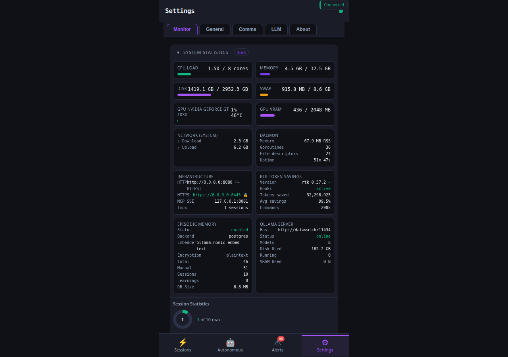
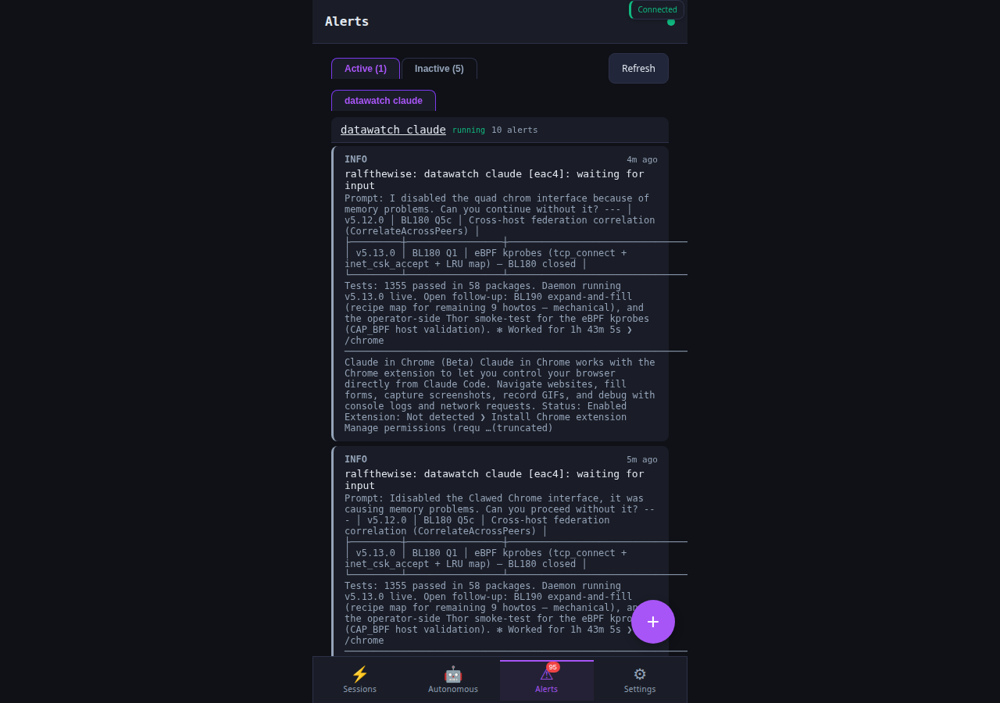
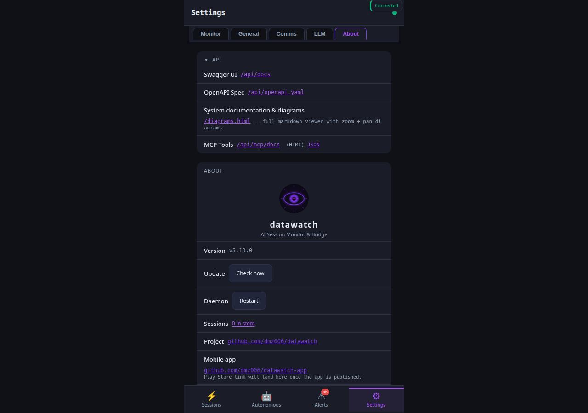

# How-to: Daemon operations

Day-two operator workflow: start, stop, restart, upgrade, diagnose,
and inspect a running datawatch daemon. The walkthroughs assume a
local install via `~/.local/bin/datawatch`; substitute paths if
your install lives elsewhere.

## Base requirements

- A datawatch binary on `$PATH` (`datawatch version` works).
- A config file (default `~/.datawatch/config.yaml`). First-run
  setup is in [`docs/setup.md`](../setup.md).

## Setup

Already done by `datawatch setup` on first install. Re-run any time
to walk the wizard for new backends:

```bash
datawatch setup            # interactive
datawatch setup signal     # only Signal
datawatch setup ebpf       # grant CAP_BPF + CAP_PERFMON for the v2 observer
```

## Walkthroughs

### Start / stop / restart

```bash
datawatch start              # foreground
datawatch start --daemon     # detach into the background
datawatch stop               # SIGTERM the daemon, preserve tmux sessions
datawatch restart            # combo: stop + start; preserves AI sessions
datawatch ping               # one-shot health probe (returns "pong")
```

Restart is the right tool after a code upgrade; tmux sessions
survive (the daemon doesn't own the panes).

### Upgrade in place

```bash
datawatch update --check     # dry-run — what version would land
datawatch update             # download + install + (the daemon will restart on its own)
```

The PWA also exposes a one-click upgrade card under Settings →
Monitor when the background checker has detected a newer release.

### Hot config reload (no restart)

```bash
# After editing ~/.datawatch/config.yaml:
datawatch reload                                # CLI
curl -X POST -H "Authorization: Bearer …" \
  https://localhost:8443/api/reload             # REST
kill -HUP $(pgrep -f datawatch.start)           # SIGHUP works too
```

Reload picks up config-file changes without restarting the daemon.
Some changes require a real restart (TLS cert / key file paths,
listen addresses) and the daemon will tell you in the reload
response which keys were ignored.

### Diagnose

```bash
datawatch diagnose           # one-shot probe of every configured backend + endpoint
```

Returns a JSON report: per-backend reachability, last error, recent
WS connection counts, observer status, eBPF capability, peer
registry health, etc. Useful for "is the daemon healthy?" without
clicking through the PWA.

### Logs

The daemon logs to `~/.datawatch/daemon.log`. Tail or grep:

```bash
tail -f ~/.datawatch/daemon.log
grep -iE "warn|error" ~/.datawatch/daemon.log | tail -50
```

Crash forensics live alongside as `~/.datawatch/daemon-crash.log`
when the panic-recovery handler catches one.

### Inspect runtime state

```bash
datawatch status             # daemon + sessions one-liner
datawatch session list
datawatch agent list         # ephemeral workers
datawatch observer peer list # federated peers
datawatch memory stats       # memory namespaces + counts
```

In the PWA: Settings → Monitor surfaces the same data as live
dashboards — CPU/mem/disk/GPU, daemon RSS + goroutine + FD counts,
RTK token-savings, episodic memory health, ollama runtime tap, and
session statistics:



The Alerts tab in the bottom nav is the operator's incoming-event
queue — daemon panics, rate-limit triggers, plugin errors, and any
custom alerts emitted by `internal/alerts`:



Settings → About is where the upgrade affordance + orphan-tmux
maintenance live:



### Auto-restart on crash

Off by default. Enable for unattended deployments:

```bash
datawatch config set server.auto_restart true
datawatch reload
```

The supervisor wrapper relaunches the daemon on non-zero exit,
preserving tmux sessions across the restart.

## Reachability across channels

| Channel | Action | Command |
|---------|--------|---------|
| CLI | start / stop / restart / status / ping / diagnose / reload / update | `datawatch <verb>` |
| REST | reload | `POST /api/reload` |
| REST | diagnose | `GET /api/diagnose` |
| REST | update | `POST /api/rtk/update` (RTK + datawatch share the auto-update path) |
| REST | health | `GET /healthz` |
| MCP | reload, diagnose | tools `reload`, `diagnose` |
| Chat | status, version, update | `status`, `version`, `update check` |
| PWA | most | header status dot, Settings → Monitor cards, Settings → General → Update card |

## See also

- [`docs/setup.md`](../setup.md) — first-time install
- [`docs/operations.md`](../operations.md) — deeper ops topics (systemd unit, security hardening, container deploy)
- [`docs/api/devices.md`](../api/devices.md) — push notifications fed by the daemon
