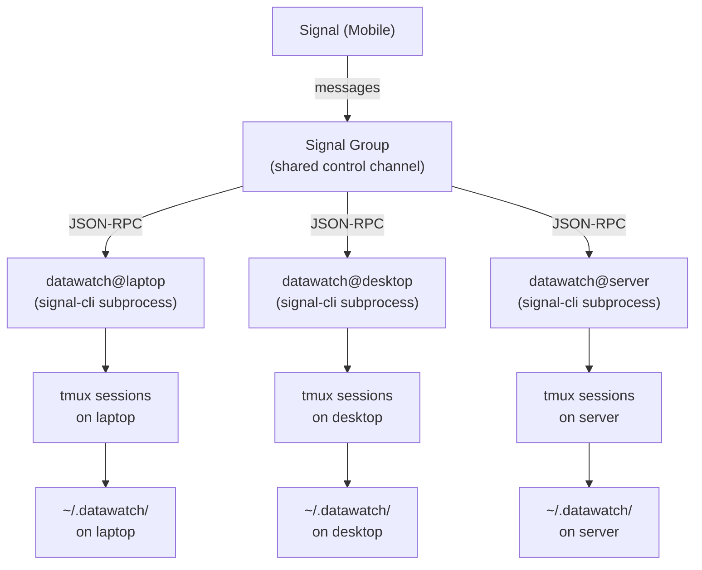

# Multi-Machine Setup

`datawatch` is designed from the ground up for multi-machine operation. Each machine runs its own daemon instance, and all instances communicate through a single shared Signal group.

---

## Architecture Overview



---

## How Each Agent Manages Its Own Sessions

Each daemon instance:
- Only creates sessions on its own host
- Only monitors sessions where `session.Hostname == config.Hostname`
- Only responds to state changes for its own sessions
- Stores sessions in its own local `sessions.json`

When a `list` command arrives, every machine in the group replies independently with its own session list. The result in Signal looks like:

```
[laptop] Sessions:
  [a3f2] running  14:32:01
    Task: refactor auth module

[desktop] No sessions.

[server] Sessions:
  [b7c1] running       14:45:22
    Task: run integration tests
  [c9d0] waiting_input 14:50:11
    Task: deploy to staging
```

---

## Session ID Format and Hostname Prefixes

Sessions are identified by a 4-character hex ID (e.g., `a3f2`). The full session ID includes the hostname: `laptop-a3f2`.

When you use a short ID in a command like `status a3f2`, each machine searches its own store. If `laptop` has session `a3f2` and `server` does not, only `laptop` responds. If both machines happen to have a session with the same short ID (unlikely but possible), both will respond — which is fine because each reply is prefixed with `[hostname]`.

---

## Implicit Routing Rules

The "implicit send" feature (replying to a waiting session without specifying its ID) applies **per machine**. Each daemon independently checks whether exactly one of its own sessions is waiting for input.

**Example:**

```
[laptop][a3f2] Needs input:
Do you want to overwrite config.yaml? [y/N]

Reply with: send a3f2: <your response>

[server][b7c1] Needs input:
Found 3 migration conflicts. How should we proceed? [skip/overwrite/abort]

Reply with: send b7c1: <your response>
```

In this case, you must use explicit `send` commands because multiple machines each have one waiting session. The implicit reply would be ambiguous across machines.

If only `laptop` has a waiting session and `server` does not, then:
- Typing `y` causes `laptop` to route it to `a3f2`
- `server` ignores it (it has no waiting sessions)

---

## Recommended tmux Setup

On each machine, run the daemon in a dedicated tmux window so you can check its logs if needed:

```bash
# Start a tmux session for the daemon
tmux new-session -d -s daemon 'datawatch start'

# Or if you already have a tmux session:
tmux new-window -n datawatch 'datawatch start'
```

To monitor daemon output:

```bash
tmux attach -t daemon
# or
tmux select-window -t daemon:datawatch
```

---

## Example: Querying Sessions Across Machines

```
# From Signal:
You: list

[laptop] Sessions:
  [a3f2] running  14:32:01
    Task: refactor auth module

[server] Sessions:
  [b7c1] waiting_input  14:45:22
    Task: deploy to staging

# Check what server needs:
You: status b7c1

[server][b7c1] State: waiting_input
Task: deploy to staging
---
Staging environment is clean.
Deploy new version 1.4.2? [y/N]

# Answer:
You: send b7c1: y

[server][b7c1] Input sent.

# Later:
[server][b7c1] State: waiting_input → complete
```

---

## Coordinating Multiple Machines

### Pattern 1: Machine-specific tasks

Name your tasks to target a specific machine:

```
new: [server] run the full test suite
new: [laptop] generate documentation
```

The `[server]` prefix is just a naming convention for your own clarity — the task text is passed verbatim to `claude-code`.

### Pattern 2: Separate groups per machine

For strict isolation, create a separate Signal group per machine. Each group has its own daemon instance. Use a "meta" group to broadcast to all machines simultaneously (by sending from multiple numbers or using Signal's broadcast feature).

### Pattern 3: One group, hostname-scoped commands

The current design intentionally broadcasts commands like `new:` to all machines. For single-machine targeting, you can prefix commands with the hostname in the task description to self-identify which machine should work on what.

Future versions may support machine-targeted commands like `@laptop new: <task>`.

---

## Daemon Lifecycle

Each machine is independently responsible for:
1. Starting its daemon (`datawatch start`)
2. Resuming monitors after restart (`ResumeMonitors` is called automatically)
3. Persisting its own sessions to `~/.datawatch/sessions.json`

If one machine's daemon crashes, sessions on other machines continue unaffected. When the crashed daemon restarts, it re-reads `sessions.json` and resumes monitoring any sessions that are still running in tmux.
