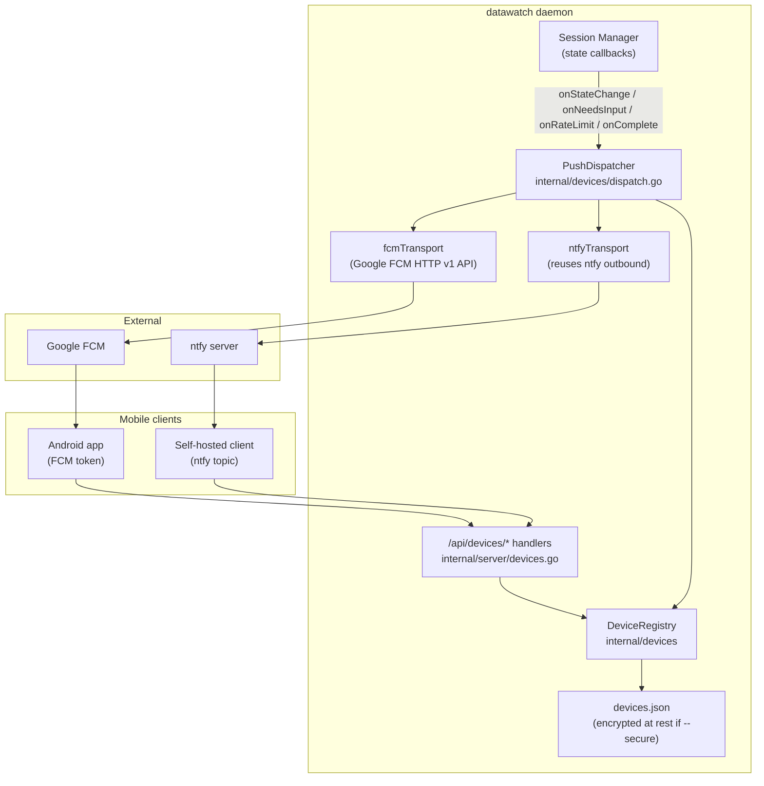

# F17: Mobile Device Registry & Push Token API

**Date:** 2026-04-18
**Version at planning:** v2.4.5
**Priority:** high (mobile MVP blocker — target 2026-06-12)
**Effort:** 3-4 days
**Category:** api / messaging / mobile
**Source:** [GitHub issue #1](https://github.com/dmz006/datawatch/issues/1) — request from `dmz006/datawatch-app` mobile client
**Cross-reference:** mobile ADR-0012, `datawatch-app docs/api-parity.md` row "POST /api/devices/register"

---

## Problem

The upcoming `dmz006/datawatch-app` mobile client (Android first, iOS later) needs a
deterministic way to register a per-install push token (FCM registration token or ntfy
topic URL) with a datawatch server, so the server can wake the device on session events
(`input_needed`, `rate_limited`, `completed`, `error`).

datawatch already supports outbound `ntfy` via `NtfyConfig` (single shared topic), but:

- there is no per-device registry,
- there is no FCM sender,
- there is no way for a phone to enroll/unenroll without editing `~/.datawatch/config.yaml`,
- there is no way to scope push events to one device (all devices subscribed to the shared
  ntfy topic see every event today).

If we ship without F17, the mobile app must fall back to ntfy-only with a single shared
topic — higher battery cost, no per-device routing, no auth scoping.

---

## Goals

1. Per-bearer-token device registry with stable `device_id` (UUID) the server controls.
2. Multi-transport: FCM (preferred for Android/iOS), ntfy (fallback / self-hosted).
3. Minimal payload contract — no session content travels through Google FCM (per mobile
   ADR-0012 privacy model). Device pulls full content via authenticated REST.
4. Full configurability through every datawatch access channel (no hard-coded values).
5. Observable: per-device delivery counters, last-seen, error surface.
6. Backward compatible: existing single-topic `ntfy` outbound continues to work unchanged
   when no devices are registered.

---

## Non-goals

- iOS APNs sender (Sprint 2 of mobile is Android-first; APNs piggybacks via FCM v1).
- Web push (browsers can keep using PWA WS).
- Per-event subscription filters (every registered device gets every event in v1; filters
  ride on F19/BL31 device targeting later).

---

## API surface

All endpoints require `Authorization: Bearer <token>` (existing server token). All accept
JSON unless noted.

```
POST   /api/devices/register
DELETE /api/devices/{device_id}
GET    /api/devices                  # list registered devices for this bearer
PATCH  /api/devices/{device_id}      # rename, toggle enabled, update app_version
POST   /api/devices/{device_id}/test # send a no-op push to verify the channel
```

### Register

```json
POST /api/devices/register
{
  "device_token":  "<FCM registration token | ntfy topic URL>",
  "kind":          "fcm" | "ntfy",
  "app_version":   "0.1.0",
  "platform":      "android" | "ios" | "other",
  "profile_hint":  "Pixel 8 — primary"
}
→ 200
{
  "device_id":   "uuid",
  "registered":  "2026-04-18T12:34:56Z",
  "kind":        "fcm"
}
```

### Push payload contract (server → device)

Per mobile ADR-0012, payloads are minimal and contain no session content:

```json
{
  "profile_id":   "<datawatch server id>",
  "event":        "input_needed" | "rate_limited" | "completed" | "error",
  "session_hint": "first 4 chars of session id",
  "ts":           1744924800000
}
```

The mobile app fetches full content from the bearer-authenticated REST API after wake.

---

## Architecture



### Data model

```go
// internal/devices/registry.go
type Device struct {
    ID           string    `json:"device_id"`        // server-issued UUID
    BearerHash   string    `json:"-"`                // sha256(token); never serialized to disk in plaintext
    Kind         string    `json:"kind"`             // "fcm" | "ntfy"
    Token        string    `json:"-"`                // sensitive; encrypted via session key when --secure
    TokenLast4   string    `json:"token_last4"`      // for UI display (e.g. "…f3a2")
    Platform     string    `json:"platform"`
    AppVersion   string    `json:"app_version"`
    ProfileHint  string    `json:"profile_hint"`
    Enabled      bool      `json:"enabled"`
    Registered   time.Time `json:"registered"`
    LastSeen     time.Time `json:"last_seen"`
    LastPushOK   time.Time `json:"last_push_ok,omitempty"`
    LastPushErr  string    `json:"last_push_err,omitempty"`
    PushOK       uint64    `json:"push_ok"`
    PushFail     uint64    `json:"push_fail"`
}
```

**Storage:** `~/.datawatch/devices.json` (atomic-write pattern as `sessions.json`).
Encrypted with the existing XChaCha20-Poly1305 envelope when `secure.enabled = true`.
Token field is **always** encrypted on disk regardless of `secure` mode (so unencrypted
deployments cannot leak FCM tokens via a stolen disk image), using a key derived from the
server token.

---

## Configuration (no hard-coded values, all five channels)

### New config block

```yaml
# config.yaml
push:
  enabled: true                      # master kill switch
  fcm:
    enabled: false
    credentials_path: ""             # path to FCM service account JSON
    project_id: ""
    sender_id: ""
  ntfy:
    enabled: true                    # reuses outbound ntfy server URL
    server_url: ""                   # blank → falls back to messaging.ntfy.server_url
  registry:
    max_devices_per_bearer: 10       # 0 = unlimited
    inactive_after_days: 90          # auto-disable after this many days of no LastSeen
    payload_session_hint_chars: 4    # privacy knob — chars of session id in payload
```

### Access methods (mandatory per AGENT.md "Configuration Accessibility Rule")

| Method | How |
|--------|-----|
| **YAML** | `~/.datawatch/config.yaml` → `push:` block above |
| **CLI** | `datawatch setup push` (wizard); `datawatch config set push.fcm.credentials_path /etc/datawatch/fcm.json` |
| **Web UI** | Settings → Comms → **Push & Devices** card (toggle, FCM credentials path picker, registered-device table with revoke/test buttons) |
| **REST API** | `GET /api/config` → `push.*`; `PUT /api/config` to mutate; device CRUD via `/api/devices/*` |
| **Comm channel** | `configure push.enabled=true`; `devices list`, `devices revoke <id>`, `devices test <id>` |
| **MCP** | `devices_list`, `devices_register`, `devices_revoke`, `devices_test`, `push_stats` tools |

### Sensitive-field handling

- `push.fcm.credentials_path` → file path (not contents) so the JSON service account never
  enters logs / API responses. `GET /api/config` returns the path; daemon reads on use.
- `Device.Token` → never returned over API; UI sees `token_last4` only.
- `server.token` exclusion list expanded to also redact `device.token` in any future
  log/diag dump.

---

## Push fan-out wiring

`internal/session/manager.go` already exposes composed callbacks (`onStateChange`,
`onNeedsInput`). Add `pushDispatcher.NotifyEvent(...)` to the same composition in
`cmd/datawatch/main.go`:

```go
onStateChange = router.HandleStateChange + httpServer.NotifyStateChange + pushDispatcher.NotifyStateChange
onNeedsInput  = router.HandleNeedsInput  + httpServer.NotifyNeedsInput  + pushDispatcher.NotifyNeedsInput
```

`PushDispatcher.NotifyEvent(profileID, event, sessionID)`:

1. Map session event → push event (`input_needed`, `rate_limited`, `completed`, `error`).
2. For each enabled `Device`, build the minimal payload and enqueue.
3. Per-transport workers (`fcmTransport.Send`, `ntfyTransport.Send`) — bounded queue,
   exponential backoff, circuit breaker per `device_id` (reuses pattern from
   `internal/proxy/queue.go`).
4. On unrecoverable FCM error (`UNREGISTERED`, `INVALID_ARGUMENT`), auto-disable the
   device and surface the reason in `Device.LastPushErr`.

---

## Implementation phases

### Phase 1 — config + storage skeleton (0.5 day)

- Add `PushConfig` struct + `DefaultConfig` defaults in `internal/config/config.go`.
- Add to `docs/config-reference.yaml`.
- Add `internal/devices/registry.go` with in-memory store + atomic JSON persistence.
- Wire token encryption (re-use `internal/encryption` envelope helper).
- Unit tests: register / list / revoke / patch / load+save round-trip.

### Phase 2 — REST API + auth scoping (1 day)

- Add handlers in new file `internal/server/devices.go`:
  `POST /api/devices/register`, `GET /api/devices`,
  `DELETE /api/devices/{id}`, `PATCH /api/devices/{id}`,
  `POST /api/devices/{id}/test`.
- Each handler validates the bearer and enforces `device.bearerHash` ownership.
- Add to `docs/api/openapi.yaml` (5 paths + `Device`, `DeviceRegisterRequest`,
  `DeviceListResponse` schemas).
- Tests: 401 without bearer, 403 cross-bearer access, 404 unknown device,
  409 duplicate registration (same token), 200 happy paths.

### Phase 3 — push transports (1 day)

- `internal/devices/transport_ntfy.go` — POST to `topic`, headers per ntfy docs.
- `internal/devices/transport_fcm.go` — Google FCM HTTP v1 API
  (`oauth2/google` for service-account → bearer; `https://fcm.googleapis.com/v1/projects/{project_id}/messages:send`).
- Bounded worker queue, retry with backoff, circuit breaker per device.
- Unit tests with `httptest.NewServer` for both transports including 4xx/5xx paths.

### Phase 4 — session callback integration (0.5 day)

- New `PushDispatcher` in `internal/devices/dispatch.go`.
- Wire into `cmd/datawatch/main.go` callback composition.
- Verify the rate-limit recovery flow already in v1.0.x emits `rate_limited` push.

### Phase 5 — observability (0.5 day) [AGENT.md monitoring rule]

- Extend `SystemStats` with `PushDevices`, `PushSent`, `PushFailed`, `PushQueueDepth`.
- New `GET /api/devices/stats` (count + per-transport totals + last error).
- New MCP tools: `devices_stats`, `devices_list`.
- Web UI Monitor tab → **Push & Devices** card.
- Prometheus metrics: `datawatch_push_sent_total{transport,event}`,
  `datawatch_push_failed_total{transport,reason}`, `datawatch_push_devices`.
- Comm channel: `devices` and `push stats` commands in `internal/router/router.go`.

### Phase 6 — CLI + wizard (0.25 day)

- `cmd/datawatch` subcommands: `datawatch setup push`,
  `datawatch devices list|revoke|test|register`.
- Wizard step in `internal/wizard/defs.go`.

### Phase 7 — docs + diagrams (0.25 day)

- Add a section to `docs/messaging-backends.md` (Push & Devices subsection).
- Add a flow diagram to `docs/data-flow.md` (registration + dispatch sequence).
- Update `docs/architecture.md` Component Overview (add `devices` package).
- Update `docs/architecture-overview.md` (extracted from README — see F17/F18/F19 cluster).
- README Documentation Index entry.
- `docs/testing-tracker.md` row for the device registry interface.

### Phase 8 — testing (0.5 day)

| Test | Method | Expected |
|------|--------|----------|
| Register w/ bearer | curl POST | 200 + `device_id` |
| Cross-bearer DELETE | curl with another bearer | 403 |
| Encrypted token round-trip | unit | decrypt(encrypt(t)) == t |
| FCM 200 path | httptest fake FCM | `push_ok++`, `LastPushOK` updated |
| FCM `UNREGISTERED` | httptest fake | device auto-disabled, `LastPushErr` set |
| ntfy fallback | httptest fake ntfy | message body matches contract |
| Web UI revoke | Chrome automation | row removed, `GET /api/devices` reflects |
| Comm channel `devices list` | `POST /api/test/message` | response lists devices |
| MCP `devices_list` | mcp test client | matches REST output |
| Config round-trip | PUT → GET → comm `configure` | every `push.*` field round-trips |

---

## Files to add / modify

| File | Change |
|------|--------|
| `internal/devices/registry.go` | new |
| `internal/devices/dispatch.go` | new |
| `internal/devices/transport_fcm.go` | new |
| `internal/devices/transport_ntfy.go` | new |
| `internal/devices/registry_test.go` | new |
| `internal/devices/dispatch_test.go` | new |
| `internal/server/devices.go` | new HTTP handlers |
| `internal/server/api.go` | wire `push.*` into `handleGetConfig` / `applyConfigPatch` |
| `internal/server/server.go` | route registration |
| `internal/config/config.go` | `PushConfig` struct + defaults |
| `internal/config/template.go` | template entries |
| `internal/router/router.go` | `devices`, `push stats` commands |
| `internal/mcp/server.go` | `devices_*` and `push_stats` tools |
| `internal/stats/collector.go` | `PushDevices`, `PushSent`, `PushFailed` |
| `internal/metrics/metrics.go` | Prometheus counters |
| `internal/server/web/app.js` | Push & Devices settings card + monitor card |
| `internal/wizard/defs.go` | `setup push` wizard |
| `cmd/datawatch/main.go` | dispatcher wiring; `devices` subcommand |
| `docs/config-reference.yaml` | `push:` block |
| `docs/messaging-backends.md` | Push & Devices section |
| `docs/data-flow.md` | new sequence diagram |
| `docs/architecture.md` | add `devices` package + diagram node |
| `docs/architecture-overview.md` | new top-level diagram (extracted from README) |
| `docs/api/openapi.yaml` | 5 new paths + 3 schemas |
| `docs/testing-tracker.md` | new row |
| `docs/operations.md` | "Push & Devices" subsection |
| `README.md` | Documentation Index entry; replace inline ASCII diagram with link to architecture-overview.md |
| `CHANGELOG.md` | `[Unreleased]` entry |

---

## Risk assessment

| Risk | Impact | Mitigation |
|------|--------|------------|
| FCM service account file leak | Push hijack | Store path only; file mode 0600 enforced at load; never returned over API |
| Token in plaintext on disk | Push hijack if disk stolen | Always encrypt `Device.Token` even when `secure` mode off |
| Bearer reuse → cross-tenant | Wrong push targets | `bearerHash` scoping on every device read/write; tested |
| FCM rate limits | Push backlog | Bounded queue + per-device circuit breaker; surface `PushQueueDepth` metric |
| Self-hosted ntfy down | Silent fallback miss | `LastPushErr` exposed in UI + Prometheus alert via `datawatch_push_failed_total` |
| Privacy regression (content in payload) | Mobile ADR-0012 violation | Schema test asserts payload only contains `profile_id`, `event`, `session_hint`, `ts` |

---

## Dependencies

- `golang.org/x/oauth2/google` for FCM service-account auth (new go.mod dep — note in CHANGELOG).
- Existing `internal/encryption` envelope.
- Existing `internal/proxy/queue.go` patterns (queue + circuit breaker).
- F19 (federation fan-out) is *not* a dependency but they share registry concepts.

---

## Status

- [ ] Phase 1 — config + storage skeleton
- [ ] Phase 2 — REST API + auth scoping
- [ ] Phase 3 — push transports (FCM + ntfy)
- [ ] Phase 4 — session callback integration
- [ ] Phase 5 — observability
- [ ] Phase 6 — CLI + wizard
- [ ] Phase 7 — docs + diagrams
- [ ] Phase 8 — testing

**Shipped in:** _(fill on completion)_
