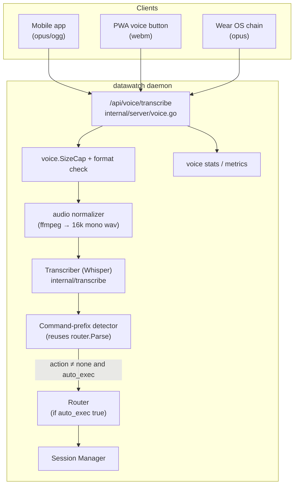

# F18: Generic Voice Transcription Endpoint

**Date:** 2026-04-18
**Version at planning:** v2.4.5
**Priority:** high (mobile MVP blocker — target 2026-06-12)
**Effort:** 2 days
**Category:** api / transcription / mobile
**Source:** [GitHub issue #2](https://github.com/dmz006/datawatch/issues/2) — request from `dmz006/datawatch-app` mobile client
**Cross-reference:** mobile ADR-0006 (voice pipeline), ADR-0038 (Wear voice chain), `datawatch-app docs/api-parity.md` row "POST /api/voice/transcribe"

---

## Problem

The Whisper transcriber (`internal/transcribe`) is wired only into the **Telegram voice
backend** flow today. Other clients (mobile app, future iOS, PWA voice button, third-party
HTTP clients) cannot reach it without faking a Telegram chat context.

The mobile app records voice on-device and ships the audio blob to the server (mobile
ADR-0006: "no on-device STT in v1"). It needs a clean, bearer-authenticated HTTP endpoint.

Issue #2 lists two options:
- **(a)** Add a generic `POST /api/voice/transcribe` endpoint — preferred.
- **(b)** Document Telegram-path reuse — workaround.

This plan implements **(a)**.

---

## Goals

1. Reusable HTTP endpoint that any bearer-authenticated client can POST audio to.
2. Optional auto-route: if `session_id` is supplied, transcript becomes input to that
   session; if `auto_exec` is true, recognized command prefixes (`new:`, `reply:`,
   `status`) are executed and the action is reported back.
3. No new STT engine — wrap the existing `WhisperTranscriber` (`internal/transcribe`).
4. Configurable everywhere (no hard-coded values).
5. Observable: per-device latency, success/error counters, language histogram.
6. Backward compatible: Telegram voice path keeps working unchanged.

---

## Non-goals

- Streaming partial transcripts (v1 returns one transcript per upload).
- Speaker diarization, translation (Whisper supports it but not in v1 contract).
- On-device STT (out of scope per ADR-0006).
- Replacing/removing the Telegram voice path.

---

## API surface

```
POST /api/voice/transcribe
Authorization: Bearer <token>
Content-Type: multipart/form-data

audio       (required)  opus/ogg, webm, m4a, wav, mp3 — mono 16 kHz preferred
session_id  (optional)  if present, transcript auto-replies to that session
auto_exec   (optional)  bool; if true, server executes recognized command prefix
ts_client   (optional)  unix_ms; for end-to-end latency telemetry
language    (optional)  ISO code; default = config voice.language
device_id   (optional)  registered device id from F17 (for telemetry / rate scoping)

→ 200
{
  "transcript":   "send a3f2: yes proceed",
  "confidence":   0.93,
  "language":     "en",
  "action":       "new" | "reply" | "status" | "none",
  "session_id":   "a3f2" or null,
  "latency_ms":   1234,
  "engine":       "whisper",
  "engine_model": "base"
}

→ 400  invalid audio / format unsupported
→ 401  bearer missing/invalid
→ 413  payload too large (configurable cap)
→ 429  rate-limited
→ 503  whisper unavailable (venv missing, model missing)
```

### Error contract

Errors return JSON `{ "error": "<code>", "detail": "<msg>" }` with stable codes
(`invalid_audio`, `unsupported_format`, `too_large`, `rate_limited`,
`engine_unavailable`, `internal`) so the mobile app can branch deterministically.

---

## Architecture


<sub>🔍 <a href="https://mermaid.live/view#pako:eNptU8Fu2zAM_RVCpxZr6jaHAsthQJHs0EO2YAmWw1wMjEw7Qm3JkOSkW9t_HyXFTbzGF5OPj9QTSb0IaQoSE1FZbLewmuUa-HPdJgG5mNaKtHe5SJHwzc1G1fQrF8kAbNs81xem7VxmquoyF49H8mJ9_9MoGehswi7YsOm8Nzok7WnTDBPWhJbJ4QfflyC3qHRf_sgkXeT6g9gCPe7Ryy0USA2fcKI6qrhfPHDtDFuVRSWZt6idtGpDfIbSnqzGOnNkd2QT5boyA31TbLlECi3VX2IfPkFpbIOe1ZJ8GtC_cYD52BXKgA6smpNsuFFZNi1VkHfj289juL17ApZsYI-7YUdWQSPXWL1rtXCx3irXkr08lX1ymdP8GXmSngtMTdOgLkatpVI9QxFxE7VY6hw5sKbjWtcLtI6GIn7ECBdJRshRJWDnzW96Jgnedv9lLMk5ZfS8ClkHB-aoseL0AdGjd31PwQUPMmjIWyXduYkf9m40-vI-1RTol-1MKO7TR7j3YohHmdAw0wCE4SUkWBGKQ0hYNCOYOpzQZAf4FaUPd-YBj-9uePia34oujk17PXQ1JSY71ju27ozK2C5xJRriZVIFP96XN3a7lrefvhaKJyomJdaOrkQ4avlHSzEJ8-lJM4X8YpoD6-0fKqJLaA">View this diagram fullscreen (zoom &amp; pan)</a></sub>

### Reuse vs new code

- **Reuse:** `internal/transcribe.WhisperTranscriber`, `internal/router.Parse`,
  bearer auth middleware, multipart parser, encryption-at-rest envelope (for transient
  on-disk audio).
- **New:** `internal/voice` package containing the dispatcher, normalizer wrapper, the
  command-prefix detector adapter, and a small `Recorder` interface (so future
  alternative engines — Vosk, faster-whisper — can swap in without changing the API).

---

## Configuration (no hard-coded values, all five channels)

### New / extended config block

```yaml
voice:
  enabled: true
  engine: "whisper"                  # future: "vosk", "faster-whisper"
  model: "base"                      # whisper model
  language: ""                       # blank = auto-detect
  venv_path: "~/.datawatch/venv"
  max_audio_bytes: 5242880           # 5 MiB cap (configurable)
  max_audio_seconds: 60              # hard cap; 0 = unlimited
  allowed_formats: ["opus","ogg","webm","m4a","wav","mp3"]
  ffmpeg_path: ""                    # blank = autodetect on PATH
  per_bearer_qps: 1.0                # rate limit floor; 0 = unlimited
  auto_exec_default: false           # fallback when client omits auto_exec
  store_audio: false                 # if true, keep audio under data_dir/voice/<id>.opus
  audio_retention_hours: 24
```

### Access methods

| Method | How |
|--------|-----|
| **YAML** | `~/.datawatch/config.yaml` → `voice:` block |
| **CLI** | `datawatch setup voice` (wizard); `datawatch config set voice.model small`; `datawatch voice transcribe path/to/file.opus` (one-shot) |
| **Web UI** | Settings → General → **Voice & Transcription** card (engine/model/language/cap toggles + a "Test mic → upload" button that records and POSTs to `/api/voice/transcribe`) |
| **REST API** | `POST /api/voice/transcribe` (this endpoint); `GET /api/config` → `voice.*`; `PUT /api/config` to mutate |
| **Comm channel** | `configure voice.model=small` etc.; existing Telegram voice path unchanged |
| **MCP** | `voice_transcribe` (path or base64), `voice_stats`, `voice_config_set` tools |

### Sensitive-field handling

- No new secrets. Whisper venv path is local; no API keys.
- If `voice.store_audio=true`, files are encrypted with the existing XChaCha20-Poly1305
  envelope when `secure.enabled=true`, and a janitor goroutine deletes anything older
  than `audio_retention_hours`.
- Audio bytes are **never logged**; only size + format + latency.

---

## Implementation phases

### Phase 1 — endpoint scaffold (0.25 day)

- New file `internal/server/voice.go`. Wire route in `server.go` mux.
- Multipart parse with strict `max_audio_bytes` cap (`http.MaxBytesReader`).
- Format sniff (magic bytes, not just MIME) before persisting to a `t, _ := os.CreateTemp` file.
- Tests: 401, 413, 415 (unsupported format), 200 happy path with stub transcriber.

### Phase 2 — `internal/voice` dispatcher (0.5 day)

- Define `Recorder` interface; implement `WhisperRecorder` thin wrapper around
  `internal/transcribe.WhisperTranscriber`.
- Audio normalizer using `ffmpeg` (configurable path) → mono 16 kHz wav before
  handing to Whisper.
- Per-bearer token bucket (rate limit) — reuse pattern from `internal/proxy/queue.go`.
- Unit tests with a fake `Recorder` for the dispatcher path; integration test gated by
  `WHISPER_VENV` env var for the real Whisper path.

### Phase 3 — auto-exec routing (0.25 day)

- Adapt `router.Parse` so the dispatcher can call it without a messaging backend.
- Detector returns `action`, `session_id`, and either executes (when `auto_exec=true`) or
  reports the suggested action only.
- Tests: each prefix (`new:`, `reply:`, `send <id>:`, `status`, `list`).

### Phase 4 — observability (0.25 day) [AGENT.md monitoring rule]

- Add to `SystemStats`: `VoiceRequests`, `VoiceErrors`, `VoiceAvgLatencyMs`,
  `VoiceLanguageCounts` (map).
- `GET /api/voice/stats` endpoint.
- MCP tools: `voice_stats`, `voice_transcribe`.
- Web UI Monitor → **Voice** card.
- Prometheus: `datawatch_voice_requests_total{action,language}`,
  `datawatch_voice_errors_total{code}`,
  `datawatch_voice_latency_ms` histogram.
- Comm channel: `voice stats` command.

### Phase 5 — CLI + wizard (0.25 day)

- `datawatch voice transcribe <file>` subcommand (POSTs to local API for parity).
- `datawatch setup voice` wizard step (probes venv, downloads model on consent).

### Phase 6 — docs + diagrams (0.25 day)

- New section in `docs/messaging-backends.md` "Voice transcription (generic API)".
- Sequence diagram in `docs/data-flow.md`.
- Update `docs/api/openapi.yaml` (1 path + 4 schemas: `VoiceTranscribeRequest`
  multipart, `VoiceTranscribeResponse`, `VoiceStatsResponse`, `VoiceError`).
- Update `docs/architecture.md` Component Overview (`voice` package).
- Update `docs/architecture-overview.md`.
- README Documentation Index entry.
- `docs/testing-tracker.md` row.

### Phase 7 — testing (0.25 day)

| Test | Method | Expected |
|------|--------|----------|
| Bearer required | curl POST | 401 without bearer |
| Size cap | curl 6MiB | 413 |
| Format guess | upload `.txt` renamed `.ogg` | 415 (magic mismatch) |
| Happy path | upload `tests/data/hello.opus` (real Whisper if venv present, else stub) | transcript matches expected; `latency_ms > 0` |
| Auto-exec `new:` | upload `"new: write fib"` audio (mock recorder) + `auto_exec=true` | session created |
| Auto-exec disabled | same upload + `auto_exec=false` | session NOT created; `action="new"` reported |
| Rate limit | 5 rapid POSTs same bearer | 429 after limit |
| Whisper missing | unset venv | 503 with `engine_unavailable` |
| MCP `voice_transcribe` | mcp test client | matches REST output |
| Comm channel `voice stats` | `POST /api/test/message` | response contains counters |
| Config round-trip | PUT → GET → comm `configure` | every `voice.*` field round-trips |
| Web UI mic test | Chrome automation | upload roundtrips and shows transcript |

---

## Files to add / modify

| File | Change |
|------|--------|
| `internal/voice/dispatcher.go` | new |
| `internal/voice/recorder.go` | new |
| `internal/voice/recorder_whisper.go` | new |
| `internal/voice/dispatcher_test.go` | new |
| `internal/server/voice.go` | new HTTP handler + voice stats handler |
| `internal/server/api.go` | wire `voice.*` into config GET/PUT |
| `internal/server/server.go` | route registration |
| `internal/config/config.go` | `VoiceConfig` extension |
| `internal/router/router.go` | factor out parser for non-messaging callers; `voice stats` command |
| `internal/mcp/server.go` | `voice_transcribe`, `voice_stats` tools |
| `internal/stats/collector.go` | voice counters |
| `internal/metrics/metrics.go` | Prometheus metrics |
| `internal/server/web/app.js` | Voice settings card + monitor card + mic-test panel |
| `internal/wizard/defs.go` | `setup voice` wizard step extension |
| `cmd/datawatch/main.go` | `voice` subcommand |
| `docs/config-reference.yaml` | `voice:` extension |
| `docs/messaging-backends.md` | Generic voice section |
| `docs/data-flow.md` | new sequence diagram |
| `docs/architecture.md` | `voice` package |
| `docs/architecture-overview.md` | new top-level diagram |
| `docs/api/openapi.yaml` | path + schemas |
| `docs/testing-tracker.md` | new row |
| `docs/operations.md` | "Voice transcription" subsection |
| `README.md` | Documentation Index entry |
| `CHANGELOG.md` | `[Unreleased]` entry |

---

## Risk assessment

| Risk | Impact | Mitigation |
|------|--------|------------|
| Whisper venv missing in deploy | 503 on every request | Probe at boot; expose `voice.ready` in `/api/voice/stats`; setup wizard auto-creates venv |
| Audio bytes leaked into logs | Privacy violation | Logger never receives audio; tests assert no `len(audio)` token in any log line |
| `auto_exec` mis-routes user voice into a destructive command | Damage | Server-side allowlist of prefixes; `kill`, `delete` require explicit confirmation prompt round-trip |
| ffmpeg missing | Normalization fails | Probe + clear `engine_unavailable` error; setup wizard checks |
| Large model OOM on small hosts | Crash | Default model = `base`; warn on `large-v3` selection if RAM < 8 GiB |
| Bearer-bypass via Telegram path | Auth gap | Telegram path retains its existing per-chat allowlist; new endpoint is bearer-only |

---

## Dependencies

- Existing `internal/transcribe` Whisper wrapper.
- ffmpeg on PATH (or configured path).
- F17 device registry (optional — used only for the optional `device_id` telemetry tag).

---

## Status

- [ ] Phase 1 — endpoint scaffold
- [ ] Phase 2 — dispatcher + normalizer
- [ ] Phase 3 — auto-exec routing
- [ ] Phase 4 — observability
- [ ] Phase 5 — CLI + wizard
- [ ] Phase 6 — docs + diagrams
- [ ] Phase 7 — testing

**Shipped in:** _(fill on completion)_
